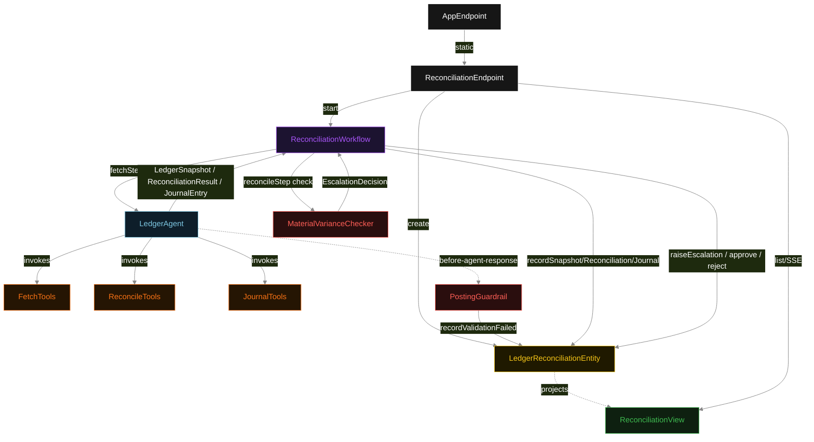
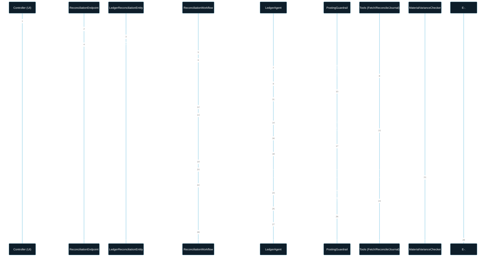
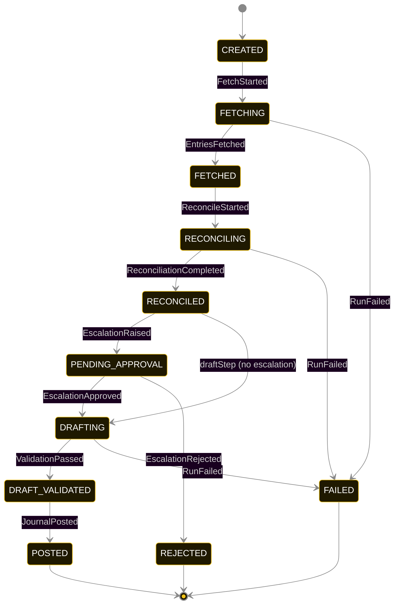

# PLAN — gl-reconciler

Architectural sketch consumed by `/akka:plan` and rendered on the generated system's Architecture tab. The four mermaid diagrams below carry the theme variables and CSS overrides from Lesson 24; without them, state names render black-on-black and edge labels clip.

---

## Component graph

## Interaction sequence — J1 (happy path, no material variance)

## State machine — `LedgerReconciliationEntity`

`ValidationFailed` is a side-event recorded on the entity when `PostingGuardrail` rejects the draft; it does not change the status — the agent's retry stays inside the same task, and the workflow's step continues. Only an exhausted retry budget or a step timeout transitions to `FAILED`.

## Entity model

```mermaid
%%{init: {'theme':'base','themeVariables':{'primaryColor':'#1f1900','primaryTextColor':'#ffffff','primaryBorderColor':'#F5C518','lineColor':'#888','nodeTextColor':'#ffffff','stateLabelColor':'#ffffff'}}}%%
erDiagram
  LedgerReconciliationEntity ||--o{ RunCreated : emits
  LedgerReconciliationEntity ||--o{ FetchStarted : emits
  LedgerReconciliationEntity ||--o{ EntriesFetched : emits
  LedgerReconciliationEntity ||--o{ ReconcileStarted : emits
  LedgerReconciliationEntity ||--o{ ReconciliationCompleted : emits
  LedgerReconciliationEntity ||--o{ EscalationRaised : emits
  LedgerReconciliationEntity ||--o{ EscalationApproved : emits
  LedgerReconciliationEntity ||--o{ EscalationRejected : emits
  LedgerReconciliationEntity ||--o{ DraftStarted : emits
  LedgerReconciliationEntity ||--o{ JournalDrafted : emits
  LedgerReconciliationEntity ||--o{ ValidationPassed : emits
  LedgerReconciliationEntity ||--o{ ValidationFailed : emits
  LedgerReconciliationEntity ||--o{ JournalPosted : emits
  LedgerReconciliationEntity ||--o{ RunFailed : emits
  ReconciliationView }o--|| LedgerReconciliationEntity : projects
  ReconciliationWorkflow }o--|| LedgerReconciliationEntity : reads-and-writes
  LedgerAgent ||--o{ LedgerSnapshot : returns
  LedgerAgent ||--o{ ReconciliationResult : returns
  LedgerAgent ||--o{ JournalEntry : returns
```

## Component table — Java file targets

| Component | Path (generated) |
|---|---|
| `ReconciliationEndpoint` | `api/ReconciliationEndpoint.java` |
| `AppEndpoint` | `api/AppEndpoint.java` |
| `LedgerReconciliationEntity` | `application/LedgerReconciliationEntity.java` (state in `domain/ReconciliationRun.java`, events in `domain/ReconciliationEvent.java`) |
| `ReconciliationWorkflow` | `application/ReconciliationWorkflow.java` |
| `LedgerAgent` | `application/LedgerAgent.java` (tasks in `application/LedgerTasks.java`) |
| `FetchTools` | `application/FetchTools.java` |
| `ReconcileTools` | `application/ReconcileTools.java` |
| `JournalTools` | `application/JournalTools.java` |
| `PostingGuardrail` | `application/PostingGuardrail.java` |
| `MaterialVarianceChecker` | `application/MaterialVarianceChecker.java` |
| `ReconciliationView` | `application/ReconciliationView.java` |
| `MockModelProvider` (option-a only) | `application/MockModelProvider.java` |
| Bootstrap | `Bootstrap.java` |

## Concurrency notes

- **Per-step timeout**: `fetchStep` 60 s, `reconcileStep` 60 s, `hitlStep` 72 h (controller window), `draftStep` 60 s, `validateStep` 5 s, `error` 5 s. Default step recovery `maxRetries(2).failoverTo(ReconciliationWorkflow::error)`. The 60 s on each agent-calling step accommodates LLM latency including tool round-trips (Lesson 4). The 72 h on `hitlStep` gives the controller a working-day window to review and decide.
- **Idempotency**: each workflow uses `"recon-" + runId` as the workflow id; restart of the same runId is rejected by the workflow runtime. The agent instance id is `"agent-" + runId` so each reconciliation run has its own per-task conversation memory.
- **One agent per run**: `LedgerAgent` runs three tasks per run — FETCH, RECONCILE, DRAFT — each with `capability(...).maxIterationsPerTask(4)`. The 4-iteration budget gives the posting guardrail room to reject an unbalanced draft and still let the agent self-correct.
- **Guardrail-driven retry**: when `PostingGuardrail` rejects a task result, the rejection is returned as a structured error to the agent loop. The loop counts toward `maxIterationsPerTask`; if all 4 iterations fail validation, the workflow step fails over to `error` and the entity transitions to `FAILED`.
- **Material variance check is synchronous and deterministic**: `MaterialVarianceChecker` runs in-process inside `reconcileStep`. No LLM call, no external service. This is a deliberate single-agent invariant.
- **Task-boundary handoff is the dependency contract**: `fetchStep` writes `EntriesFetched` BEFORE returning; `reconcileStep` reads the recorded `LedgerSnapshot` from the entity to build its task's instruction context; `draftStep` reads both `LedgerSnapshot` and `ReconciliationResult`. The agent itself is stateless across phases.
- **HITL is an explicit workflow state**: the `hitlStep` is not a notification side-channel — it is a genuine workflow step with a timer. The controller's `approve` / `reject` command is a command on the entity, which the workflow polls. Every decision is recorded in the entity log.
- **No saga / no compensation**: every step is either pure read, append-only event write, or a single-task agent call. A failed run stays at the last successful event; the UI shows the partial state for the controller.
