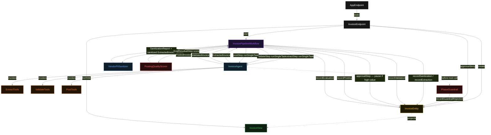
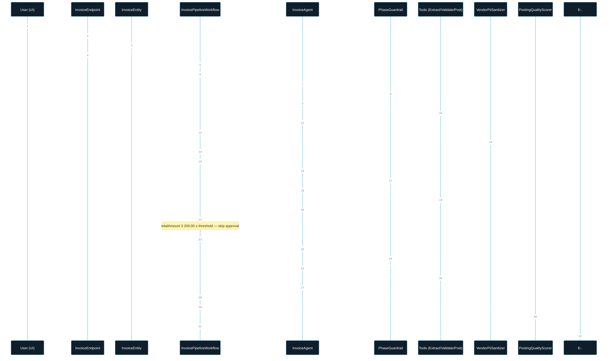
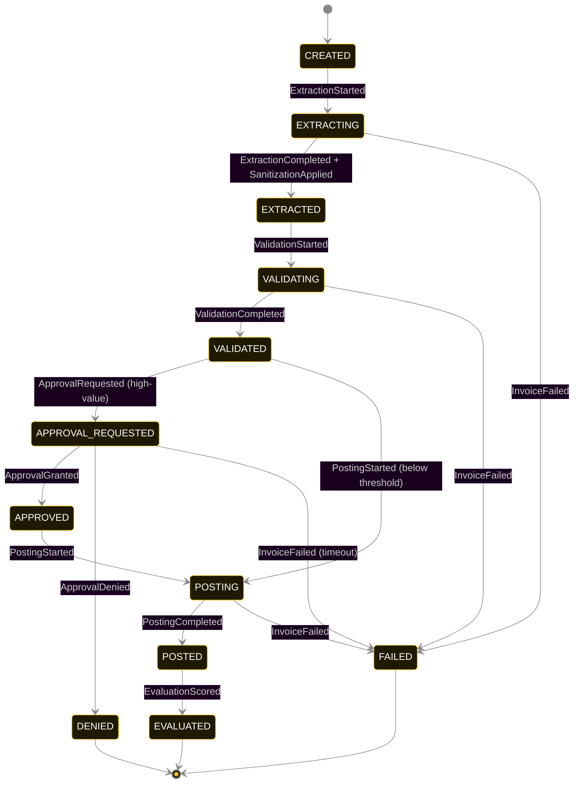

# PLAN — invoice-processing

Architectural sketch consumed by `/akka:plan` and rendered on the generated system's Architecture tab. The four mermaid diagrams below carry the theme variables and CSS overrides from Lesson 24; without them, state names render black-on-black and edge labels clip.

---

## Component graph

## Interaction sequence — J1 (happy path, below-threshold invoice)

## State machine — `InvoiceEntity`

`PhaseGuardrailRejected` is a side-event recorded on the entity for audit; it does not change the status — the agent's retry stays inside the same task. Only an exhausted retry budget or a step timeout transitions to `FAILED`.

## Entity model

```mermaid
%%{init: {'theme':'base','themeVariables':{'primaryColor':'#1f1900','primaryTextColor':'#ffffff','primaryBorderColor':'#F5C518','lineColor':'#888','nodeTextColor':'#ffffff','stateLabelColor':'#ffffff'}}}%%
erDiagram
  InvoiceEntity ||--o{ InvoiceCreated : emits
  InvoiceEntity ||--o{ ExtractionStarted : emits
  InvoiceEntity ||--o{ SanitizationApplied : emits
  InvoiceEntity ||--o{ ExtractionCompleted : emits
  InvoiceEntity ||--o{ ValidationStarted : emits
  InvoiceEntity ||--o{ ValidationCompleted : emits
  InvoiceEntity ||--o{ ApprovalRequested : emits
  InvoiceEntity ||--o{ ApprovalGranted : emits
  InvoiceEntity ||--o{ ApprovalDenied : emits
  InvoiceEntity ||--o{ PostingStarted : emits
  InvoiceEntity ||--o{ PostingCompleted : emits
  InvoiceEntity ||--o{ EvaluationScored : emits
  InvoiceEntity ||--o{ PhaseGuardrailRejected : emits
  InvoiceEntity ||--o{ InvoiceFailed : emits
  InvoiceView }o--|| InvoiceEntity : projects
  InvoicePipelineWorkflow }o--|| InvoiceEntity : reads-and-writes
  InvoiceAgent ||--o{ ExtractedInvoice : returns
  InvoiceAgent ||--o{ ValidatedInvoice : returns
  InvoiceAgent ||--o{ PostedInvoice : returns
  VendorPiiSanitizer ||--o{ SanitizationReport : produces
```

## Component table — Java file targets

| Component | Path (generated) |
|---|---|
| `InvoiceEndpoint` | `api/InvoiceEndpoint.java` |
| `AppEndpoint` | `api/AppEndpoint.java` |
| `InvoiceEntity` | `application/InvoiceEntity.java` (state in `domain/InvoiceRecord.java`, events in `domain/InvoiceEvent.java`) |
| `InvoicePipelineWorkflow` | `application/InvoicePipelineWorkflow.java` |
| `InvoiceAgent` | `application/InvoiceAgent.java` (tasks in `application/InvoiceTasks.java`) |
| `ExtractTools` | `application/ExtractTools.java` |
| `ValidateTools` | `application/ValidateTools.java` |
| `PostTools` | `application/PostTools.java` |
| `PhaseGuardrail` | `application/PhaseGuardrail.java` |
| `VendorPiiSanitizer` | `application/VendorPiiSanitizer.java` |
| `PostingQualityScorer` | `application/PostingQualityScorer.java` |
| `InvoiceView` | `application/InvoiceView.java` |
| `MockModelProvider` (option-a only) | `application/MockModelProvider.java` |
| Bootstrap | `Bootstrap.java` |

## Concurrency notes

- **Per-step timeout**: `extractStep` 60 s, `validateStep` 60 s, `postStep` 60 s, `evalStep` 5 s, `approvalStep` 172 800 s (48 h), `error` 5 s. Default step recovery `maxRetries(2).failoverTo(InvoicePipelineWorkflow::error)`. The 60 s on each agent-calling step accommodates LLM latency including tool round-trips (Lesson 4).
- **Idempotency**: each workflow uses `"pipeline-" + invoiceId` as the workflow id; restart of the same invoiceId is rejected by the workflow runtime. The agent instance id is `"agent-" + invoiceId` so each invoice has its own per-task conversation memory.
- **One agent per invoice**: `InvoiceAgent` runs three tasks per invoice — EXTRACT, VALIDATE, POST — each with `capability(...).maxIterationsPerTask(4)`. The 4-iteration budget gives the guardrail room to reject a misordered tool call and still let the agent self-correct.
- **Sanitizer is not the agent's responsibility**: `VendorPiiSanitizer` runs in-process inside `extractStep`, between the agent's typed return and the entity write. The agent never sees the raw PII after the sanitizer fires, and the sanitizer never makes an LLM call.
- **Approval gate is workflow-managed**: `approvalStep` reads the entity state (not the agent) to decide whether to suspend. When the reviewer calls the approve/deny endpoint, the entity emits the corresponding event and the workflow polls its own entity to detect the decision and resume.
- **Eval is synchronous and deterministic**: `PostingQualityScorer` runs in-process inside `evalStep`. No LLM call, no external service.
- **Task-boundary handoff is the dependency contract**: `extractStep` writes `ExtractionCompleted` BEFORE returning; `validateStep` reads the recorded sanitized `ExtractedInvoice` from the entity to build its task's instruction context; `postStep` reads the `ValidatedInvoice`. The agent itself is stateless across phases.
