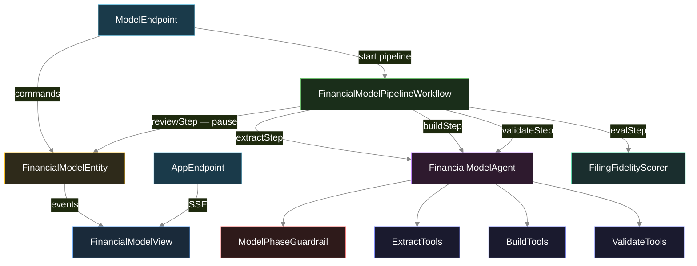
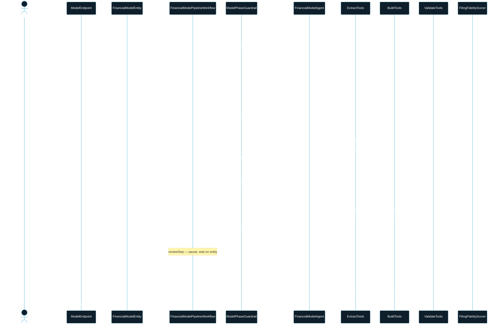
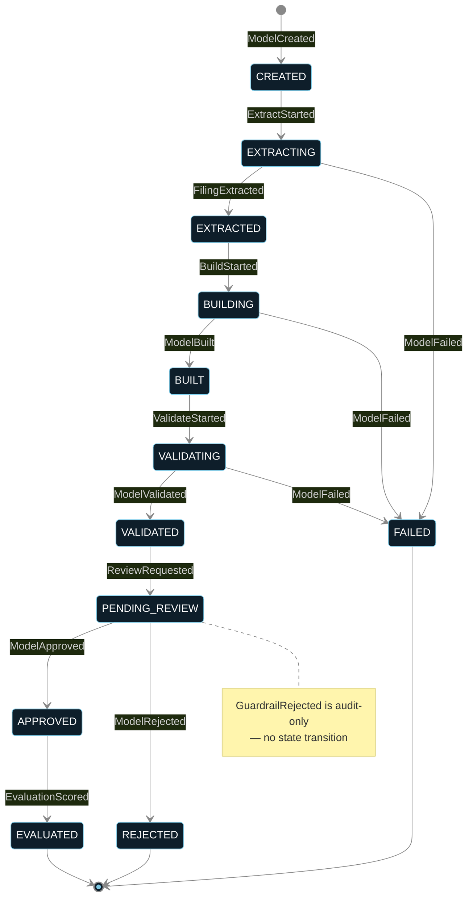
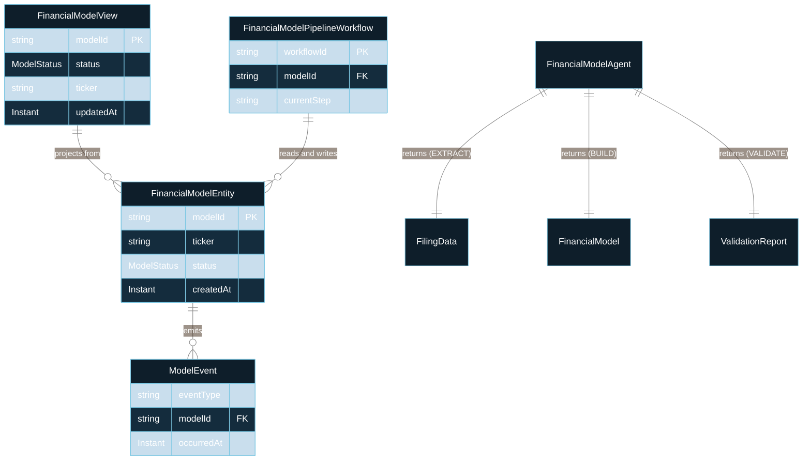

# PLAN — financial-model-builder

---

## 1. Component graph

---

## 2. Interaction sequence — J1 happy path

---

## 3. State machine — FinancialModelEntity

---

## 4. Entity model

---

## 5. Component table

| Java file | Kind | Responsibility |
|---|---|---|
| `entity/FinancialModelEntity.java` | EventSourcedEntity | All state; processes commands; emits events |
| `workflow/FinancialModelPipelineWorkflow.java` | Workflow | Drives extract→build→validate→review→eval steps |
| `agent/FinancialModelAgent.java` | AutonomousAgent | Executes one task per invocation via tools |
| `tools/ExtractTools.java` | Tool class | parseFiling, fetchLineItem |
| `tools/BuildTools.java` | Tool class | computeRatio, projectFigure |
| `tools/ValidateTools.java` | Tool class | crossCheckAssumption, detectAnomalies |
| `guardrail/ModelPhaseGuardrail.java` | Guardrail | before-tool-call phase gate |
| `scorer/FilingFidelityScorer.java` | Scorer | on-decision-eval; four filing-fidelity checks |
| `view/FinancialModelView.java` | View | SSE-ready read-model projected from entity events |
| `endpoint/ModelEndpoint.java` | HttpEndpoint | /api/models/* CRUD + approve/reject + SSE |
| `endpoint/AppEndpoint.java` | HttpEndpoint | /app/* static assets + / redirect |
| `model/ModelTasks.java` | Constants | EXTRACT_FINANCIALS, BUILD_MODEL, VALIDATE_MODEL |

---

## 6. Concurrency notes

- One `FinancialModelEntity` instance per `modelId`; concurrent submissions for different tickers are independent.
- The workflow's `reviewStep` uses `asyncEffect` to observe entity state; it does not hold a thread.
- `FilingFidelityScorer` is synchronous and stateless; it reads from the workflow context, not from a separate entity call.
- `ModelPhaseGuardrail` is read-only; it does not mutate entity state and never emits events directly — only the entity emits `GuardrailRejected` when the workflow reports the block.
