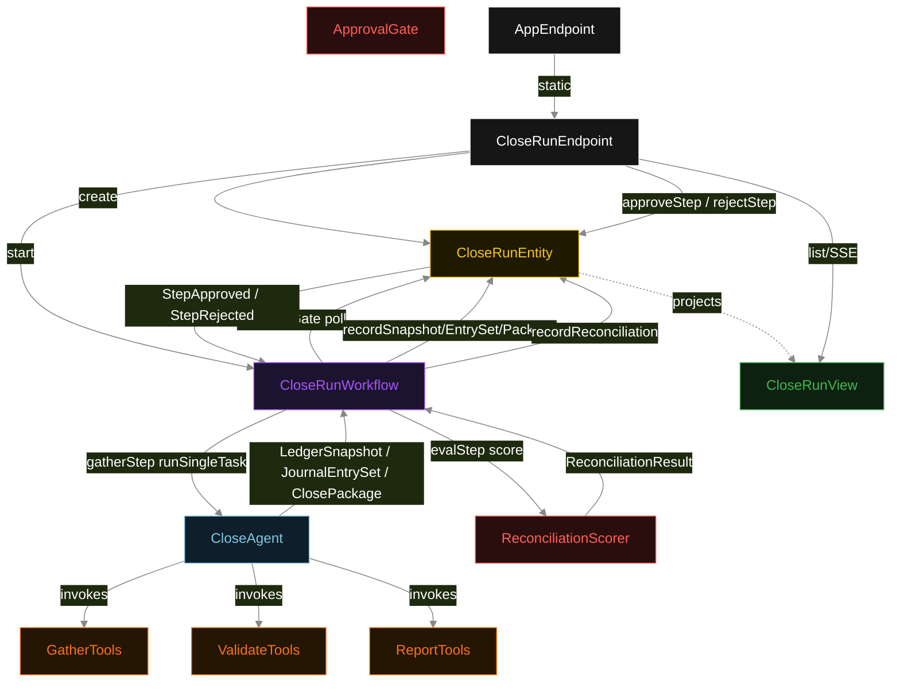
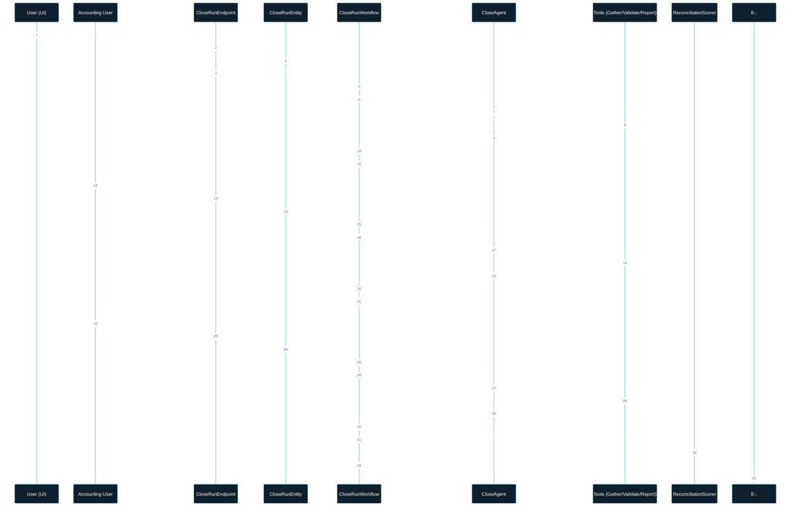
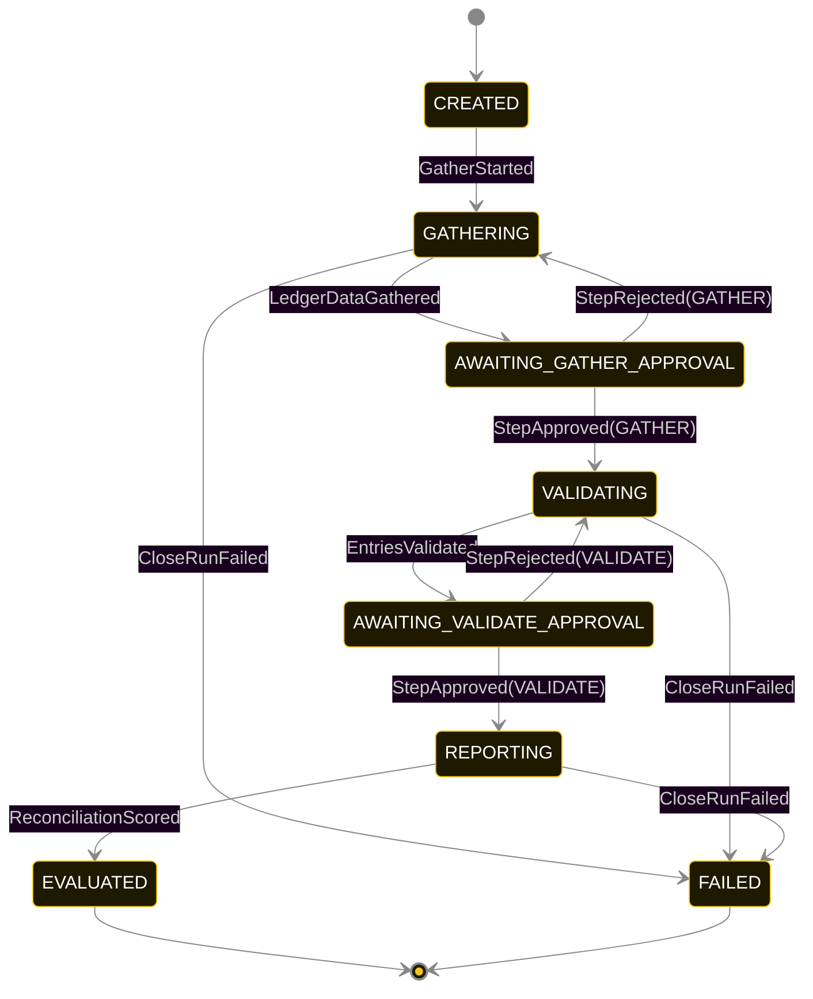
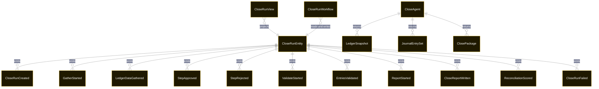

# PLAN — month-end-closer

Architectural sketch consumed by `/akka:plan` and rendered on the generated system's Architecture tab. The four mermaid diagrams below carry the theme variables and CSS overrides from Lesson 24; without them, state names render black-on-black and edge labels clip.

---

## Component graph

## Interaction sequence — J1 (happy path)

## State machine — `CloseRunEntity`

A `StepRejected` event does not transition to `FAILED` — it drives the workflow back into the previous task phase for a re-run, consuming another iteration of the agent's budget. Only an exhausted retry budget, a step timeout, or an explicit error transitions to `FAILED`.

## Entity model

## Component table — Java file targets

| Component | Path (generated) |
|---|---|
| `CloseRunEndpoint` | `api/CloseRunEndpoint.java` |
| `AppEndpoint` | `api/AppEndpoint.java` |
| `CloseRunEntity` | `application/CloseRunEntity.java` (state in `domain/CloseRunRecord.java`, events in `domain/CloseRunEvent.java`) |
| `CloseRunWorkflow` | `application/CloseRunWorkflow.java` |
| `CloseAgent` | `application/CloseAgent.java` (tasks in `application/CloseTasks.java`) |
| `GatherTools` | `application/GatherTools.java` |
| `ValidateTools` | `application/ValidateTools.java` |
| `ReportTools` | `application/ReportTools.java` |
| `ApprovalGate` | `application/ApprovalGate.java` |
| `ReconciliationScorer` | `application/ReconciliationScorer.java` |
| `CloseRunView` | `application/CloseRunView.java` |
| `MockModelProvider` (option-a only) | `application/MockModelProvider.java` |
| Bootstrap | `Bootstrap.java` |

## Concurrency notes

- **Per-step timeout**: `gatherStep` 60 s, `validateStep` 60 s, `reportStep` 60 s, `evalStep` 5 s, `approvalGate(GATHER)` 3600 s, `approvalGate(VALIDATE)` 3600 s, `error` 5 s. Default step recovery `maxRetries(2).failoverTo(CloseRunWorkflow::error)`. The 60 s on each agent-calling step accommodates LLM latency including tool round-trips (Lesson 4). The 3600 s on approval gates accommodates human review time.
- **Idempotency**: each workflow uses `"workflow-" + closeRunId` as the workflow id; restart of the same closeRunId is rejected by the workflow runtime. The agent instance id is `"agent-" + closeRunId` so each run has its own per-task conversation memory.
- **One agent per run**: `CloseAgent` runs three tasks per close run — GATHER, VALIDATE, REPORT — each with `capability(...).maxIterationsPerTask(4)`. The 4-iteration budget gives the agent room to recover from a tool call error and still complete the task.
- **Approval drives phase advance**: the workflow's `approvalGate` steps poll `CloseRunEntity.status`. The only way to advance past `AWAITING_GATHER_APPROVAL` is a `StepApproved(GATHER)` event written by `POST /api/close-runs/{id}/approve`. This is the application-level HITL gate — no timeout, no auto-advance. A `StepRejected` causes the workflow to replay the immediately-preceding task step.
- **Eval is synchronous and deterministic**: `ReconciliationScorer` runs in-process inside `evalStep`. No LLM call, no external service — the same close package always scores the same.
- **Task-boundary handoff is the dependency contract**: `gatherStep` writes `LedgerDataGathered` BEFORE the approval gate opens; `validateStep` reads the recorded `LedgerSnapshot` to build the VALIDATE task's instruction context; `reportStep` reads both. The agent is stateless across phases — it never holds gather + validate + report context in one conversation.
