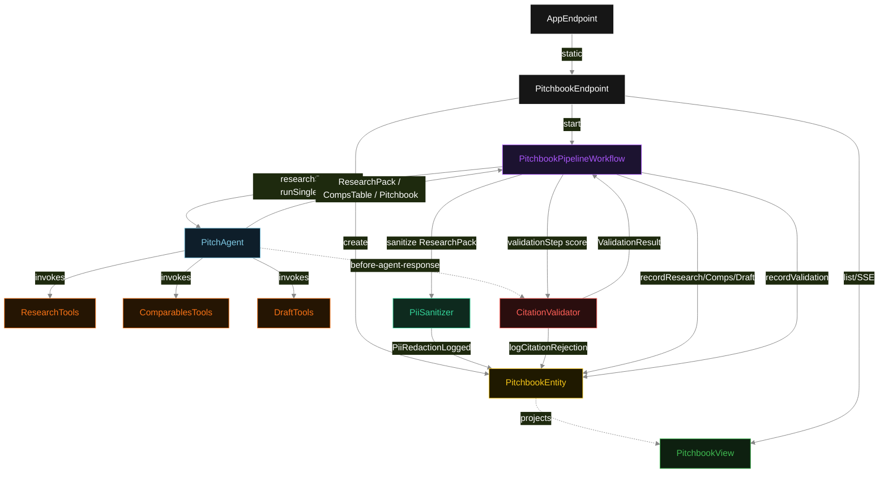
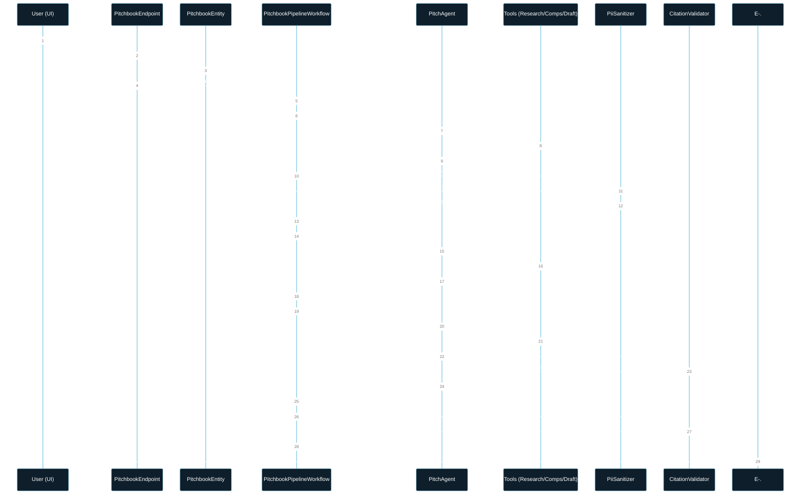
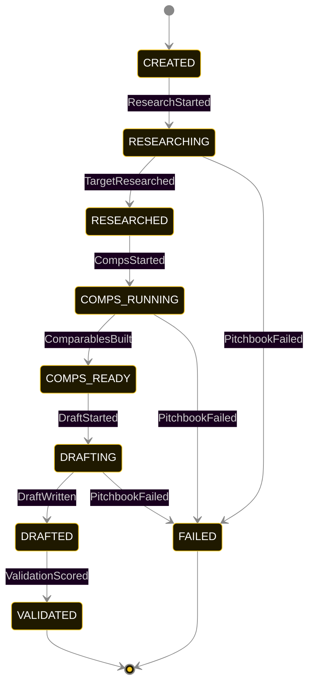
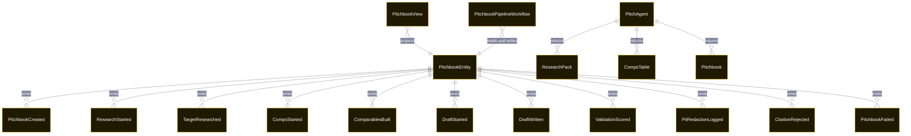

# PLAN — pitch-builder

Architectural sketch consumed by `/akka:plan` and rendered on the generated system's Architecture tab. The four mermaid diagrams below carry the theme variables and CSS overrides from Lesson 24; without them, state names render black-on-black and edge labels clip.

---

## Component graph

## Interaction sequence — J1 (happy path)

## State machine — `PitchbookEntity`

`PiiRedactionLogged` and `CitationRejected` are side-events recorded on the entity for audit; they do not change the status — the PII sanitizer runs once per `researchStep`, and the agent's retry stays inside the same `draftStep` task. Only an exhausted retry budget or a step timeout transitions to `FAILED`.

## Entity model

## Component table — Java file targets

| Component | Path (generated) |
|---|---|
| `PitchbookEndpoint` | `api/PitchbookEndpoint.java` |
| `AppEndpoint` | `api/AppEndpoint.java` |
| `PitchbookEntity` | `application/PitchbookEntity.java` (state in `domain/PitchbookRecord.java`, events in `domain/PitchbookEvent.java`) |
| `PitchbookPipelineWorkflow` | `application/PitchbookPipelineWorkflow.java` |
| `PitchAgent` | `application/PitchAgent.java` (tasks in `application/PitchTasks.java`) |
| `ResearchTools` | `application/ResearchTools.java` |
| `ComparablesTools` | `application/ComparablesTools.java` |
| `DraftTools` | `application/DraftTools.java` |
| `PiiSanitizer` | `application/PiiSanitizer.java` |
| `PiiPatternRegistry` | `application/PiiPatternRegistry.java` |
| `CitationValidator` | `application/CitationValidator.java` |
| `PitchbookView` | `application/PitchbookView.java` |
| `MockModelProvider` (option-a only) | `application/MockModelProvider.java` |
| Bootstrap | `Bootstrap.java` |

## Concurrency notes

- **Per-step timeout**: `researchStep` 60 s, `comparablesStep` 60 s, `draftStep` 60 s, `validationStep` 5 s, `error` 5 s. Default step recovery `maxRetries(2).failoverTo(PitchbookPipelineWorkflow::error)`. The 60 s on each agent-calling step accommodates LLM latency including tool round-trips (Lesson 4).
- **Idempotency**: each workflow uses `"pipeline-" + pitchbookId` as the workflow id; restart of the same pitchbookId is rejected by the workflow runtime. The agent instance id is `"agent-" + pitchbookId` so each pitchbook has its own per-task conversation memory.
- **One agent per pitchbook**: `PitchAgent` runs three tasks per pitchbook — RESEARCH, COMPARABLES, DRAFT — each with `capability(...).maxIterationsPerTask(4)`. The 4-iteration budget gives the citation guardrail room to reject a misordered draft and still let the agent self-correct.
- **PII sanitizer is synchronous**: `PiiSanitizer.sanitize()` runs in-process inside `researchStep` between the agent returning and the entity write. It is not an LLM call; latency is bounded by the number of `RawResearchItem` entries (typically < 10 ms).
- **Validation is synchronous and deterministic**: `CitationValidator` runs in-process inside `validationStep`. No LLM call — the same pitchbook always scores the same. This is a deliberate single-agent invariant.
- **Task-boundary handoff is the dependency contract**: `researchStep` writes `TargetResearched` (with the sanitized pack) BEFORE returning; `comparablesStep` reads the recorded `ResearchPack` from the entity to build its task's instruction context; `draftStep` reads both. The agent itself is stateless across phases.
- **No saga / no compensation**: every step is either pure read, append-only event write, or a single-task agent call. A failed pitchbook stays at the last successful event; the UI shows the partial state for the user.
