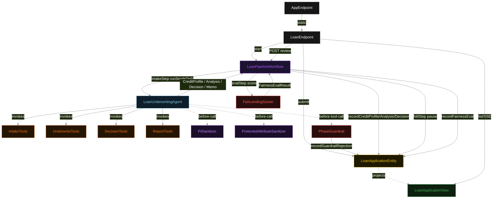
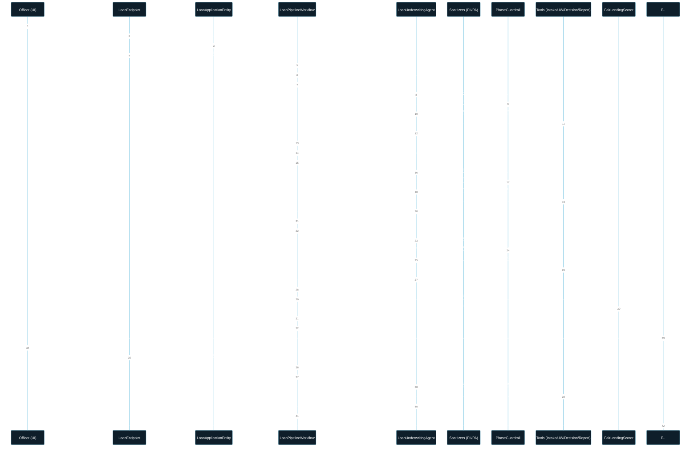
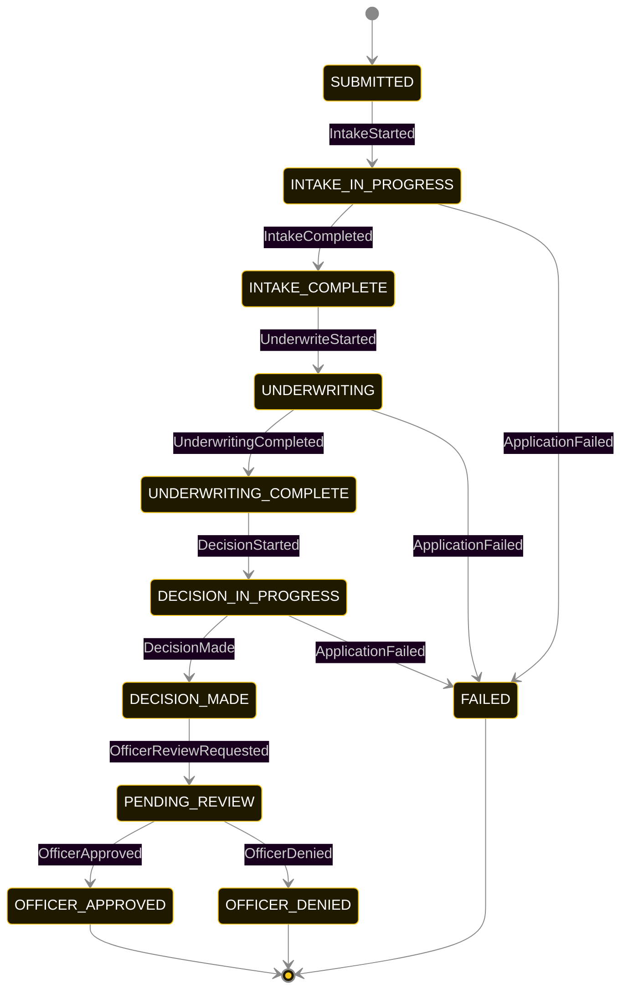

# PLAN — sba-loan-processor

Architectural sketch consumed by `/akka:plan` and rendered on the generated system's Architecture tab. The four mermaid diagrams below carry the theme variables and CSS overrides from Lesson 24; without them, state names render black-on-black and edge labels clip.

---

## Component graph

## Interaction sequence — J1 (happy path)

## State machine — `LoanApplicationEntity`

GuardrailRejected is a side-event recorded on the entity for audit; it does not change the status — the agent's retry stays inside the same task. Only an exhausted retry budget or a step timeout transitions to FAILED.

FairnessEvaluated fires between DECISION_MADE and PENDING_REVIEW and is an audit-only event — it does not change the application status.

## Entity model

```mermaid
%%{init: {'theme':'base','themeVariables':{'primaryColor':'#1f1900','primaryTextColor':'#ffffff','primaryBorderColor':'#F5C518','lineColor':'#888','nodeTextColor':'#ffffff','stateLabelColor':'#ffffff'}}}%%
erDiagram
  LoanApplicationEntity ||--o{ ApplicationSubmitted : emits
  LoanApplicationEntity ||--o{ IntakeStarted : emits
  LoanApplicationEntity ||--o{ IntakeCompleted : emits
  LoanApplicationEntity ||--o{ UnderwriteStarted : emits
  LoanApplicationEntity ||--o{ UnderwritingCompleted : emits
  LoanApplicationEntity ||--o{ DecisionStarted : emits
  LoanApplicationEntity ||--o{ DecisionMade : emits
  LoanApplicationEntity ||--o{ FairnessEvaluated : emits
  LoanApplicationEntity ||--o{ MemoGenerated : emits
  LoanApplicationEntity ||--o{ OfficerReviewRequested : emits
  LoanApplicationEntity ||--o{ OfficerApproved : emits
  LoanApplicationEntity ||--o{ OfficerDenied : emits
  LoanApplicationEntity ||--o{ GuardrailRejected : emits
  LoanApplicationEntity ||--o{ ApplicationFailed : emits
  LoanApplicationView }o--|| LoanApplicationEntity : projects
  LoanPipelineWorkflow }o--|| LoanApplicationEntity : reads-and-writes
  LoanUnderwritingAgent ||--o{ CreditProfile : returns
  LoanUnderwritingAgent ||--o{ UnderwritingAnalysis : returns
  LoanUnderwritingAgent ||--o{ LoanDecision : returns
  LoanUnderwritingAgent ||--o{ UnderwritingMemo : returns
```

## Component table — Java file targets

| Component | Path (generated) |
|---|---|
| `LoanEndpoint` | `api/LoanEndpoint.java` |
| `AppEndpoint` | `api/AppEndpoint.java` |
| `LoanApplicationEntity` | `application/LoanApplicationEntity.java` (state in `domain/LoanApplicationRecord.java`, events in `domain/LoanApplicationEvent.java`) |
| `LoanPipelineWorkflow` | `application/LoanPipelineWorkflow.java` |
| `LoanUnderwritingAgent` | `application/LoanUnderwritingAgent.java` (tasks in `application/LoanTasks.java`) |
| `IntakeTools` | `application/IntakeTools.java` |
| `UnderwriteTools` | `application/UnderwriteTools.java` |
| `DecisionTools` | `application/DecisionTools.java` |
| `ReportTools` | `application/ReportTools.java` |
| `PiiSanitizer` | `application/PiiSanitizer.java` |
| `ProtectedAttributeSanitizer` | `application/ProtectedAttributeSanitizer.java` |
| `PhaseGuardrail` | `application/PhaseGuardrail.java` |
| `FairLendingScorer` | `application/FairLendingScorer.java` |
| `LoanApplicationView` | `application/LoanApplicationView.java` |
| `MockModelProvider` (option-a only) | `application/MockModelProvider.java` |
| Bootstrap | `Bootstrap.java` |

## Concurrency notes

- **Per-step timeout**: `intakeStep` 60 s, `underwriteStep` 60 s, `decisionStep` 60 s, `hitlStep` no timeout (HITL gates are indefinite), `evalStep` 5 s, `reportStep` 60 s, `error` 5 s. Default step recovery `maxRetries(2).failoverTo(LoanPipelineWorkflow::error)`.
- **Idempotency**: each workflow uses `"pipeline-" + applicationId` as the workflow id. The agent instance id is `"agent-" + applicationId` so each application has its own per-task conversation memory.
- **One agent per application**: `LoanUnderwritingAgent` runs four tasks per application — INTAKE, UNDERWRITE, DECISION, REPORT — each with `capability(...).maxIterationsPerTask(4)`. The 4-iteration budget gives the guardrail room to reject a misordered tool call and still let the agent self-correct.
- **HITL pause is durable**: the workflow is suspended at `hitlStep` with no time limit. An Akka Workflow survives restarts in the paused state; the `PENDING_REVIEW` status on the entity is the durable signal that a human action is required.
- **Sanitizers run before context assembly**: both `PiiSanitizer` and `ProtectedAttributeSanitizer` are registered on the agent as `before-call` hooks. They fire synchronously before the task's instruction context is sent to the model; they do not run on tool-call results.
- **Eval is synchronous and deterministic**: `FairLendingScorer` runs in-process inside `evalStep`. No LLM call; the same decision always scores the same.
- **No saga / no compensation**: every step is either a pure append-only event write, a single-task agent call, or the durable HITL pause. A failed application stays at the last successful event; the UI shows partial state.
