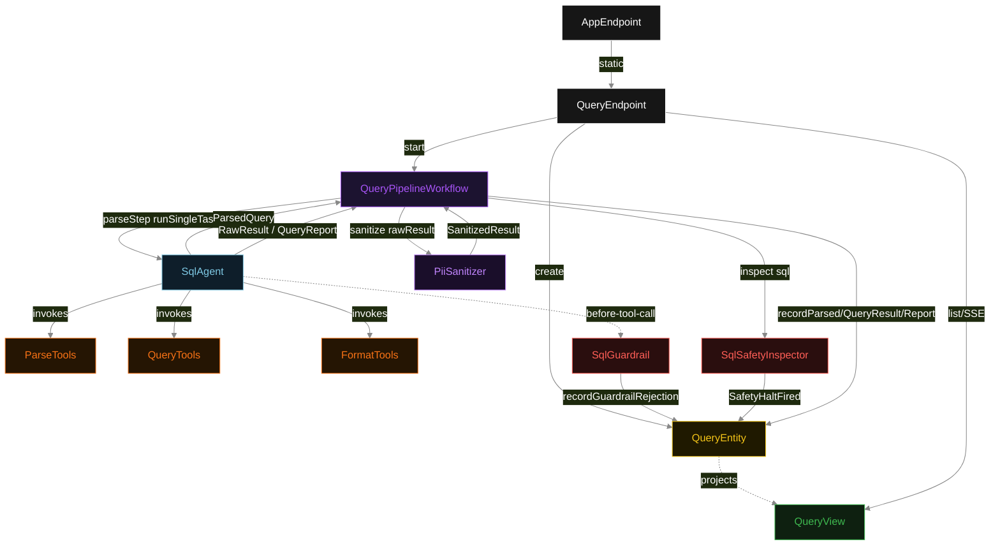
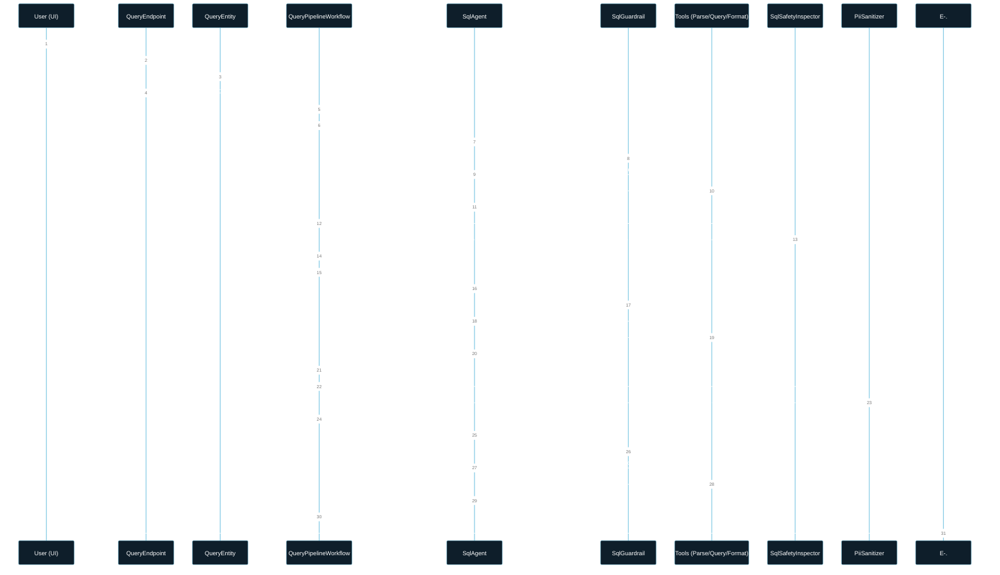
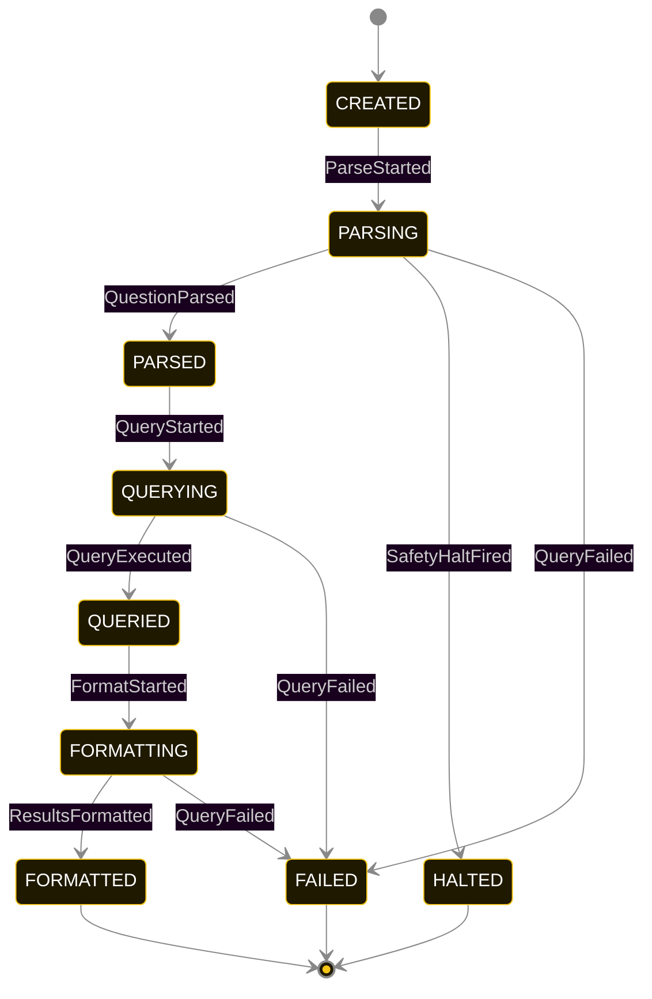
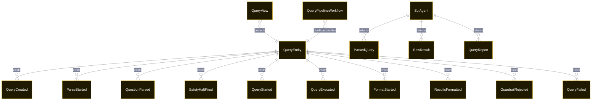

# PLAN — text-to-sql-guarded

Architectural sketch consumed by `/akka:plan` and rendered on the generated system's Architecture tab. The four mermaid diagrams below carry the theme variables and CSS overrides from Lesson 24; without them, state names render black-on-black and edge labels clip.

---

## Component graph

## Interaction sequence — J1 (happy path)

## State machine — `QueryEntity`

GuardrailRejected is a side-event recorded on the entity for audit; it does not change the status — the agent's retry stays inside the same task, and the workflow's step continues. SafetyHaltFired is terminal: the workflow ends immediately and no retry path exists for the same run. Only an exhausted retry budget or a step timeout transitions to FAILED.

## Entity model

## Component table — Java file targets

| Component | Path (generated) |
|---|---|
| `QueryEndpoint` | `api/QueryEndpoint.java` |
| `AppEndpoint` | `api/AppEndpoint.java` |
| `QueryEntity` | `application/QueryEntity.java` (state in `domain/QueryRecord.java`, events in `domain/QueryEvent.java`) |
| `QueryPipelineWorkflow` | `application/QueryPipelineWorkflow.java` |
| `SqlAgent` | `application/SqlAgent.java` (tasks in `application/SqlTasks.java`) |
| `ParseTools` | `application/ParseTools.java` |
| `QueryTools` | `application/QueryTools.java` |
| `FormatTools` | `application/FormatTools.java` |
| `SqlGuardrail` | `application/SqlGuardrail.java` |
| `SqlSafetyInspector` | `application/SqlSafetyInspector.java` |
| `PiiSanitizer` | `application/PiiSanitizer.java` |
| `QueryView` | `application/QueryView.java` |
| `MockModelProvider` (option-a only) | `application/MockModelProvider.java` |
| Bootstrap | `Bootstrap.java` |

## Concurrency notes

- **Per-step timeout**: `parseStep` 60 s, `queryStep` 60 s, `formatStep` 60 s, `haltStep` 5 s, `error` 5 s. Default step recovery `maxRetries(2).failoverTo(QueryPipelineWorkflow::error)`. The 60 s on each agent-calling step accommodates LLM latency including tool round-trips (Lesson 4).
- **Safety halt is synchronous and non-retryable**: `SqlSafetyInspector` runs in-process immediately after the agent returns `ParsedQuery`, before any network call to the database. A halted workflow writes `SafetyHaltFired` and ends; no retry path. The user submits a new question.
- **PII sanitizer runs before the FORMAT agent task**: the `RawResult` is sanitized inside `formatStep` before `runSingleTask(FORMAT_RESULTS)` is called. The agent's FORMAT task context carries the sanitized rows only; the raw rows are never passed to the LLM.
- **Idempotency**: each workflow uses `"pipeline-" + queryId` as the workflow id; restart of the same queryId is rejected by the workflow runtime. The agent instance id is `"agent-" + queryId`.
- **One agent per query**: `SqlAgent` runs three tasks per query — PARSE, QUERY, FORMAT — each with `capability(...).maxIterationsPerTask(4)`.
- **Guardrail-driven retry**: when `SqlGuardrail` rejects a tool call, the rejection is returned as a structured error to the agent loop. If all 4 iterations fail validation, the workflow step fails over to `error` and the entity transitions to `FAILED`.
- **Task-boundary handoff is the dependency contract**: `parseStep` writes `QuestionParsed` BEFORE returning; `queryStep` reads the recorded `ParsedQuery` to build its task's instruction context; `formatStep` reads both `parsedQuery` and the sanitized result. The agent itself is stateless across phases.
