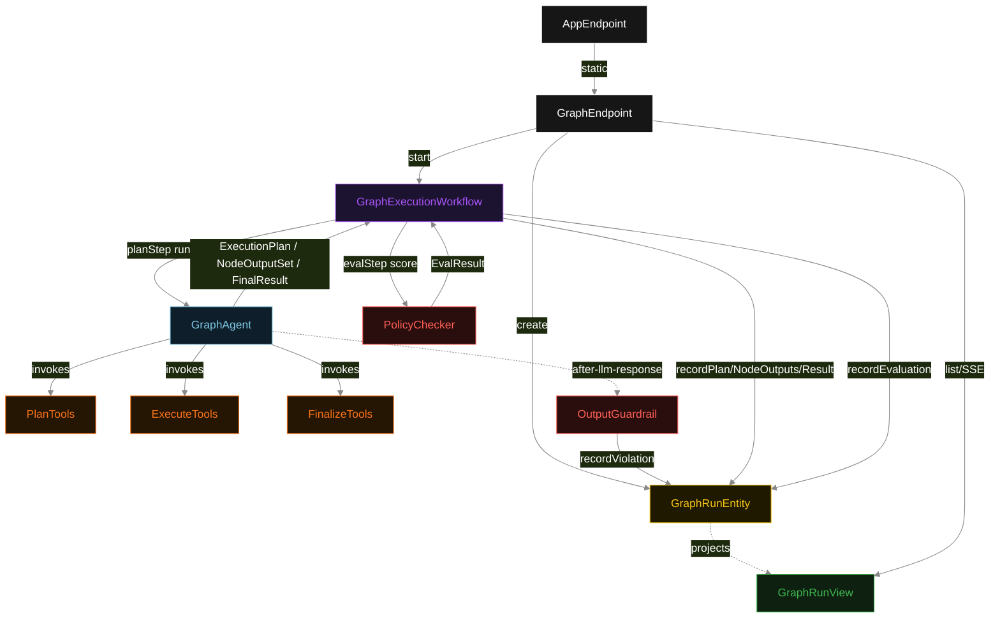
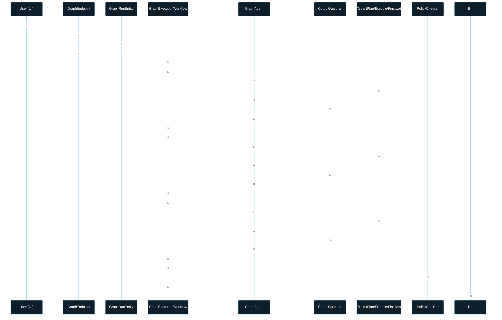
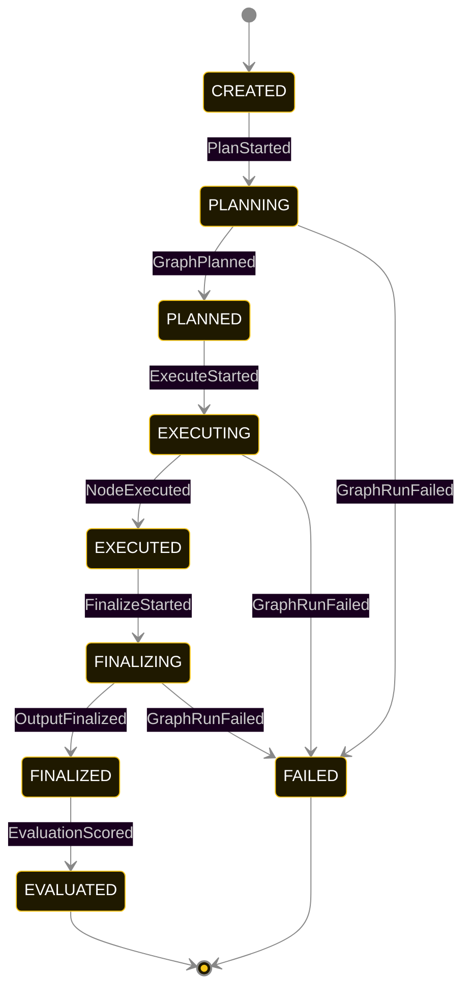
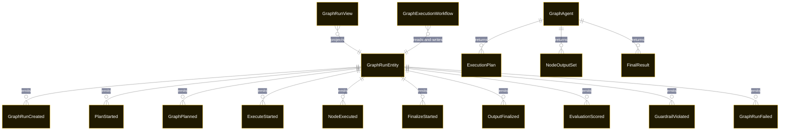

# PLAN — akka-bridge

Architectural sketch consumed by `/akka:plan` and rendered on the generated system's Architecture tab. The four mermaid diagrams below carry the theme variables and CSS overrides from Lesson 24; without them, state names render black-on-black and edge labels clip.

---

## Component graph

## Interaction sequence — J1 (happy path)

## State machine — `GraphRunEntity`

`GuardrailViolated` is a side-event recorded on the entity for audit; it does not change the status — the agent's retry stays inside the same task, and the workflow's step continues. Only an exhausted retry budget or a step timeout transitions to FAILED.

## Entity model

## Component table — Java file targets

| Component | Path (generated) |
|---|---|
| `GraphEndpoint` | `api/GraphEndpoint.java` |
| `AppEndpoint` | `api/AppEndpoint.java` |
| `GraphRunEntity` | `application/GraphRunEntity.java` (state in `domain/GraphRunRecord.java`, events in `domain/GraphRunEvent.java`) |
| `GraphExecutionWorkflow` | `application/GraphExecutionWorkflow.java` |
| `GraphAgent` | `application/GraphAgent.java` (tasks in `application/GraphTasks.java`) |
| `PlanTools` | `application/PlanTools.java` |
| `ExecuteTools` | `application/ExecuteTools.java` |
| `FinalizeTools` | `application/FinalizeTools.java` |
| `OutputGuardrail` | `application/OutputGuardrail.java` |
| `PolicyChecker` | `application/PolicyChecker.java` |
| `GraphRunView` | `application/GraphRunView.java` |
| `MockModelProvider` (option-a only) | `application/MockModelProvider.java` |
| Bootstrap | `Bootstrap.java` |

## Concurrency notes

- **Per-step timeout**: `planStep` 60 s, `executeStep` 60 s, `finalizeStep` 60 s, `evalStep` 5 s, `error` 5 s. Default step recovery `maxRetries(2).failoverTo(GraphExecutionWorkflow::error)`. The 60 s on each agent-calling step accommodates LLM latency including tool round-trips (Lesson 4).
- **Idempotency**: each workflow uses `"run-" + runId` as the workflow id; restart of the same runId is rejected by the workflow runtime. The agent instance id is `"agent-" + runId` so each run has its own per-task conversation memory.
- **One agent per run**: `GraphAgent` runs three tasks per run — PLAN, EXECUTE, FINALIZE — each with `capability(...).maxIterationsPerTask(4)`. The 4-iteration budget gives the guardrail room to block a policy-violating output and still let the agent self-correct.
- **Guardrail-driven retry**: when `OutputGuardrail` blocks a response, the block is returned as a structured error to the agent loop. The loop counts toward `maxIterationsPerTask`; if all 4 iterations fail validation, the workflow step fails over to `error` and the entity transitions to `FAILED`.
- **Eval is synchronous and deterministic**: `PolicyChecker` runs in-process inside `evalStep`. No LLM call, no external service — the same result always scores the same. This is a deliberate single-agent invariant.
- **Task-boundary handoff is the dependency contract**: `planStep` writes `GraphPlanned` BEFORE returning; `executeStep` reads the recorded `ExecutionPlan` from the entity to build its task's instruction context; `finalizeStep` reads both `ExecutionPlan` and `NodeOutputSet`. The agent itself is stateless across phases — it never holds plan + execute + finalize context in one conversation.
- **No saga / no compensation**: every step is either pure read, append-only event write, or a single-task agent call. A failed run stays at the last successful event; the UI shows the partial state for the user.
