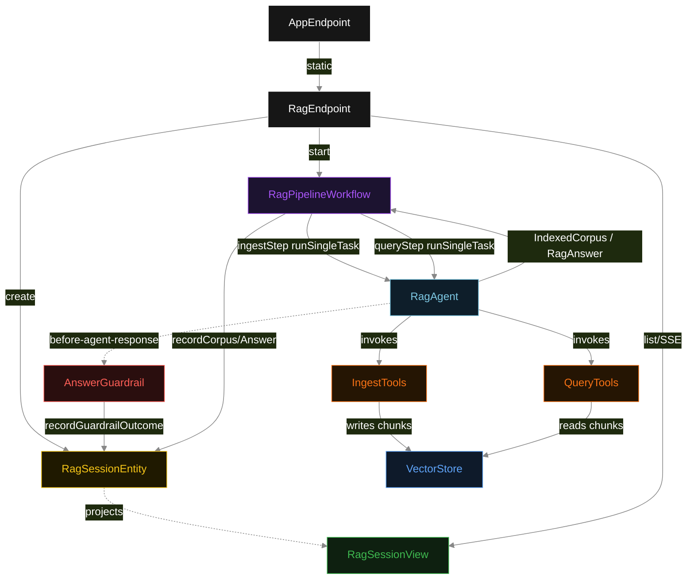
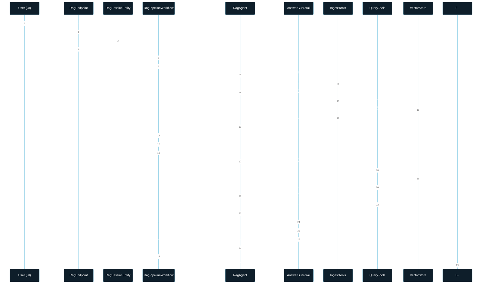
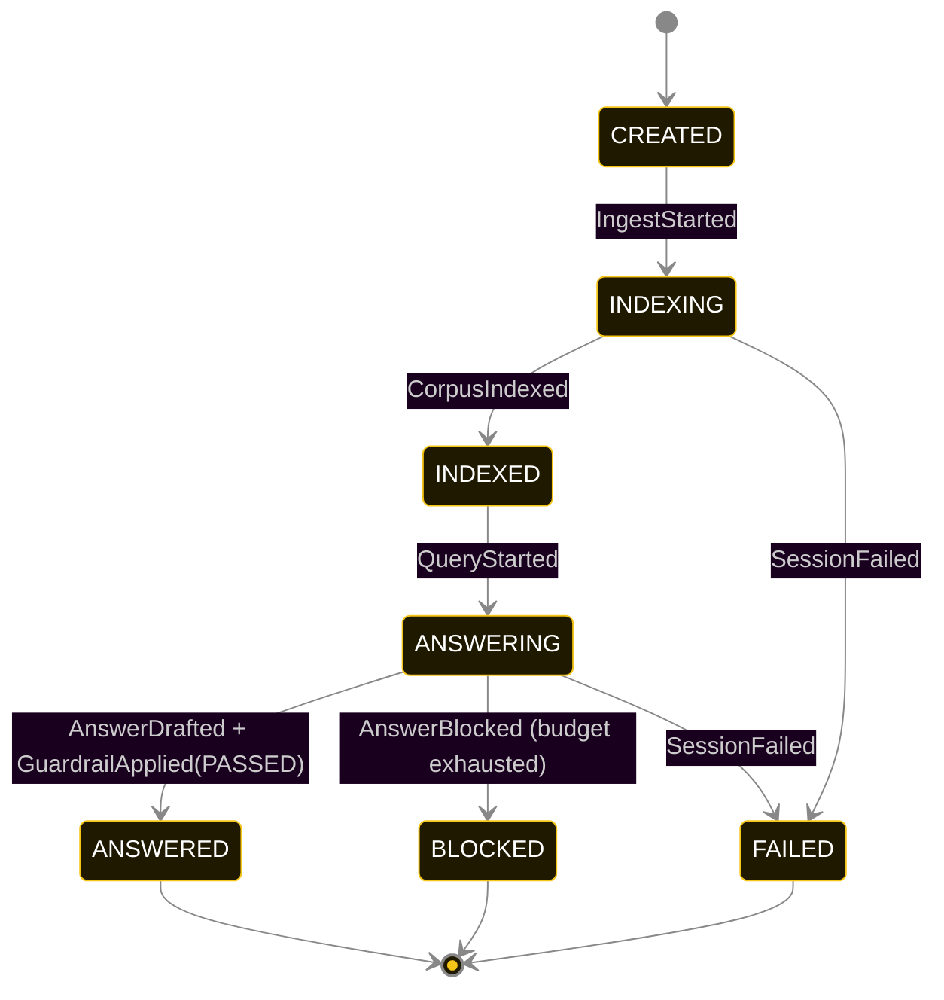
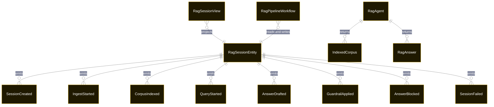

# PLAN — basic-rag-pipeline

Architectural sketch consumed by `/akka:plan` and rendered on the generated system's Architecture tab. The four mermaid diagrams below carry the theme variables and CSS overrides from Lesson 24; without them, state names render black-on-black and edge labels clip.

---

## Component graph

## Interaction sequence — J1 (happy path)

## State machine — `RagSessionEntity`

`GuardrailApplied{verdict: BLOCKED}` is recorded each time the guardrail rejects a draft answer during the agent's iteration budget. The status stays `ANSWERING` until the agent either produces a grounded answer (transitions to `ANSWERED`) or exhausts its budget (transitions to `BLOCKED`).

## Entity model

## Component table — Java file targets

| Component | Path (generated) |
|---|---|
| `RagEndpoint` | `api/RagEndpoint.java` |
| `AppEndpoint` | `api/AppEndpoint.java` |
| `RagSessionEntity` | `application/RagSessionEntity.java` (state in `domain/RagSessionRecord.java`, events in `domain/RagSessionEvent.java`) |
| `RagPipelineWorkflow` | `application/RagPipelineWorkflow.java` |
| `RagAgent` | `application/RagAgent.java` (tasks in `application/RagTasks.java`) |
| `IngestTools` | `application/IngestTools.java` |
| `QueryTools` | `application/QueryTools.java` |
| `VectorStore` | `application/VectorStore.java` |
| `AnswerGuardrail` | `application/AnswerGuardrail.java` |
| `RagSessionView` | `application/RagSessionView.java` |
| `MockModelProvider` (option-a only) | `application/MockModelProvider.java` |
| Bootstrap | `Bootstrap.java` |

## Concurrency notes

- **Per-step timeout**: `ingestStep` 60 s, `queryStep` 60 s, `error` 5 s. Default step recovery `maxRetries(2).failoverTo(RagPipelineWorkflow::error)`. The 60 s on each agent-calling step accommodates LLM latency including tool round-trips (Lesson 4).
- **Idempotency**: each workflow uses `"rag-" + sessionId` as the workflow id; restart of the same sessionId is rejected by the workflow runtime. The agent instance id is `"agent-" + sessionId` so each session has its own per-task conversation memory.
- **One agent per session**: `RagAgent` runs two tasks per session — INGEST and QUERY — each with `capability(...).maxIterationsPerTask(4)`. The 4-iteration budget gives the guardrail room to reject a draft answer and still let the agent self-correct.
- **Guardrail-driven retry**: when `AnswerGuardrail` rejects a draft answer, the rejection is returned as a structured error to the agent loop. The loop counts toward `maxIterationsPerTask`; if all 4 iterations produce ungrounded citations, the workflow step fails over to `error` and the entity transitions to `BLOCKED` then `FAILED`.
- **VectorStore is in-process and shared across tasks**: the same singleton is written by `IngestTools.indexChunks` in the INGEST task and read by `QueryTools.retrieveChunks` in the QUERY task. Because `ingestStep` writes `CorpusIndexed` and the workflow advances to `queryStep` only after that write, there is no concurrency hazard — the write is complete before the read begins.
- **Task-boundary handoff is the dependency contract**: `ingestStep` writes `CorpusIndexed` BEFORE returning; `queryStep` reads the recorded `IndexedCorpus` from the entity to build the QUERY task's instruction context. The agent itself is stateless across phases — it never holds ingest + query context in one conversation.
- **No saga / no compensation**: every step is either pure read, append-only event write, or a single-task agent call. A failed session stays at the last successful event; the UI shows the partial state.
