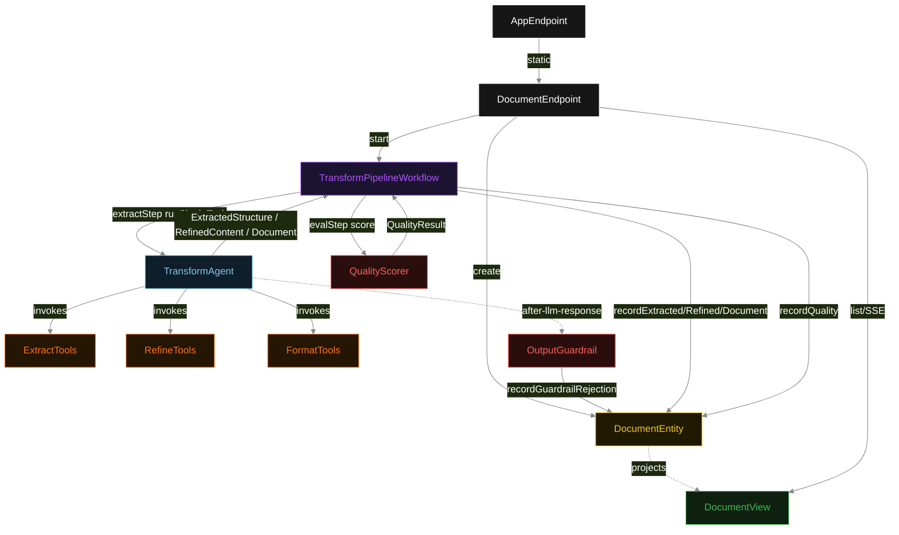
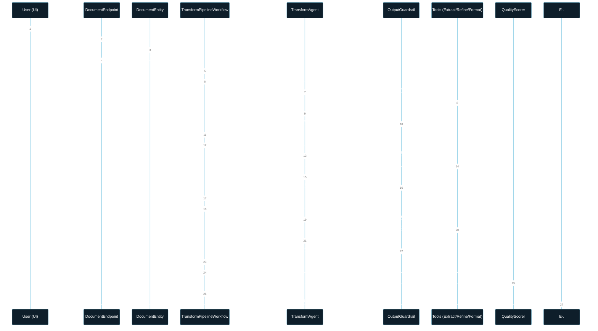
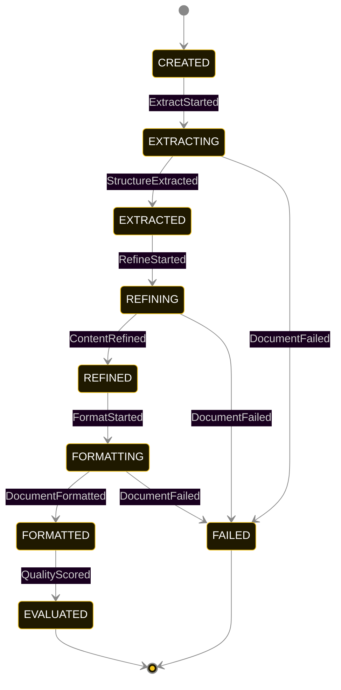
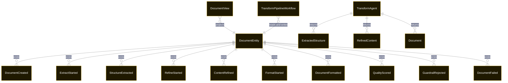

# PLAN — chain-workflow

Architectural sketch consumed by `/akka:plan` and rendered on the generated system's Architecture tab. The four mermaid diagrams below carry the theme variables and CSS overrides from Lesson 24; without them, state names render black-on-black and edge labels clip.

---

## Component graph

## Interaction sequence — J1 (happy path)

## State machine — `DocumentEntity`

`GuardrailRejected` is a side-event recorded on the entity for audit; it does not change the status — the agent's retry stays inside the same task, and the workflow's step continues. Only an exhausted retry budget or a step timeout transitions to FAILED.

## Entity model

## Component table — Java file targets

| Component | Path (generated) |
|---|---|
| `DocumentEndpoint` | `api/DocumentEndpoint.java` |
| `AppEndpoint` | `api/AppEndpoint.java` |
| `DocumentEntity` | `application/DocumentEntity.java` (state in `domain/DocumentRecord.java`, events in `domain/DocumentEvent.java`) |
| `TransformPipelineWorkflow` | `application/TransformPipelineWorkflow.java` |
| `TransformAgent` | `application/TransformAgent.java` (tasks in `application/TransformTasks.java`) |
| `ExtractTools` | `application/ExtractTools.java` |
| `RefineTools` | `application/RefineTools.java` |
| `FormatTools` | `application/FormatTools.java` |
| `OutputGuardrail` | `application/OutputGuardrail.java` |
| `QualityScorer` | `application/QualityScorer.java` |
| `DocumentView` | `application/DocumentView.java` |
| `MockModelProvider` (option-a only) | `application/MockModelProvider.java` |
| Bootstrap | `Bootstrap.java` |

## Concurrency notes

- **Per-step timeout**: `extractStep` 60 s, `refineStep` 60 s, `formatStep` 60 s, `evalStep` 5 s, `error` 5 s. Default step recovery `maxRetries(2).failoverTo(TransformPipelineWorkflow::error)`. The 60 s on each agent-calling step accommodates LLM latency including tool round-trips (Lesson 4).
- **Idempotency**: each workflow uses `"chain-" + documentId` as the workflow id; restart of the same documentId is rejected by the workflow runtime. The agent instance id is `"agent-" + documentId` so each document has its own per-task conversation memory.
- **One agent per document**: `TransformAgent` runs three tasks per document — EXTRACT, REFINE, FORMAT — each with `capability(...).maxIterationsPerTask(4)`. The 4-iteration budget gives the guardrail room to reject an invalid output and still let the agent self-correct.
- **Guardrail-driven retry**: when `OutputGuardrail` rejects an output, the rejection is returned as a structured error to the agent loop. The loop counts toward `maxIterationsPerTask`; if all 4 iterations fail validation, the workflow step fails over to `error` and the entity transitions to `FAILED`.
- **Eval is synchronous and deterministic**: `QualityScorer` runs in-process inside `evalStep`. No LLM call, no external service — the same document always scores the same. This is a deliberate single-agent invariant.
- **Task-boundary handoff is the dependency contract**: `extractStep` writes `StructureExtracted` BEFORE returning; `refineStep` reads the recorded `ExtractedStructure` from the entity to build its task's instruction context; `formatStep` reads both `ExtractedStructure` and `RefinedContent`. The agent itself is stateless across stages — it never holds extract + refine + format context in one conversation.
- **No saga / no compensation**: every step is either pure read, append-only event write, or a single-task agent call. A failed document stays at the last successful event; the UI shows the partial state for the user.
