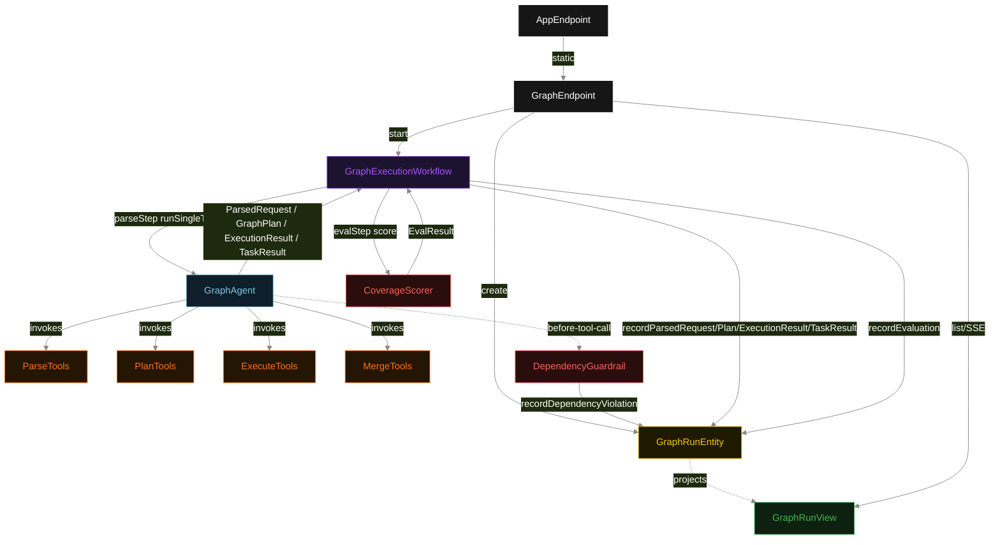
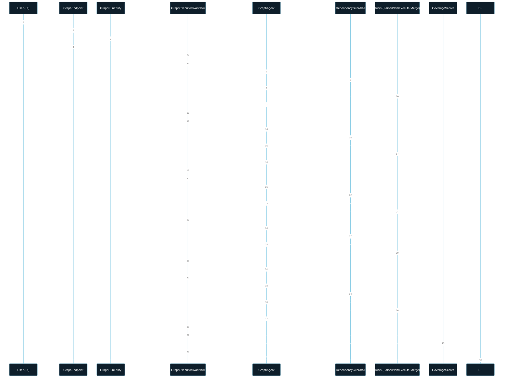
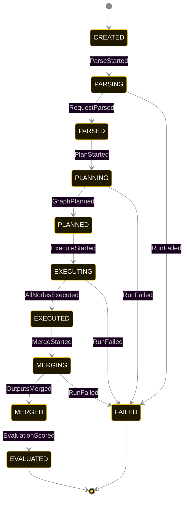
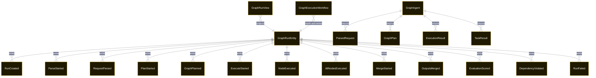

# PLAN — graph-pattern

Architectural sketch consumed by `/akka:plan` and rendered on the generated system's Architecture tab. The four mermaid diagrams below carry the theme variables and CSS overrides from Lesson 24; without them, state names render black-on-black and edge labels clip.

---

## Component graph

## Interaction sequence — J1 (happy path)

## State machine — `GraphRunEntity`

`DependencyViolated` is a side-event recorded on the entity for audit within the EXECUTING state; it does not change status. `NodeExecuted` events are recorded individually within the EXECUTING state as each node completes. Only an exhausted retry budget or a step timeout transitions to FAILED.

## Entity model

## Component table — Java file targets

| Component | Path (generated) |
|---|---|
| `GraphEndpoint` | `api/GraphEndpoint.java` |
| `AppEndpoint` | `api/AppEndpoint.java` |
| `GraphRunEntity` | `application/GraphRunEntity.java` (state in `domain/RunRecord.java`, events in `domain/RunEvent.java`) |
| `GraphExecutionWorkflow` | `application/GraphExecutionWorkflow.java` |
| `GraphAgent` | `application/GraphAgent.java` (tasks in `application/GraphTasks.java`) |
| `ParseTools` | `application/ParseTools.java` |
| `PlanTools` | `application/PlanTools.java` |
| `ExecuteTools` | `application/ExecuteTools.java` |
| `MergeTools` | `application/MergeTools.java` |
| `DependencyGuardrail` | `application/DependencyGuardrail.java` |
| `CoverageScorer` | `application/CoverageScorer.java` |
| `GraphRunView` | `application/GraphRunView.java` |
| `MockModelProvider` (option-a only) | `application/MockModelProvider.java` |
| Bootstrap | `Bootstrap.java` |

## Concurrency notes

- **Per-step timeout**: `parseStep` 60 s, `planStep` 60 s, `executeStep` 120 s (node execution may span multiple tool round-trips), `mergeStep` 60 s, `evalStep` 5 s, `error` 5 s. Default step recovery `maxRetries(2).failoverTo(GraphExecutionWorkflow::error)`. The extended timeout on `executeStep` accommodates a multi-node DAG where each node's tool call goes through an LLM iteration.
- **Idempotency**: each workflow uses `"graph-" + runId` as the workflow id; restart of the same `runId` is rejected by the workflow runtime. The agent instance id is `"agent-" + runId`.
- **One agent per run**: `GraphAgent` runs four tasks per run — PARSE, PLAN, EXECUTE, MERGE — each with `capability(...).maxIterationsPerTask(5)`. The 5-iteration budget on EXECUTE gives the guardrail room to reject an out-of-order node-execution call and let the agent self-correct.
- **Incremental NodeExecuted writes**: within `executeStep`, the workflow writes `NodeExecuted{nodeId, output}` to the entity after each `runNode` tool call returns. `DependencyGuardrail` reads this partial state to enforce per-node predecessor checks. `AllNodesExecuted` is written once the full `ExecutionResult` is committed.
- **Eval is synchronous and deterministic**: `CoverageScorer` runs in-process inside `evalStep`. No LLM call, no external service — the same result always scores the same. This is a deliberate single-agent invariant.
- **No saga / no compensation**: every step is either pure read, append-only event write, or a single-task agent call. A failed run stays at the last successful event; the UI shows the partial state.
