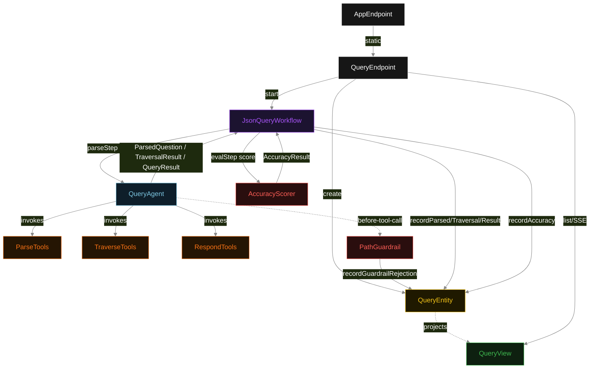
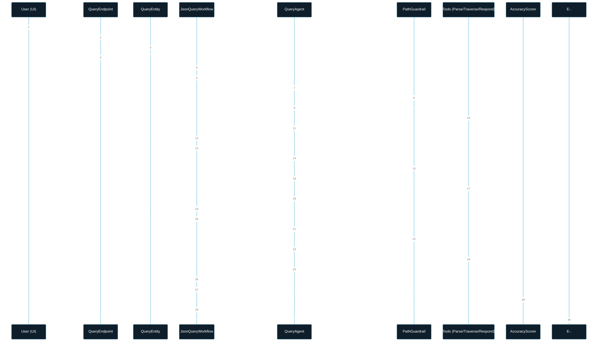
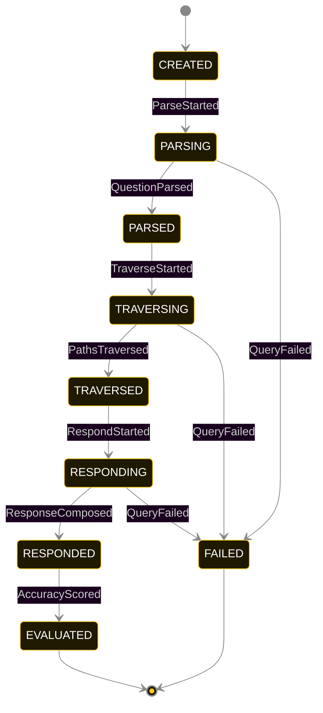
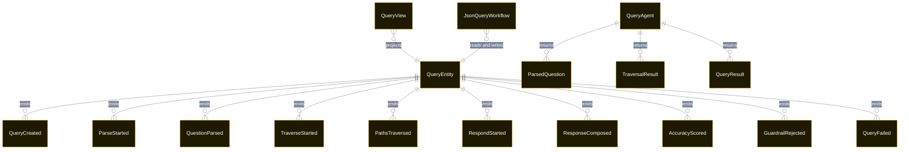

# PLAN — json-query-engine

Architectural sketch consumed by `/akka:plan` and rendered on the generated system's Architecture tab. The four mermaid diagrams below carry the theme variables and CSS overrides from Lesson 24; without them, state names render black-on-black and edge labels clip.

---

## Component graph

## Interaction sequence — J1 (happy path)

## State machine — `QueryEntity`

GuardrailRejected is a side-event recorded on the entity for audit; it does not change the status — the agent's retry stays inside the same task, and the workflow's step continues. Only an exhausted retry budget or a step timeout transitions to FAILED.

## Entity model

## Component table — Java file targets

| Component | Path (generated) |
|---|---|
| `QueryEndpoint` | `api/QueryEndpoint.java` |
| `AppEndpoint` | `api/AppEndpoint.java` |
| `QueryEntity` | `application/QueryEntity.java` (state in `domain/QueryRecord.java`, events in `domain/QueryEvent.java`) |
| `JsonQueryWorkflow` | `application/JsonQueryWorkflow.java` |
| `QueryAgent` | `application/QueryAgent.java` (tasks in `application/QueryTasks.java`) |
| `ParseTools` | `application/ParseTools.java` |
| `TraverseTools` | `application/TraverseTools.java` |
| `RespondTools` | `application/RespondTools.java` |
| `PathGuardrail` | `application/PathGuardrail.java` |
| `AccuracyScorer` | `application/AccuracyScorer.java` |
| `QueryView` | `application/QueryView.java` |
| `MockModelProvider` (option-a only) | `application/MockModelProvider.java` |
| Bootstrap | `Bootstrap.java` |

## Concurrency notes

- **Per-step timeout**: `parseStep` 60 s, `traverseStep` 60 s, `respondStep` 60 s, `evalStep` 5 s, `error` 5 s. Default step recovery `maxRetries(2).failoverTo(JsonQueryWorkflow::error)`. The 60 s on each agent-calling step accommodates LLM latency including tool round-trips (Lesson 4).
- **Idempotency**: each workflow uses `"workflow-" + queryId` as the workflow id; restart of the same queryId is rejected by the workflow runtime. The agent instance id is `"agent-" + queryId` so each query has its own per-task conversation memory.
- **One agent per query**: `QueryAgent` runs three tasks per query — PARSE, TRAVERSE, RESPOND — each with `capability(...).maxIterationsPerTask(4)`. The 4-iteration budget gives the path guardrail room to reject a malformed expression and still let the agent self-correct.
- **Guardrail-driven retry**: when `PathGuardrail` rejects a tool call, the rejection is returned as a structured error to the agent loop. The loop counts toward `maxIterationsPerTask`; if all 4 iterations fail validation, the workflow step fails over to `error` and the entity transitions to `FAILED`.
- **Eval is synchronous and deterministic**: `AccuracyScorer` runs in-process inside `evalStep`. No LLM call, no external service — the same query result always scores the same.
- **Task-boundary handoff is the dependency contract**: `parseStep` writes `QuestionParsed` BEFORE returning; `traverseStep` reads the recorded `ParsedQuestion` from the entity to build its task's instruction context; `respondStep` reads both `ParsedQuestion` and `TraversalResult`. The agent itself is stateless across phases.
- **No saga / no compensation**: every step is either pure read, append-only event write, or a single-task agent call. A failed query stays at the last successful event; the UI shows the partial state for the user.
