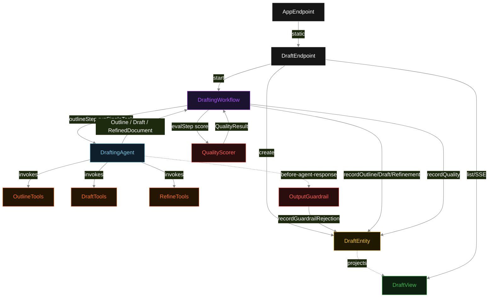
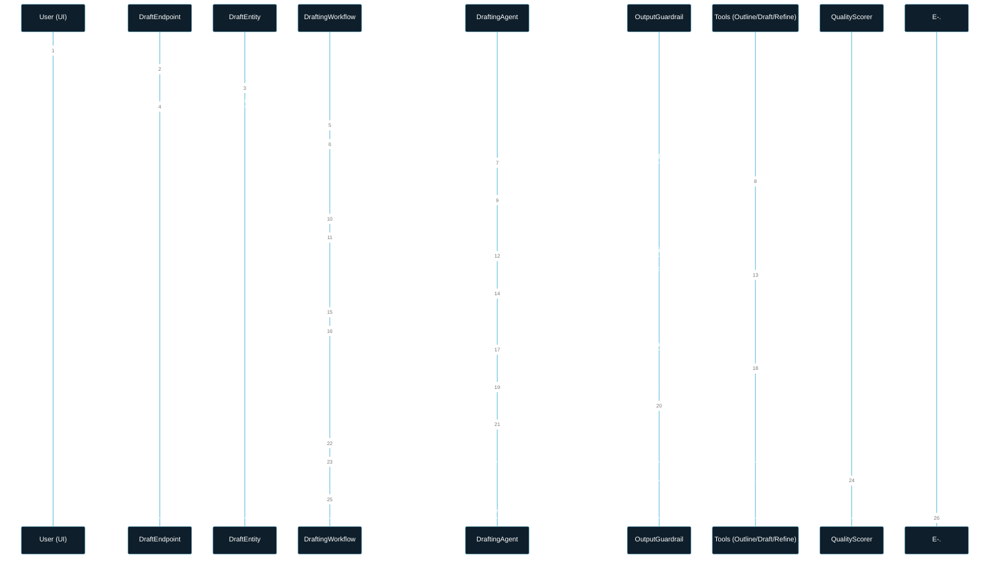
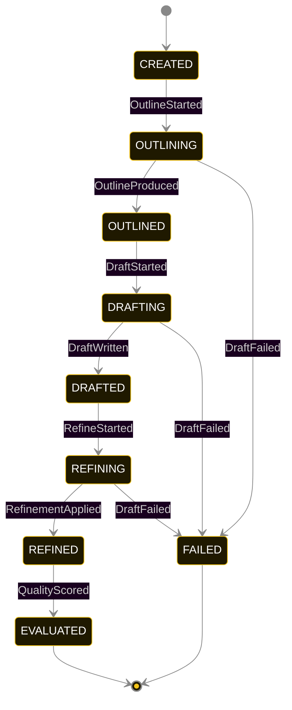
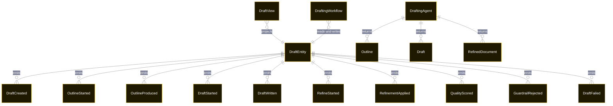

# PLAN — prompt-chaining-workflow

Architectural sketch consumed by `/akka:plan` and rendered on the generated system's Architecture tab. The four mermaid diagrams below carry the theme variables and CSS overrides from Lesson 24; without them, state names render black-on-black and edge labels clip.

---

## Component graph

## Interaction sequence — J1 (happy path)

## State machine — `DraftEntity`

`GuardrailRejected` is a side-event recorded on the entity for audit; it does not change the status — the workflow retries `refineStep` and the entity stays in `REFINING`. Only an exhausted retry budget or a step timeout transitions to `FAILED`.

## Entity model

## Component table — Java file targets

| Component | Path (generated) |
|---|---|
| `DraftEndpoint` | `api/DraftEndpoint.java` |
| `AppEndpoint` | `api/AppEndpoint.java` |
| `DraftEntity` | `application/DraftEntity.java` (state in `domain/DraftRecord.java`, events in `domain/DraftEvent.java`) |
| `DraftingWorkflow` | `application/DraftingWorkflow.java` |
| `DraftingAgent` | `application/DraftingAgent.java` (tasks in `application/DraftingTasks.java`) |
| `OutlineTools` | `application/OutlineTools.java` |
| `DraftTools` | `application/DraftTools.java` |
| `RefineTools` | `application/RefineTools.java` |
| `OutputGuardrail` | `application/OutputGuardrail.java` |
| `QualityScorer` | `application/QualityScorer.java` |
| `DraftView` | `application/DraftView.java` |
| `MockModelProvider` (option-a only) | `application/MockModelProvider.java` |
| Bootstrap | `Bootstrap.java` |

## Concurrency notes

- **Per-step timeout**: `outlineStep` 60 s, `draftStep` 90 s, `refineStep` 90 s, `evalStep` 5 s, `error` 5 s. Default step recovery `maxRetries(2).failoverTo(DraftingWorkflow::error)`. The 90 s on draft and refine steps accommodates LLM latency for longer document generation (Lesson 4).
- **Idempotency**: each workflow uses `"drafting-" + draftId` as the workflow id; restart of the same draftId is rejected by the workflow runtime. The agent instance id is `"agent-" + draftId` so each draft has its own per-task conversation memory.
- **One agent per draft**: `DraftingAgent` runs three tasks per draft — OUTLINE, DRAFT, REFINE — each with `capability(...).maxIterationsPerTask(4)`. The 4-iteration budget accommodates the guardrail retry path where refineStep must be retried.
- **Guardrail-driven retry on refineStep**: when `OutputGuardrail` rejects a `RefinedDocument`, the rejection reason is appended to the next retry's instruction context and `refineStep` re-invokes `runSingleTask`. The retry counter is tracked in the workflow step; if both retries fail, the workflow steps over to `error` and the entity transitions to `FAILED`.
- **Eval is synchronous and deterministic**: `QualityScorer` runs in-process inside `evalStep`. No LLM call, no external service — the same document always scores the same.
- **Task-boundary handoff is the dependency contract**: `outlineStep` writes `OutlineProduced` BEFORE returning; `draftStep` reads the recorded `Outline` from the entity to build its task's instruction context; `refineStep` reads both `Outline` and `Draft`. The agent itself is stateless across steps.
- **No saga / no compensation**: every step is either pure read, append-only event write, or a single-task agent call. A failed draft stays at the last successful event; the UI shows the partial state.
