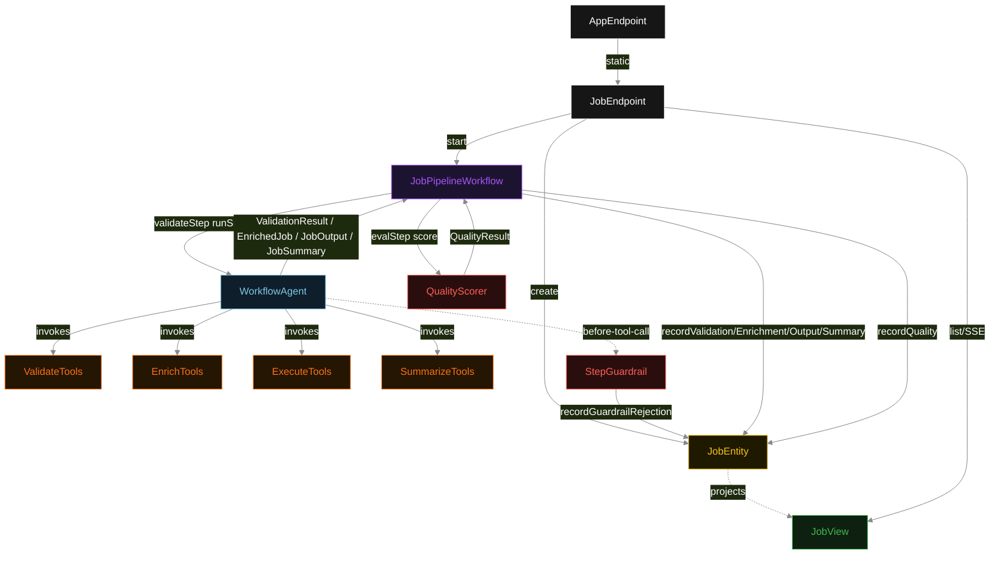
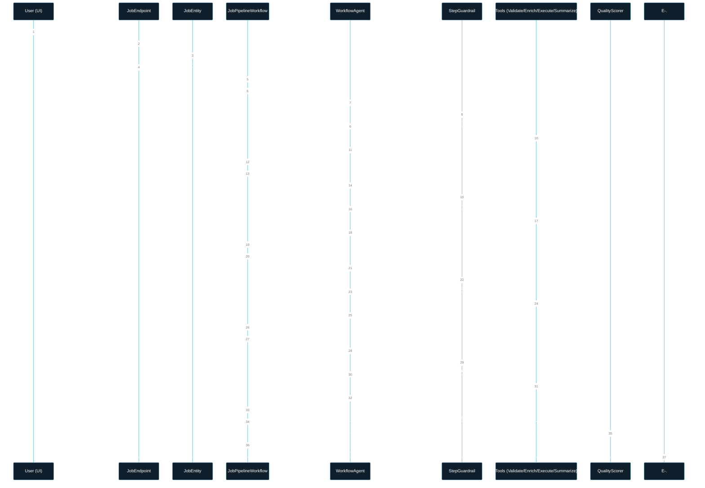
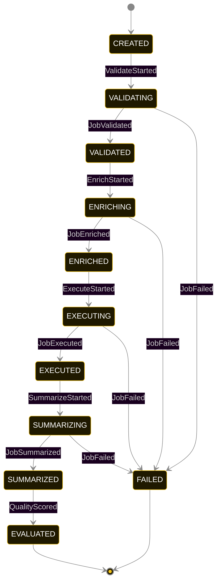
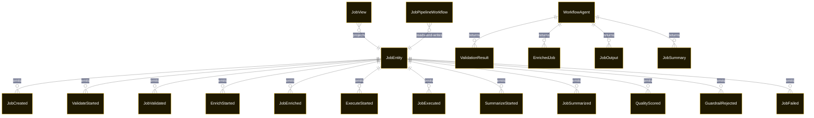

# PLAN — sequential-workflow

Architectural sketch consumed by `/akka:plan` and rendered on the generated system's Architecture tab. The four mermaid diagrams below carry the theme variables and CSS overrides from Lesson 24; without them, state names render black-on-black and edge labels clip.

---

## Component graph

## Interaction sequence — J1 (happy path)

## State machine — `JobEntity`

GuardrailRejected is a side-event recorded on the entity for audit; it does not change the status — the agent's retry stays inside the same task, and the workflow's step continues. Only an exhausted retry budget or a step timeout transitions to FAILED.

## Entity model

## Component table — Java file targets

| Component | Path (generated) |
|---|---|
| `JobEndpoint` | `api/JobEndpoint.java` |
| `AppEndpoint` | `api/AppEndpoint.java` |
| `JobEntity` | `application/JobEntity.java` (state in `domain/JobRecord.java`, events in `domain/JobEvent.java`) |
| `JobPipelineWorkflow` | `application/JobPipelineWorkflow.java` |
| `WorkflowAgent` | `application/WorkflowAgent.java` (tasks in `application/WorkflowTasks.java`) |
| `ValidateTools` | `application/ValidateTools.java` |
| `EnrichTools` | `application/EnrichTools.java` |
| `ExecuteTools` | `application/ExecuteTools.java` |
| `SummarizeTools` | `application/SummarizeTools.java` |
| `StepGuardrail` | `application/StepGuardrail.java` |
| `QualityScorer` | `application/QualityScorer.java` |
| `JobView` | `application/JobView.java` |
| `MockModelProvider` (option-a only) | `application/MockModelProvider.java` |
| Bootstrap | `Bootstrap.java` |

## Concurrency notes

- **Per-step timeout**: `validateStep` 60 s, `enrichStep` 60 s, `executeStep` 60 s, `summarizeStep` 60 s, `evalStep` 5 s, `error` 5 s. Default step recovery `maxRetries(2).failoverTo(JobPipelineWorkflow::error)`. The 60 s on each agent-calling step accommodates LLM latency including tool round-trips (Lesson 4).
- **Idempotency**: each workflow uses `"pipeline-" + jobId` as the workflow id; restart of the same jobId is rejected by the workflow runtime. The agent instance id is `"agent-" + jobId` so each job has its own per-task conversation memory.
- **One agent per job**: `WorkflowAgent` runs four tasks per job — VALIDATE, ENRICH, EXECUTE, SUMMARIZE — each with `capability(...).maxIterationsPerTask(4)`. The 4-iteration budget gives the guardrail room to reject a misordered tool call and still let the agent self-correct.
- **Guardrail-driven retry**: when `StepGuardrail` rejects a tool call, the rejection is returned as a structured error to the agent loop. The loop counts toward `maxIterationsPerTask`; if all 4 iterations fail validation, the workflow step fails over to `error` and the entity transitions to `FAILED`.
- **Eval is synchronous and deterministic**: `QualityScorer` runs in-process inside `evalStep`. No LLM call, no external service — the same job always scores the same. This is a deliberate single-agent invariant.
- **Task-boundary handoff is the dependency contract**: `validateStep` writes `JobValidated` BEFORE returning; `enrichStep` reads the recorded `ValidationResult` from the entity to build its task's instruction context; `executeStep` reads both `ValidationResult` and `EnrichedJob`; `summarizeStep` reads `JobOutput`. The agent itself is stateless across phases — it never holds validate + enrich + execute + summarize context in one conversation.
- **No saga / no compensation**: every step is either pure read, append-only event write, or a single-task agent call. A failed job stays at the last successful event; the UI shows the partial state for the user.
