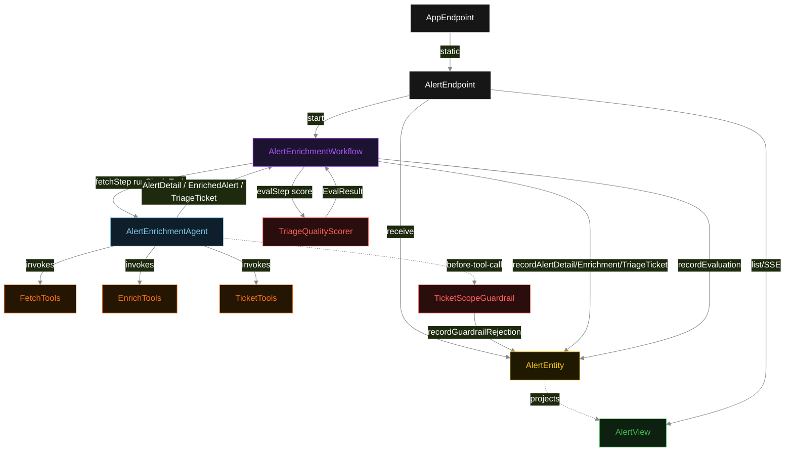
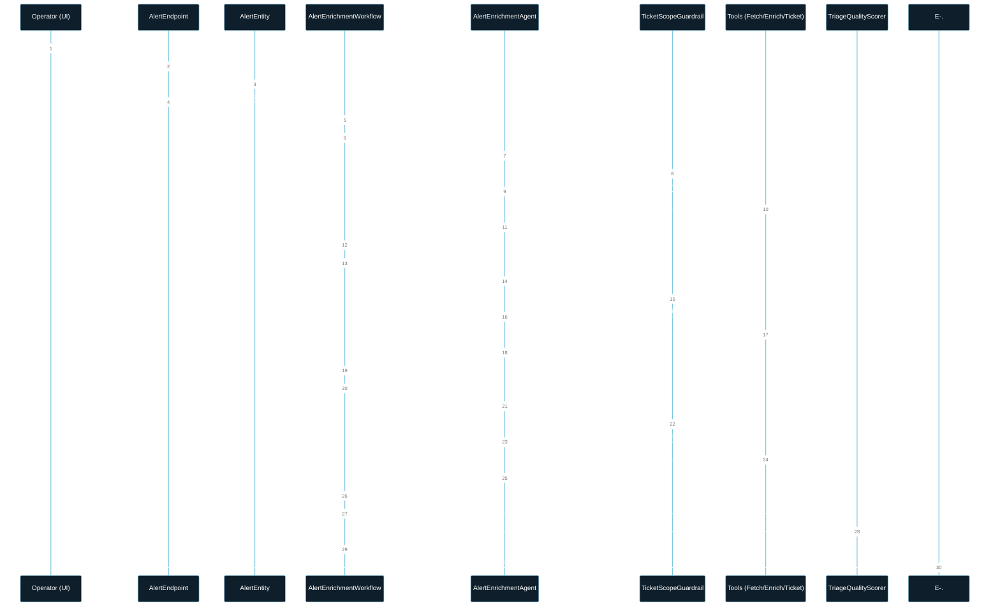
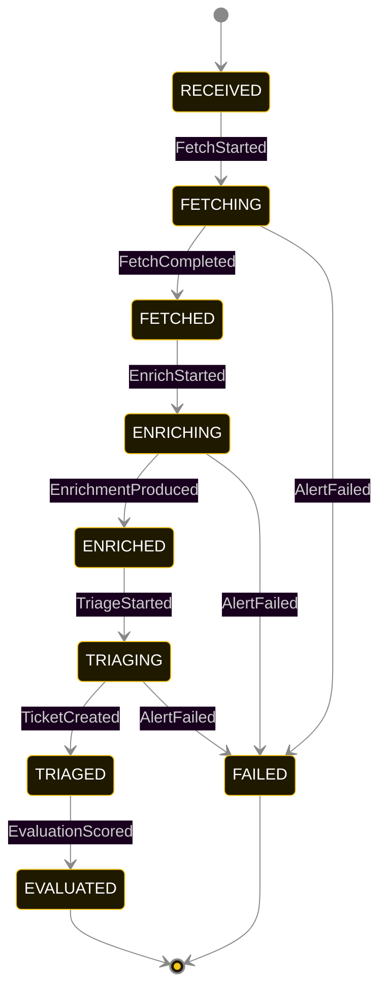
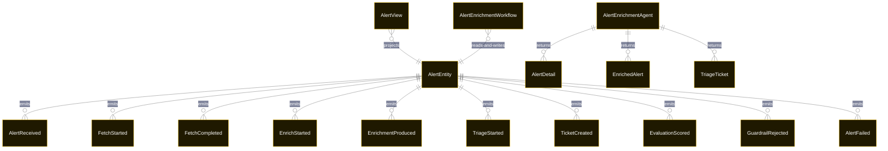

# PLAN — siem-enrichment

Architectural sketch consumed by `/akka:plan` and rendered on the generated system's Architecture tab. The four mermaid diagrams below carry the theme variables and CSS overrides from Lesson 24; without them, state names render black-on-black and edge labels clip.

---

## Component graph

## Interaction sequence — J1 (happy path)

## State machine — `AlertEntity`

GuardrailRejected is a side-event recorded on the entity for audit; it does not change the status — the agent's retry stays inside the same task, and the workflow's step continues. Only an exhausted retry budget or a step timeout transitions to FAILED.

## Entity model

## Component table — Java file targets

| Component | Path (generated) |
|---|---|
| `AlertEndpoint` | `api/AlertEndpoint.java` |
| `AppEndpoint` | `api/AppEndpoint.java` |
| `AlertEntity` | `application/AlertEntity.java` (state in `domain/AlertRecord.java`, events in `domain/AlertEvent.java`) |
| `AlertEnrichmentWorkflow` | `application/AlertEnrichmentWorkflow.java` |
| `AlertEnrichmentAgent` | `application/AlertEnrichmentAgent.java` (tasks in `application/AlertTasks.java`) |
| `FetchTools` | `application/FetchTools.java` |
| `EnrichTools` | `application/EnrichTools.java` |
| `TicketTools` | `application/TicketTools.java` |
| `TicketScopeGuardrail` | `application/TicketScopeGuardrail.java` |
| `TriageQualityScorer` | `application/TriageQualityScorer.java` |
| `AlertView` | `application/AlertView.java` |
| `MockModelProvider` (option-a only) | `application/MockModelProvider.java` |
| Bootstrap | `Bootstrap.java` |

## Concurrency notes

- **Per-step timeout**: `fetchStep` 60 s, `enrichStep` 60 s, `ticketStep` 60 s, `evalStep` 5 s, `error` 5 s. Default step recovery `maxRetries(2).failoverTo(AlertEnrichmentWorkflow::error)`. The 60 s on each agent-calling step accommodates LLM latency including tool round-trips (Lesson 4).
- **Idempotency**: each workflow uses `"pipeline-" + alertId` as the workflow id; restart of the same alertId is rejected by the workflow runtime. The agent instance id is `"agent-" + alertId` so each alert has its own per-task conversation memory.
- **One agent per alert**: `AlertEnrichmentAgent` runs three tasks per alert — FETCH, ENRICH, TRIAGE — each with `capability(...).maxIterationsPerTask(4)`. The 4-iteration budget gives the guardrail room to reject a misordered tool call and still let the agent self-correct.
- **Guardrail-driven retry**: when `TicketScopeGuardrail` rejects a tool call, the rejection is returned as a structured error to the agent loop. If all 4 iterations fail validation, the workflow step fails over to `error` and the entity transitions to FAILED.
- **Eval is synchronous and deterministic**: `TriageQualityScorer` runs in-process inside `evalStep`. No LLM call — the same enriched alert always scores the same. This is a deliberate single-agent invariant.
- **Task-boundary handoff is the dependency contract**: `fetchStep` writes `FetchCompleted` BEFORE returning; `enrichStep` reads the recorded `AlertDetail` from the entity to build its task's instruction context; `ticketStep` reads both `AlertDetail` and `EnrichedAlert`. The agent itself is stateless across phases.
- **No saga / no compensation**: every step is either pure read, append-only event write, or a single-task agent call. A failed alert stays at the last successful event; the UI shows the partial state.
- **External write boundary**: `TicketTools.openZendeskTicket` is the only tool that would make a write to an external system in a production deployment. `TicketScopeGuardrail` is the enforcement point that ensures this call never fires on an unenriched alert. In the blueprint's in-process stub, the Zendesk call returns a deterministic `ZendeskTicketRef`; a deployer swaps the stub for a real Zendesk client without changing the guardrail or workflow.
