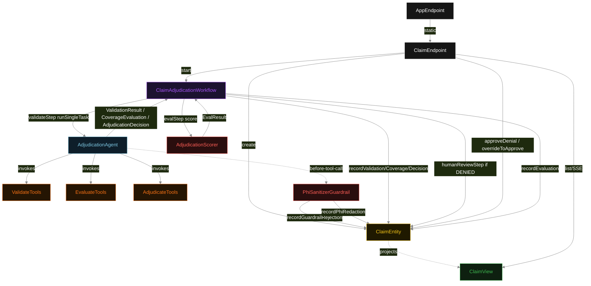
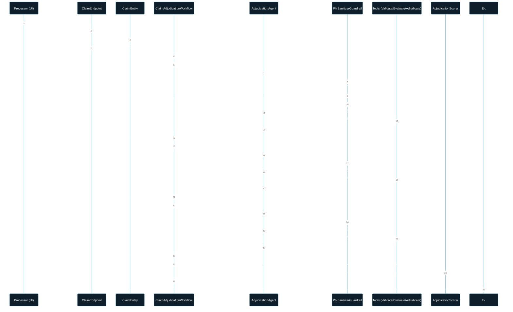
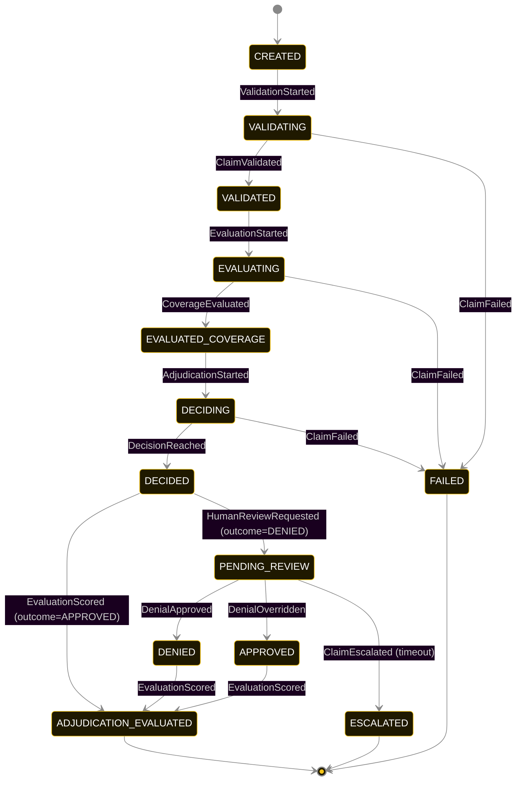

# PLAN — claim-adjudication-agent

Architectural sketch consumed by `/akka:plan` and rendered on the generated system's Architecture tab. The four mermaid diagrams below carry the theme variables and CSS overrides from Lesson 24; without them, state names render black-on-black and edge labels clip.

---

## Component graph

## Interaction sequence — J1 (approval path)

## State machine — `ClaimEntity`

`PhiRedacted` and `GuardrailRejected` are side-events recorded on the entity for audit; they do not change the status. Only an exhausted retry budget, a step timeout, or a PHI sanitisation error transitions to `FAILED`.

## Entity model

```mermaid
%%{init: {'theme':'base','themeVariables':{'primaryColor':'#1f1900','primaryTextColor':'#ffffff','primaryBorderColor':'#F5C518','lineColor':'#888','nodeTextColor':'#ffffff','stateLabelColor':'#ffffff'}}}%%
erDiagram
  ClaimEntity ||--o{ ClaimCreated : emits
  ClaimEntity ||--o{ ValidationStarted : emits
  ClaimEntity ||--o{ ClaimValidated : emits
  ClaimEntity ||--o{ EvaluationStarted : emits
  ClaimEntity ||--o{ CoverageEvaluated : emits
  ClaimEntity ||--o{ AdjudicationStarted : emits
  ClaimEntity ||--o{ DecisionReached : emits
  ClaimEntity ||--o{ HumanReviewRequested : emits
  ClaimEntity ||--o{ DenialApproved : emits
  ClaimEntity ||--o{ DenialOverridden : emits
  ClaimEntity ||--o{ ClaimEscalated : emits
  ClaimEntity ||--o{ EvaluationScored : emits
  ClaimEntity ||--o{ PhiRedacted : emits
  ClaimEntity ||--o{ GuardrailRejected : emits
  ClaimEntity ||--o{ ClaimFailed : emits
  ClaimView }o--|| ClaimEntity : projects
  ClaimAdjudicationWorkflow }o--|| ClaimEntity : reads-and-writes
  AdjudicationAgent ||--o{ ValidationResult : returns
  AdjudicationAgent ||--o{ CoverageEvaluation : returns
  AdjudicationAgent ||--o{ AdjudicationDecision : returns
```

## Component table — Java file targets

| Component | Path (generated) |
|---|---|
| `ClaimEndpoint` | `api/ClaimEndpoint.java` |
| `AppEndpoint` | `api/AppEndpoint.java` |
| `ClaimEntity` | `application/ClaimEntity.java` (state in `domain/ClaimRecord.java`, events in `domain/ClaimEvent.java`) |
| `ClaimAdjudicationWorkflow` | `application/ClaimAdjudicationWorkflow.java` |
| `AdjudicationAgent` | `application/AdjudicationAgent.java` (tasks in `application/AdjudicationTasks.java`) |
| `ValidateTools` | `application/ValidateTools.java` |
| `EvaluateTools` | `application/EvaluateTools.java` |
| `AdjudicateTools` | `application/AdjudicateTools.java` |
| `PhiSanitizerGuardrail` | `application/PhiSanitizerGuardrail.java` |
| `AdjudicationScorer` | `application/AdjudicationScorer.java` |
| `ClaimView` | `application/ClaimView.java` |
| `MockModelProvider` (option-a only) | `application/MockModelProvider.java` |
| Bootstrap | `Bootstrap.java` |

## Concurrency notes

- **Per-step timeout**: `validateStep` 90 s, `evaluateStep` 90 s, `adjudicateStep` 90 s, `humanReviewStep` 72 h (dev 10 s), `evalStep` 5 s, `error` 5 s. Default step recovery `maxRetries(2).failoverTo(ClaimAdjudicationWorkflow::error)`. The 90 s on each agent-calling step accommodates LLM latency including tool round-trips (Lesson 4).
- **Idempotency**: each workflow uses `"adj-" + claimId` as the workflow id; restart of the same claimId is rejected by the workflow runtime. The agent instance id is `"agent-" + claimId` so each claim has its own per-task conversation memory.
- **One agent per claim**: `AdjudicationAgent` runs three tasks per claim — VALIDATE, EVALUATE, ADJUDICATE — each with `capability(...).maxIterationsPerTask(4)`. The 4-iteration budget gives the guardrail room to reject a misordered tool call and still let the agent self-correct.
- **Sanitiser always fires**: `PhiSanitizerGuardrail` runs on every tool call, including retries after a phase-violation rejection. PHI that arrives in a retry is sanitised the same way as the first attempt.
- **Human-review hold**: `humanReviewStep` blocks indefinitely (within its timeout) waiting for an external command. No agent call or LLM call happens in this step — it is a pure workflow pause.
- **Eval is synchronous and deterministic**: `AdjudicationScorer` runs in-process inside `evalStep`. No LLM call, no external service.
- **Task-boundary handoff is the dependency contract**: `validateStep` writes `ClaimValidated` BEFORE returning; `evaluateStep` reads the recorded `ValidationResult` from the entity to build its task's instruction context; `adjudicateStep` reads both. The agent itself is stateless across phases.
- **No saga / no compensation**: every step is either pure read, append-only event write, or a single-task agent call. A failed claim stays at the last successful event; the UI shows the partial state for the processor.
