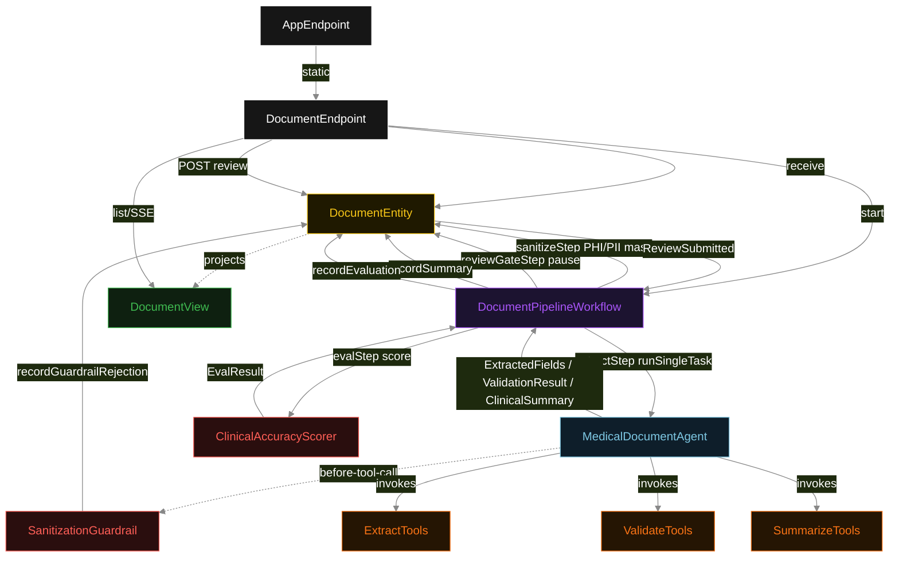
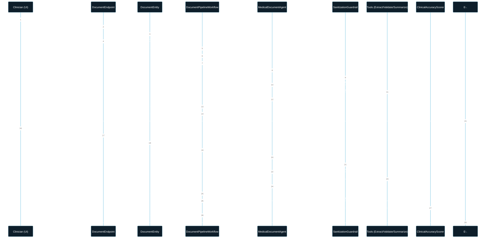
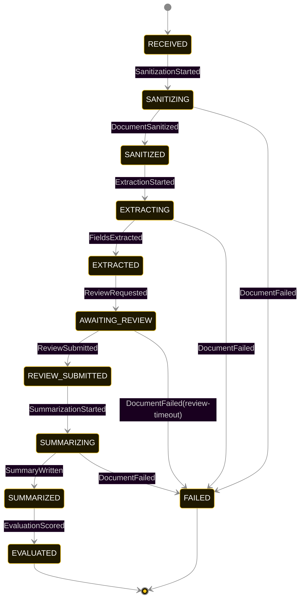
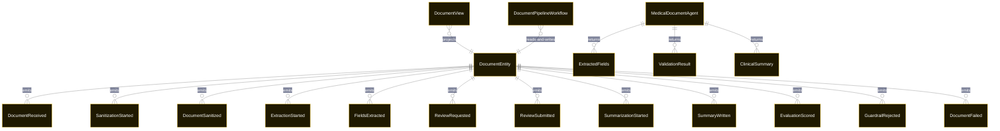

# PLAN — medical-document-pipeline

Architectural sketch consumed by `/akka:plan` and rendered on the generated system's Architecture tab. The four mermaid diagrams below carry the theme variables and CSS overrides from Lesson 24; without them, state names render black-on-black and edge labels clip.

---

## Component graph

## Interaction sequence — J1 (happy path)

## State machine — `DocumentEntity`

GuardrailRejected is a side-event recorded on the entity for audit; it does not change the status — the agent's retry stays inside the same task, and the workflow's step continues. Only an exhausted retry budget, a step timeout, or a review timeout transitions to FAILED.

## Entity model

## Component table — Java file targets

| Component | Path (generated) |
|---|---|
| `DocumentEndpoint` | `api/DocumentEndpoint.java` |
| `AppEndpoint` | `api/AppEndpoint.java` |
| `DocumentEntity` | `application/DocumentEntity.java` (state in `domain/DocumentRecord.java`, events in `domain/DocumentEvent.java`) |
| `DocumentPipelineWorkflow` | `application/DocumentPipelineWorkflow.java` |
| `MedicalDocumentAgent` | `application/MedicalDocumentAgent.java` (tasks in `application/DocumentTasks.java`) |
| `ExtractTools` | `application/ExtractTools.java` |
| `ValidateTools` | `application/ValidateTools.java` |
| `SummarizeTools` | `application/SummarizeTools.java` |
| `SanitizationGuardrail` | `application/SanitizationGuardrail.java` |
| `ClinicalAccuracyScorer` | `application/ClinicalAccuracyScorer.java` |
| `DocumentView` | `application/DocumentView.java` |
| `MockModelProvider` (option-a only) | `application/MockModelProvider.java` |
| Bootstrap | `Bootstrap.java` |

## Concurrency notes

- **Per-step timeout**: `sanitizeStep` 10 s, `extractStep` 60 s, `reviewGateStep` 48 h, `summarizeStep` 60 s, `evalStep` 5 s, `error` 5 s. Default step recovery `maxRetries(2).failoverTo(DocumentPipelineWorkflow::error)`.
- **Idempotency**: each workflow uses `"pipeline-" + documentId` as the workflow id; restart of the same documentId is rejected by the workflow runtime. The agent instance id is `"agent-" + documentId` so each document has its own per-task conversation memory.
- **Review gate**: `reviewGateStep` parks the workflow using the Akka Workflow pause/resume pattern. The external `POST /api/documents/{id}/review` call triggers `DocumentEntity.submitReview(...)`, which emits `ReviewSubmitted` and resumes the workflow. The 48 h step timeout converts to a `DocumentFailed` event with `reason = "review-timeout"` if no decision arrives.
- **One agent per document**: `MedicalDocumentAgent` runs two active LLM tasks per document — EXTRACT and WRITE_SUMMARY. VALIDATE is the clinician's review step, not an LLM call, so the agent's three-task pattern is EXTRACT → [human review] → WRITE_SUMMARY. `DocumentTasks.VALIDATE_FIELDS` is declared for type-safety and prompt coherence but its LLM invocation is replaced by the human review gate in the workflow.
- **Sanitization is synchronous and deterministic**: `sanitizeStep` runs rule-based masking in-process. No LLM call, no external service. The same document text always produces the same masked output.
- **Eval is synchronous and deterministic**: `ClinicalAccuracyScorer` runs in-process inside `evalStep`. No LLM call — the same summary always scores the same. This maintains the single-agent invariant.
- **No saga / no compensation**: every step is either deterministic in-process work, an append-only event write, a single-task agent call, or a human decision gate. A failed document stays at the last successful event; the UI shows the partial state.
