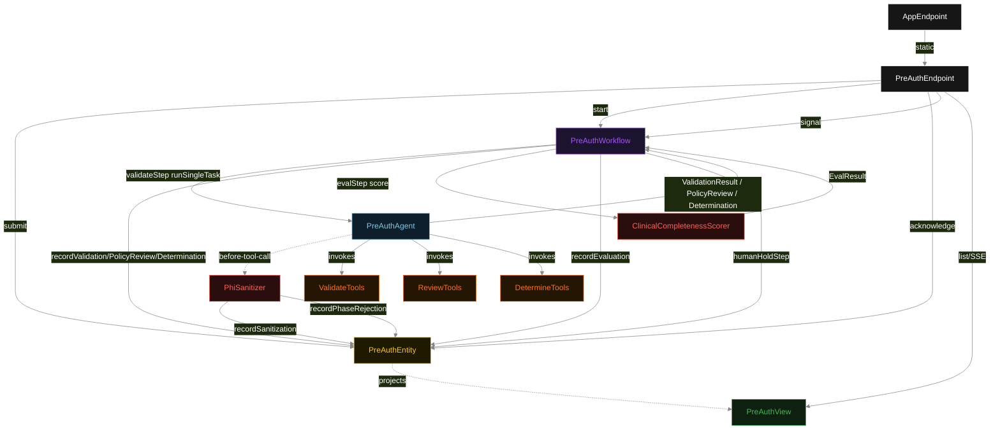
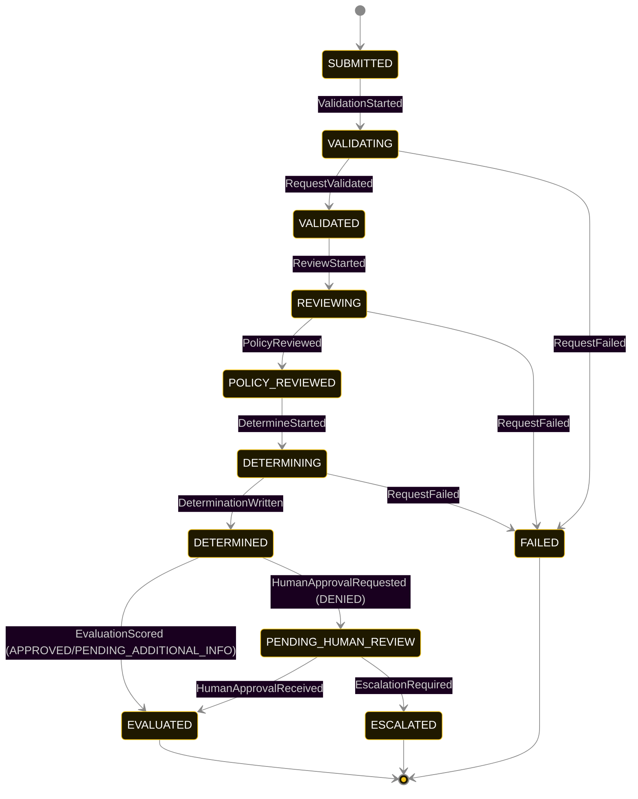

# PLAN — medical-preauth

Architectural sketch consumed by `/akka:plan` and rendered on the generated system's Architecture tab. The four mermaid diagrams below carry the theme variables and CSS overrides from Lesson 24; without them, state names render black-on-black and edge labels clip.

---

## Component graph



## Interaction sequence — J1 (happy path, APPROVED)

```mermaid
%%{init: {'theme':'base','themeVariables':{'primaryColor':'#0e1e2a','primaryTextColor':'#ffffff','primaryBorderColor':'#7EC8E3','lineColor':'#888','nodeTextColor':'#ffffff','stateLabelColor':'#ffffff','transitionLabelColor':'#cccccc'}}}%%
sequenceDiagram
  autonumber
  participant U as Clinician (UI)
  participant API as PreAuthEndpoint
  participant E as PreAuthEntity
  participant W as PreAuthWorkflow
  participant A as PreAuthAgent
  participant G as PhiSanitizer
  participant T as Tools (Validate/Review/Determine)
  participant Sc as ClinicalCompletenessScorer

  U->>API: POST /api/auth-requests { memberId, procedureCode, ... }
  API->>E: submit(request)
  E-->>API: { requestId }
  API->>W: start(requestId)
  W->>E: startValidation
  W->>A: runSingleTask(VALIDATE_REQUEST, sanitizedContext)
  A->>G: before-tool-call(checkMemberEligibility, VALIDATE)
  G-->>A: sanitize memberId → hashedToken; accept
  G->>E: SanitizationApplied{memberId, hashedToken}
  A->>T: checkMemberEligibility(hashedToken) + validateProcedureCode(code, icd10)
  T-->>A: EligibilityCheck + ProcedureCheck
  A-->>W: ValidationResult
  W->>E: recordValidation
  W->>A: runSingleTask(REVIEW_POLICY, validationContext)
  A->>G: before-tool-call(matchPolicyArticles, REVIEW)
  G-->>A: accept (status REVIEWING and validationResult present)
  A->>T: matchPolicyArticles + evaluateCriteria
  T-->>A: List<PolicyArticle> + CriteriaEvaluation
  A-->>W: PolicyReview
  W->>E: recordPolicyReview
  W->>A: runSingleTask(DETERMINE_OUTCOME, reviewContext)
  A->>G: before-tool-call(buildRationale, DETERMINE)
  G-->>A: accept (status DETERMINING and policyReview present)
  A->>T: buildRationale + classifyOutcome
  T-->>A: rationale + AuthOutcome.APPROVED
  A-->>W: Determination{APPROVED}
  W->>E: recordDetermination
  W->>Sc: score(determination, policyReview, validationResult)
  Sc-->>W: EvalResult{score:5}
  W->>E: recordEvaluation
  E-.->>U: SSE event(EVALUATED, APPROVED)
```

## State machine — `PreAuthEntity`



`SanitizationApplied` and `PhaseGuardrailRejected` are side-events recorded for audit; they do not change the status. Only an exhausted retry budget, a step timeout, or an unrecoverable error transitions to `FAILED`.

## Entity model

```mermaid
%%{init: {'theme':'base','themeVariables':{'primaryColor':'#1f1900','primaryTextColor':'#ffffff','primaryBorderColor':'#F5C518','lineColor':'#888','nodeTextColor':'#ffffff','stateLabelColor':'#ffffff'}}}%%
erDiagram
  PreAuthEntity ||--o{ RequestSubmitted : emits
  PreAuthEntity ||--o{ ValidationStarted : emits
  PreAuthEntity ||--o{ RequestValidated : emits
  PreAuthEntity ||--o{ ReviewStarted : emits
  PreAuthEntity ||--o{ PolicyReviewed : emits
  PreAuthEntity ||--o{ DetermineStarted : emits
  PreAuthEntity ||--o{ DeterminationWritten : emits
  PreAuthEntity ||--o{ EvaluationScored : emits
  PreAuthEntity ||--o{ HumanApprovalRequested : emits
  PreAuthEntity ||--o{ HumanApprovalReceived : emits
  PreAuthEntity ||--o{ EscalationRequired : emits
  PreAuthEntity ||--o{ SanitizationApplied : emits
  PreAuthEntity ||--o{ PhaseGuardrailRejected : emits
  PreAuthEntity ||--o{ RequestFailed : emits
  PreAuthView }o--|| PreAuthEntity : projects
  PreAuthWorkflow }o--|| PreAuthEntity : reads-and-writes
  PreAuthAgent ||--o{ ValidationResult : returns
  PreAuthAgent ||--o{ PolicyReview : returns
  PreAuthAgent ||--o{ Determination : returns
```



## Component table — Java file targets

| Component | Path (generated) |
|---|---|
| `PreAuthEndpoint` | `api/PreAuthEndpoint.java` |
| `AppEndpoint` | `api/AppEndpoint.java` |
| `PreAuthEntity` | `application/PreAuthEntity.java` (state in `domain/PreAuthRecord.java`, events in `domain/PreAuthEvent.java`) |
| `PreAuthWorkflow` | `application/PreAuthWorkflow.java` |
| `PreAuthAgent` | `application/PreAuthAgent.java` (tasks in `application/PreAuthTasks.java`) |
| `ValidateTools` | `application/ValidateTools.java` |
| `ReviewTools` | `application/ReviewTools.java` |
| `DetermineTools` | `application/DetermineTools.java` |
| `PhiSanitizer` | `application/PhiSanitizer.java` |
| `ClinicalCompletenessScorer` | `application/ClinicalCompletenessScorer.java` |
| `PreAuthView` | `application/PreAuthView.java` |
| `MockModelProvider` (option-a only) | `application/MockModelProvider.java` |
| Bootstrap | `Bootstrap.java` |

## Concurrency notes

- **Per-step timeout**: `validateStep` 60 s, `reviewStep` 60 s, `determineStep` 60 s, `evalStep` 5 s, `humanHoldStep` PT72H, `error` 5 s. Default step recovery `maxRetries(2).failoverTo(PreAuthWorkflow::error)`. The 60 s on each agent-calling step accommodates LLM latency including tool round-trips (Lesson 4).
- **Idempotency**: each workflow uses `"preauth-" + requestId` as the workflow id; restart of the same requestId is rejected by the workflow runtime. The agent instance id is `"agent-" + requestId` so each request has its own per-task conversation memory.
- **One agent per request**: `PreAuthAgent` runs three tasks per request — VALIDATE, REVIEW, DETERMINE — each with `capability(...).maxIterationsPerTask(4)`. The 4-iteration budget gives the guardrail room to reject a misordered tool call and still let the agent self-correct.
- **PHI sanitization is synchronous**: `PhiSanitizer` completes its scan and replacement before the call is forwarded. If the sanitizer cannot parse the payload, it blocks the call entirely. No LLM call ever receives raw PHI.
- **Human hold is a workflow pause**: `humanHoldStep` waits for an external signal (`acknowledgeApproval` on the entity, forwarded by `PreAuthEndpoint`). The Akka Workflow runtime persists this pause durably; a service restart does not lose the hold.
- **Eval is synchronous and deterministic**: `ClinicalCompletenessScorer` runs in-process inside `evalStep`. No LLM call — the same determination always scores the same.
- **Task-boundary handoff is the dependency contract**: `validateStep` writes `RequestValidated` BEFORE returning; `reviewStep` reads the recorded `ValidationResult` from the entity to build its task's instruction context; `determineStep` reads both `ValidationResult` and `PolicyReview`. The agent itself is stateless across phases.
- **No saga / no compensation**: every step is either pure read, append-only event write, or a single-task agent call. A failed request stays at the last successful event; the UI shows the partial state.
