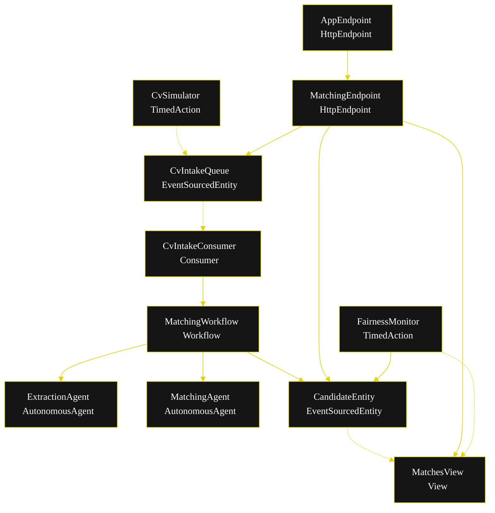
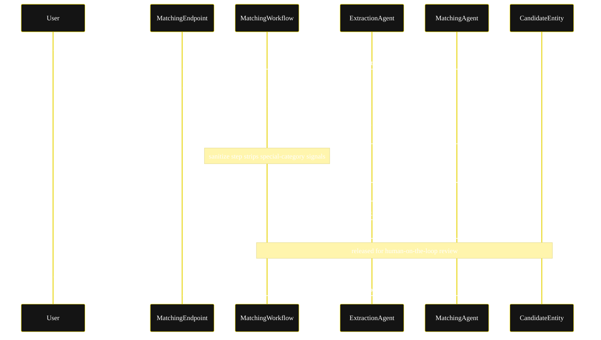
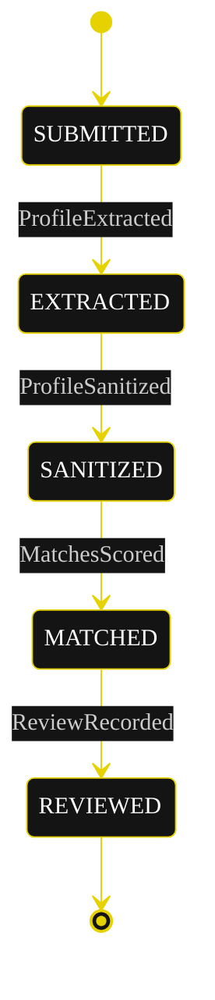
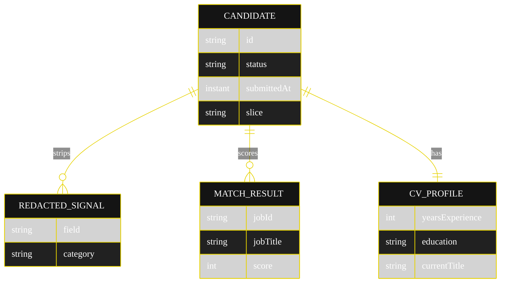

# PLAN — Fair CV Matcher

Architectural sketch for the sequential-pipeline × hr-recruiting blueprint. The generated system renders these diagrams on the Architecture tab. All mermaid blocks carry the Akka theme variables and the Lesson 24 CSS overrides for state labels and edge-label overflow.

## Component graph

Solid arrows = synchronous commands; dashed arrows = event subscriptions; dotted arrows = scheduled ticks.

## Interaction sequence

## State machine

## Entity model

## Component table

| Component | Akka primitive | File path |
|---|---|---|
| ExtractionAgent | AutonomousAgent | `application/ExtractionAgent.java` |
| MatchingAgent | AutonomousAgent | `application/MatchingAgent.java` |
| CvMatcherTasks | task constants | `application/CvMatcherTasks.java` |
| MatchingWorkflow | Workflow | `application/MatchingWorkflow.java` |
| CandidateEntity | EventSourcedEntity | `application/CandidateEntity.java` |
| CvIntakeQueue | EventSourcedEntity | `application/CvIntakeQueue.java` |
| MatchesView | View | `application/MatchesView.java` |
| CvIntakeConsumer | Consumer | `application/CvIntakeConsumer.java` |
| CvSimulator | TimedAction | `application/CvSimulator.java` |
| FairnessMonitor | TimedAction | `application/FairnessMonitor.java` |
| MatchingEndpoint | HttpEndpoint | `api/MatchingEndpoint.java` |
| AppEndpoint | HttpEndpoint | `api/AppEndpoint.java` |
| Records | records | `domain/*.java` |

## Concurrency notes

- **Step timeouts.** `extractStep` and `matchStep` call agents; each gets an explicit 60s `stepTimeout` (Lesson 4). `sanitizeStep` is deterministic and keeps the default.
- **Idempotency.** The workflow is keyed by `candidateId`; re-delivery of a `CvIntakeQueue` event with the same id is a no-op because the entity already holds later state. `CvIntakeConsumer` derives a stable workflow id from the submission id.
- **Recovery.** `defaultStepRecovery(maxRetries(2).failoverTo(MatchingWorkflow::error))` sends exhausted retries to a terminal error step rather than looping.
- **No saga.** Steps produce read-only artifacts (profile, redactions, scores); there is no external side effect to compensate. The review step is non-blocking — the pipeline completes whether or not a reviewer acts.
- **View indexing.** `MatchesView` exposes only `getAllCandidates`; status filtering is client-side because Akka cannot auto-index the enum column (Lesson 2).
