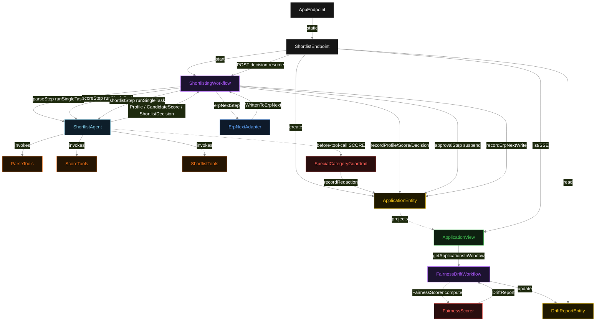
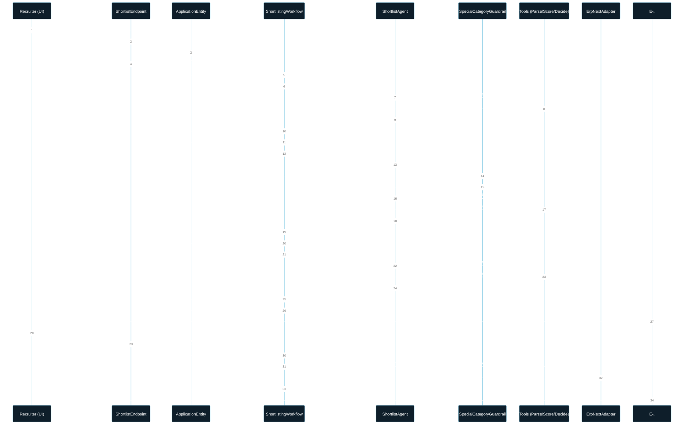
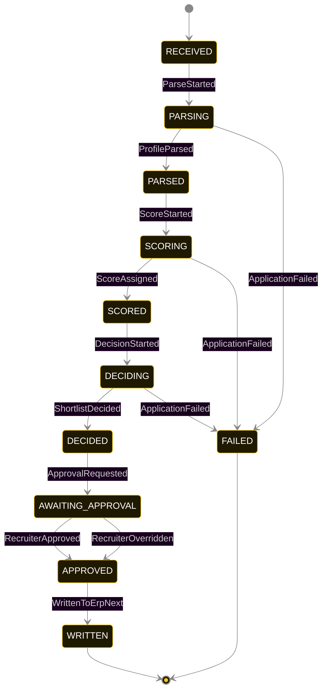
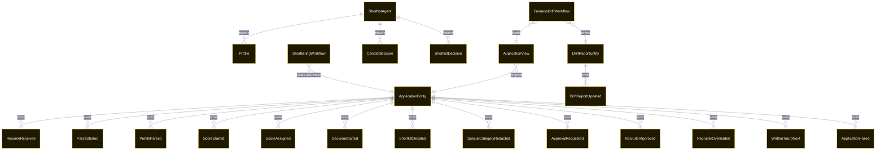

# PLAN — hr-shortlister

Architectural sketch consumed by `/akka:plan` and rendered on the generated system's Architecture tab. The four mermaid diagrams below carry the theme variables and CSS overrides from Lesson 24; without them, state names render black-on-black and edge labels clip.

---

## Component graph

## Interaction sequence — J1 (happy path with approval)

## State machine — `ApplicationEntity`

`SpecialCategoryRedacted` is a side-event recorded on the entity for audit; it does not change the status. `RecruiterOverridden` transitions to `APPROVED` just as `RecruiterApproved` does — the difference is in the payload, not the target state.

## Entity model

## Component table — Java file targets

| Component | Path (generated) |
|---|---|
| `ShortlistEndpoint` | `api/ShortlistEndpoint.java` |
| `AppEndpoint` | `api/AppEndpoint.java` |
| `ApplicationEntity` | `application/ApplicationEntity.java` (state in `domain/ApplicationRecord.java`, events in `domain/ApplicationEvent.java`) |
| `DriftReportEntity` | `application/DriftReportEntity.java` |
| `ShortlistingWorkflow` | `application/ShortlistingWorkflow.java` |
| `FairnessDriftWorkflow` | `application/FairnessDriftWorkflow.java` |
| `ShortlistAgent` | `application/ShortlistAgent.java` (tasks in `application/ShortlistTasks.java`) |
| `ParseTools` | `application/ParseTools.java` |
| `ScoreTools` | `application/ScoreTools.java` |
| `ShortlistTools` | `application/ShortlistTools.java` |
| `SpecialCategoryGuardrail` | `application/SpecialCategoryGuardrail.java` |
| `FairnessScorer` | `application/FairnessScorer.java` |
| `ErpNextAdapter` | `application/ErpNextAdapter.java` |
| `ApplicationView` | `application/ApplicationView.java` |
| `MockModelProvider` (option-a only) | `application/MockModelProvider.java` |
| Bootstrap | `Bootstrap.java` |

## Concurrency notes

- **Per-step timeout**: `parseStep` 60 s, `scoreStep` 60 s, `shortlistStep` 60 s, `erpNextStep` 30 s, `error` 5 s. `approvalStep` has no hard timeout — recruiter approval is human-paced. Default step recovery `maxRetries(2).failoverTo(ShortlistingWorkflow::error)`.
- **Idempotency**: each workflow uses `"shortlist-" + applicationId` as the workflow id. The agent instance id is `"agent-" + applicationId` so each application has its own per-task conversation memory.
- **One agent per application**: `ShortlistAgent` runs three tasks per application — PARSE, SCORE, DECIDE — each with `capability(...).maxIterationsPerTask(4)`.
- **Sanitizer is unconditional**: `SpecialCategoryGuardrail` always fires for SCORE-phase tool calls. It never rejects — it sanitizes and passes. The resulting audit trail (one `SpecialCategoryRedacted` event per field per application) is the compliance record.
- **Approval gate is the authority boundary**: the workflow can write to ERPNext only after `RecruiterApproved` or `RecruiterOverridden` has been emitted. The ERPNext write uses the final (possibly overridden) decision, not the agent's raw output.
- **Fairness drift is population-level**: `FairnessScorer` runs outside the per-application pipeline, on the full 30-day window. A single-application guardrail cannot detect population-level skew; the periodic scanner is the right cut for that.
- **No saga / no compensation**: every step is append-only. A failed application stays at the last successful event; the UI shows the partial state.
