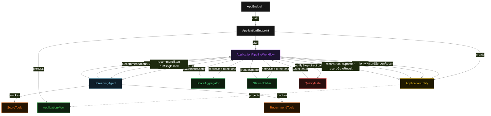
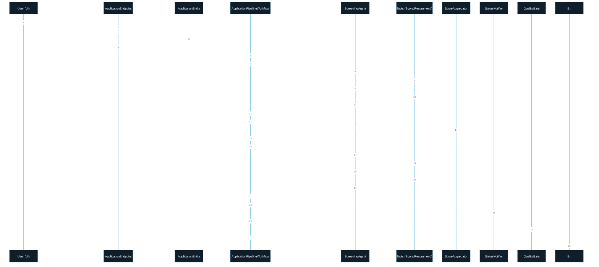
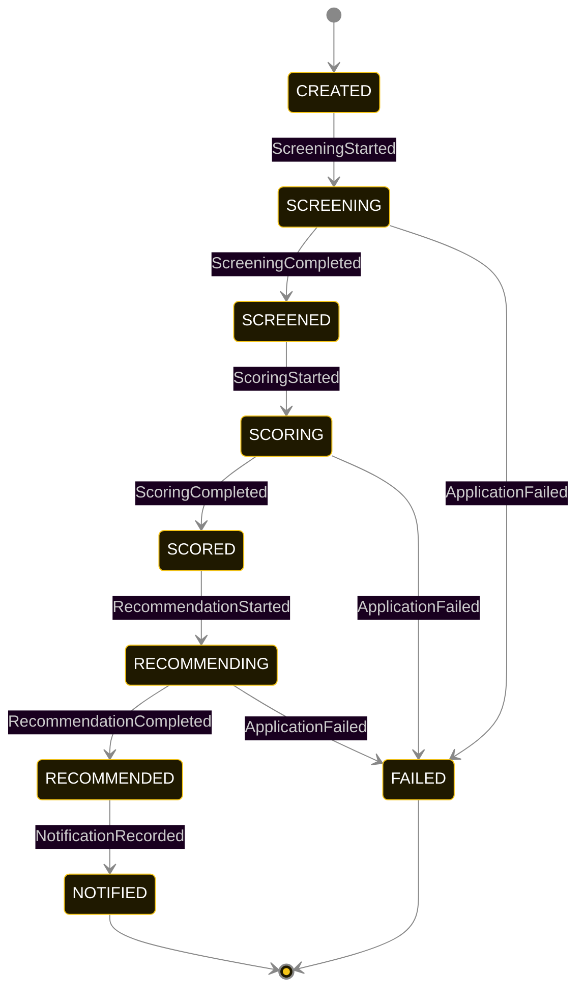
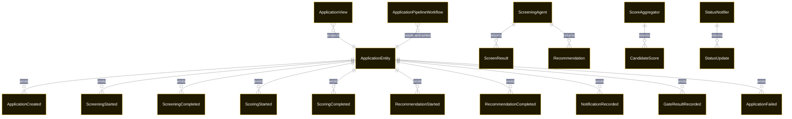

# PLAN — score-aggregator

Architectural sketch consumed by `/akka:plan` and rendered on the generated system's Architecture tab. The four mermaid diagrams below carry the theme variables and CSS overrides from Lesson 24; without them, state names render black-on-black and edge labels clip.

---

## Component graph

## Interaction sequence — J1 (happy path)

## State machine — `ApplicationEntity`

GateResultRecorded is recorded on the entity after NOTIFIED; it does not change the status. The gate is non-blocking at runtime — it annotates the application with a PASS/FAIL result; a human recruiter makes the final call. A FAIL gate result highlights the card in the UI.

## Entity model

## Component table — Java file targets

| Component | Path (generated) |
|---|---|
| `ApplicationEndpoint` | `api/ApplicationEndpoint.java` |
| `AppEndpoint` | `api/AppEndpoint.java` |
| `ApplicationEntity` | `application/ApplicationEntity.java` (state in `domain/ApplicationRecord.java`, events in `domain/ApplicationEvent.java`) |
| `ApplicationPipelineWorkflow` | `application/ApplicationPipelineWorkflow.java` |
| `ScreeningAgent` | `application/ScreeningAgent.java` (tasks in `application/ScreeningTasks.java`) |
| `ScoreTools` | `application/ScoreTools.java` |
| `RecommendTools` | `application/RecommendTools.java` |
| `ScoreAggregator` | `application/ScoreAggregator.java` |
| `StatusNotifier` | `application/StatusNotifier.java` |
| `QualityGate` | `application/QualityGate.java` |
| `ApplicationView` | `application/ApplicationView.java` |
| `MockModelProvider` (option-a only) | `application/MockModelProvider.java` |
| Bootstrap | `Bootstrap.java` |

## Concurrency notes

- **Per-step timeout**: `screenStep` 60 s, `scoreStep` 10 s, `recommendStep` 60 s, `notifyStep` 10 s, `error` 5 s. Default step recovery `maxRetries(2).failoverTo(ApplicationPipelineWorkflow::error)`. The 60 s on each LLM-calling step accommodates model latency including tool round-trips (Lesson 4). The 10 s on deterministic steps is generous given they make no LLM call.
- **Idempotency**: each workflow uses `"pipeline-" + applicationId` as the workflow id; restart of the same applicationId is rejected by the workflow runtime. The agent instance id is `"agent-" + applicationId` so each application has its own per-task conversation memory.
- **One agent per application**: `ScreeningAgent` runs two tasks per application — SCREEN and RECOMMEND — each with `capability(...).maxIterationsPerTask(4)`. The 4-iteration budget is for the LLM phases only; deterministic steps have no iteration concept.
- **Deterministic steps are synchronous**: `ScoreAggregator.score(...)` and `StatusNotifier.notify(...)` execute in the workflow step thread. They hold no state and make no network calls; both complete in under 1 ms on typical hardware.
- **Gate is non-blocking**: `QualityGate.evaluate(...)` runs inside `notifyStep` after the `StatusUpdate` is recorded. A gate failure records `GateResult{pass: false}` on the entity and highlights the UI card; it does not abort the step or fail the workflow. The decision to block or advance still belongs to a human recruiter.
- **No saga / no compensation**: every step is either pure read, append-only event write, a single-task agent call, or a deterministic in-process function. A failed application stays at the last successful event; the UI shows the partial state for the recruiter.
- **Mixed-agent invariant**: `ScreeningAgent` is the only `AutonomousAgent`. `ScoreAggregator`, `StatusNotifier`, and `QualityGate` are plain Java objects invoked by the workflow. This is the property the blueprint is designed to show — and the CI test gate is the governance mechanism that enforces it holds across builds.
