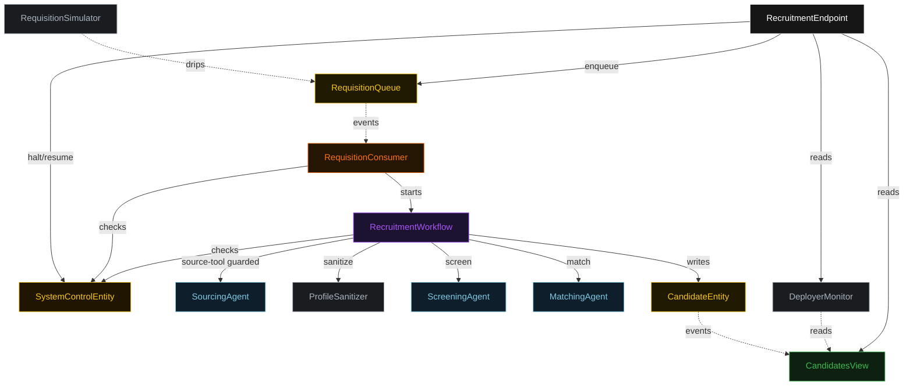
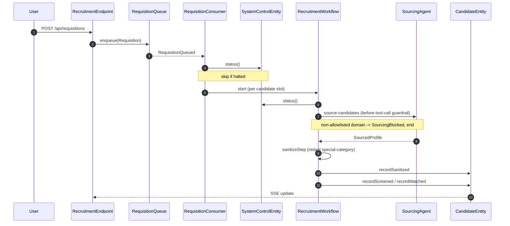
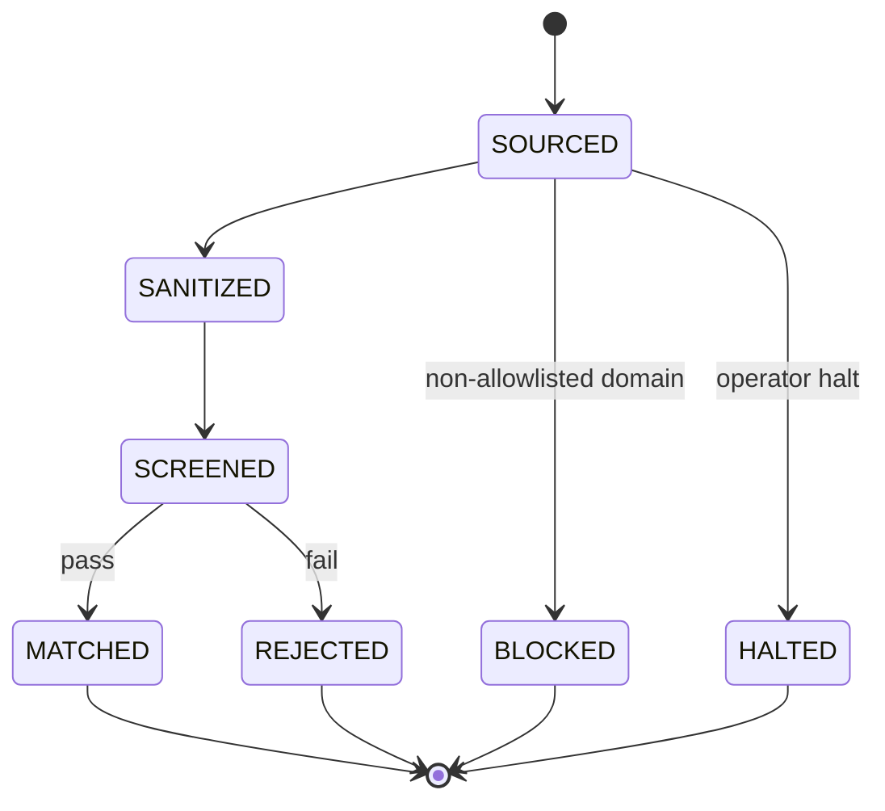
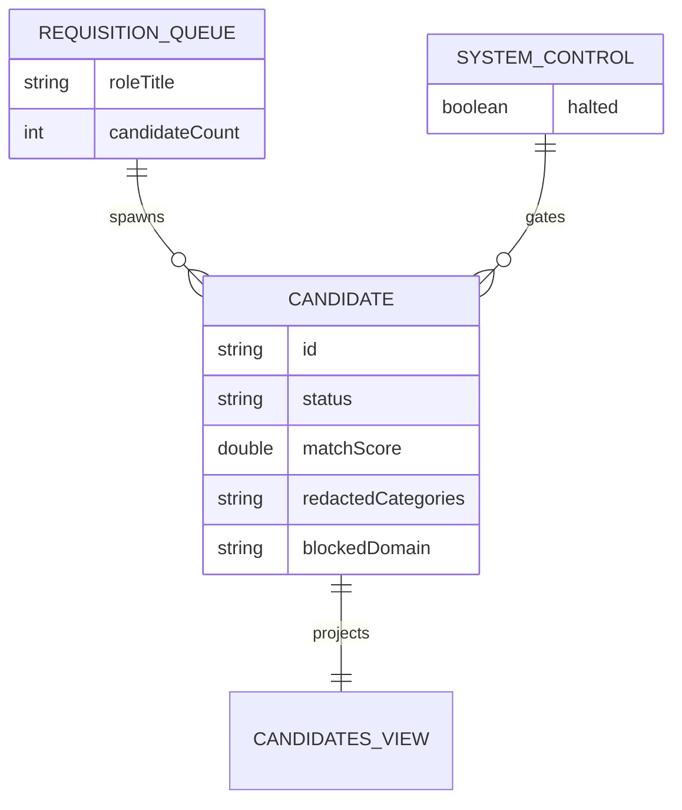

# PLAN — recruitment-high-risk

Architectural sketch. All four mermaid diagrams plus the component table.

---

## Component graph

Solid arrows are synchronous commands; dashed arrows are event subscriptions; dotted ticks are scheduled actions.

## Interaction sequence

## State machine

## Entity model

## Component table

| Component | Path (generated) |
|---|---|
| `SourcingAgent` | `application/SourcingAgent.java` |
| `ScreeningAgent` | `application/ScreeningAgent.java` |
| `MatchingAgent` | `application/MatchingAgent.java` |
| `RecruitmentTasks` | `application/RecruitmentTasks.java` |
| `ProfileSanitizer` | `application/ProfileSanitizer.java` |
| `RecruitmentWorkflow` | `application/RecruitmentWorkflow.java` |
| `CandidateEntity` | `application/CandidateEntity.java` |
| `RequisitionQueue` | `application/RequisitionQueue.java` |
| `SystemControlEntity` | `application/SystemControlEntity.java` |
| `CandidatesView` | `application/CandidatesView.java` |
| `RequisitionConsumer` | `application/RequisitionConsumer.java` |
| `RequisitionSimulator` | `application/RequisitionSimulator.java` |
| `DeployerMonitor` | `application/DeployerMonitor.java` |
| `RecruitmentEndpoint` | `api/RecruitmentEndpoint.java` |
| `AppEndpoint` | `api/AppEndpoint.java` |

## Concurrency notes

- Workflow step timeouts: `sourceStep`, `screenStep`, `matchStep` each `ofSeconds(60)` (Lesson 4). `sanitizeStep` is local (no LLM) and uses the default timeout. `WorkflowSettings` is nested in `Workflow` — no import (Lesson 5).
- Idempotency: each candidate workflow keys on a fresh UUID; `CandidateEntity` event-appliers are idempotent on replay.
- Compensation: `defaultStepRecovery(maxRetries(2).failoverTo(error))`; the error step writes `CandidateRejected` with the failure reason so no candidate is left mid-pipeline.
- Halt gate is checked at consumer entry and at the workflow's first step; an in-flight workflow that sees a halt writes `EvaluationHalted` and ends rather than completing.
