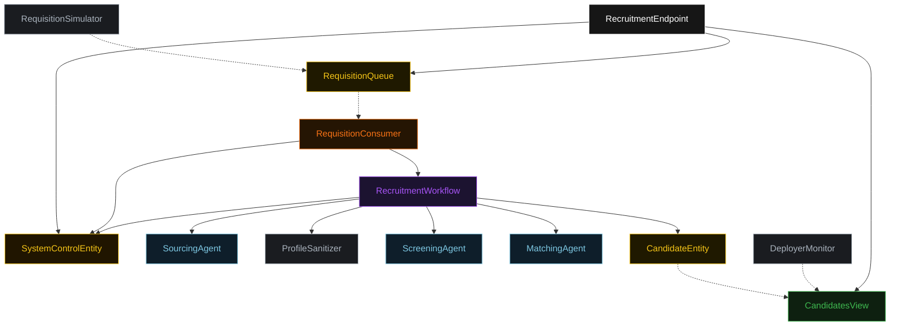
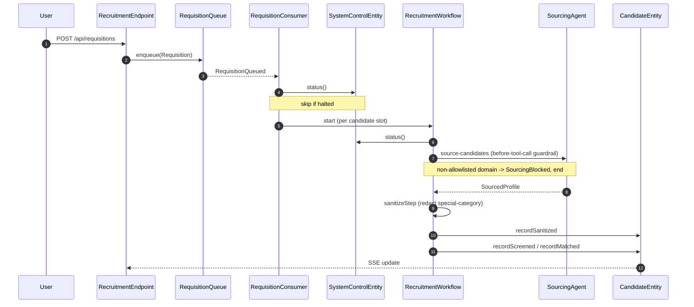
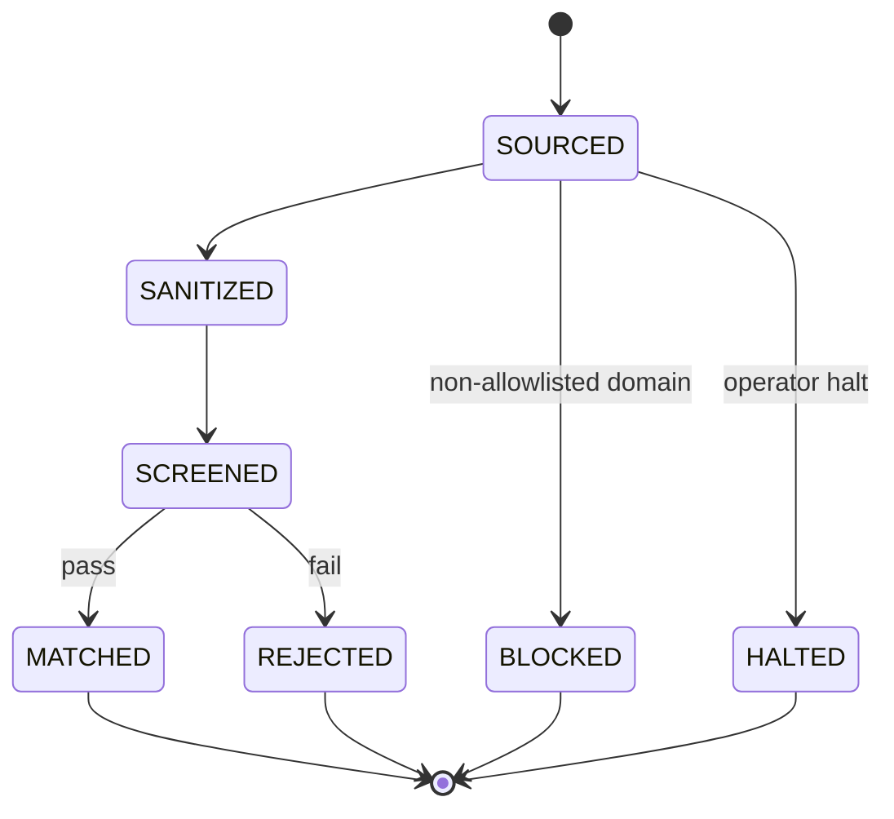
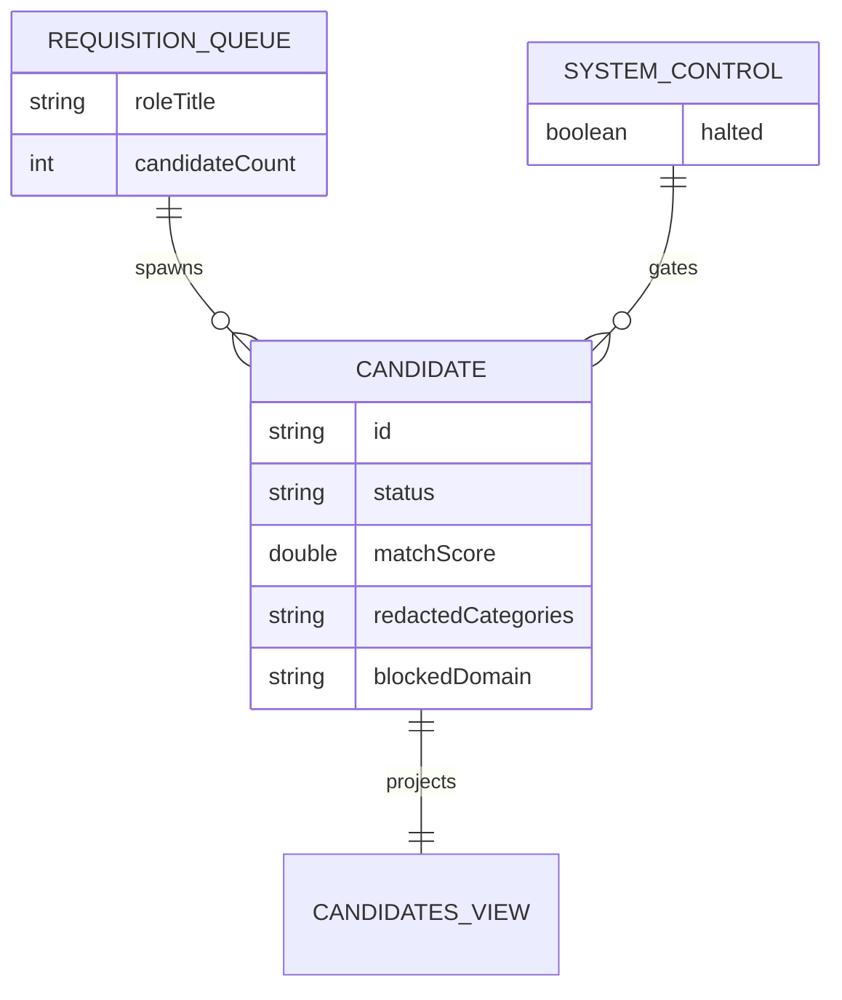

# Architecture

The system runs a fixed three-stage pipeline per candidate, governed by four
controls. The four mermaid diagrams below are the source the Architecture tab
renders.

## Component graph

A requisition enters through `RecruitmentEndpoint` or is dripped by
`RequisitionSimulator` into `RequisitionQueue`. `RequisitionConsumer` reads each
queued requisition, checks `SystemControlEntity` for a halt, and starts one
`RecruitmentWorkflow` per candidate slot. The workflow drives `SourcingAgent`,
`ProfileSanitizer`, `ScreeningAgent`, and `MatchingAgent` in order, writing each
transition into `CandidateEntity`. `CandidatesView` projects those events for the
endpoint's list and SSE stream, and `DeployerMonitor` reads the same view to
aggregate outcome metrics.

## Interaction sequence

The primary journey: a submitted requisition becomes a sourced, sanitized,
screened, and matched candidate. The guardrail and halt branches end the run
early.

## State machine

`CandidateStatus` lifecycle. BLOCKED, REJECTED, MATCHED, and HALTED are terminal.

## Entity model

