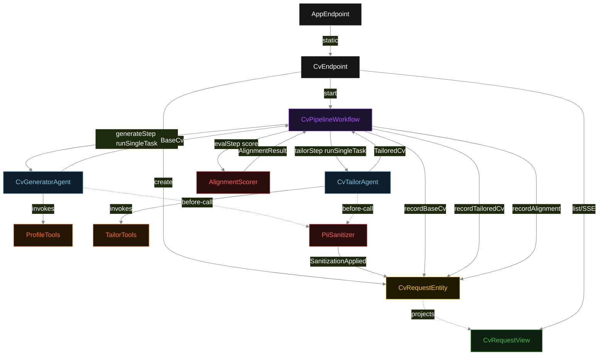
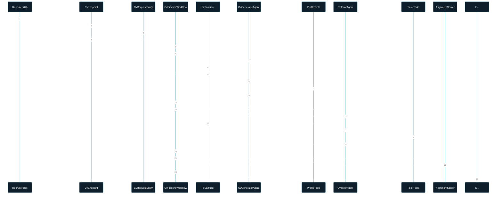
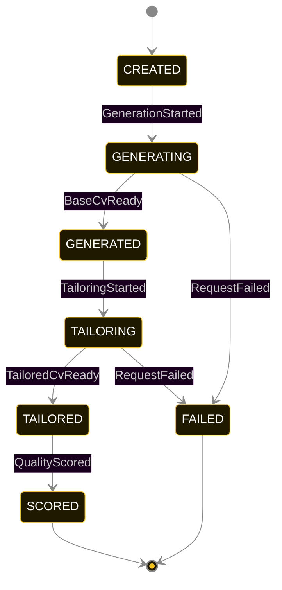
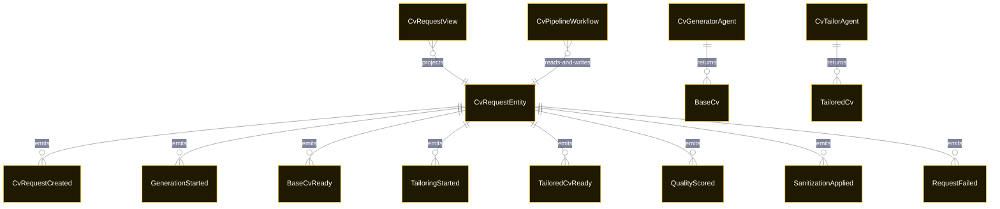

# PLAN — sequential-cv-tailor

Architectural sketch consumed by `/akka:plan` and rendered on the generated system's Architecture tab. The four mermaid diagrams below carry the theme variables and CSS overrides from Lesson 24; without them, state names render black-on-black and edge labels clip.

---

## Component graph

## Interaction sequence — J1 (happy path)

## State machine — `CvRequestEntity`

`SanitizationApplied` is a side-event recorded for audit; it does not change the status. The sanitizer may fire on the same request multiple times (once per model call). Only an exhausted retry budget or a step timeout transitions to FAILED.

## Entity model

## Component table — Java file targets

| Component | Path (generated) |
|---|---|
| `CvEndpoint` | `api/CvEndpoint.java` |
| `AppEndpoint` | `api/AppEndpoint.java` |
| `CvRequestEntity` | `application/CvRequestEntity.java` (state in `domain/CvRequestRecord.java`, events in `domain/CvRequestEvent.java`) |
| `CvPipelineWorkflow` | `application/CvPipelineWorkflow.java` |
| `CvGeneratorAgent` | `application/CvGeneratorAgent.java` (tasks in `application/CvTasks.java`) |
| `CvTailorAgent` | `application/CvTailorAgent.java` |
| `ProfileTools` | `application/ProfileTools.java` |
| `TailorTools` | `application/TailorTools.java` |
| `PiiSanitizer` | `application/PiiSanitizer.java` |
| `AlignmentScorer` | `application/AlignmentScorer.java` |
| `CvRequestView` | `application/CvRequestView.java` |
| `MockModelProvider` (option-a only) | `application/MockModelProvider.java` |
| Bootstrap | `Bootstrap.java` |

## Concurrency notes

- **Per-step timeout**: `generateStep` 60 s, `tailorStep` 60 s, `evalStep` 5 s, `error` 5 s. Default step recovery `maxRetries(2).failoverTo(CvPipelineWorkflow::error)`. The 60 s on each agent-calling step accommodates LLM latency including tool round-trips (Lesson 4).
- **Idempotency**: each workflow uses `"cv-pipeline-" + requestId` as the workflow id; restart of the same requestId is rejected by the workflow runtime. Generator agent id `"gen-" + requestId`, tailor agent id `"tailor-" + requestId`, so each request has its own per-task conversation memory.
- **Two agents, one request**: `CvGeneratorAgent` runs one task per request (`GENERATE_BASE_CV`); `CvTailorAgent` runs one task per request (`TAILOR_CV`). Each has `maxIterationsPerTask(4)`.
- **Sanitizer is stateless**: `PiiSanitizer` holds no mutable state; registering it on two agents is safe. The requestId comes from `TaskDef.metadata("requestId", ...)`.
- **Eval is synchronous and deterministic**: `AlignmentScorer` runs in-process inside `evalStep`. No LLM call — same `TailoredCv` always scores the same.
- **Typed handoff is the data boundary**: `generateStep` writes `BaseCvReady` before returning; `tailorStep` reads the recorded `BaseCv` from the entity to build its task instruction context. `CvTailorAgent` never receives the raw `CandidateProfile`.
- **No saga / no compensation**: a failed request stays at its last successful event; the UI shows the partial state.
