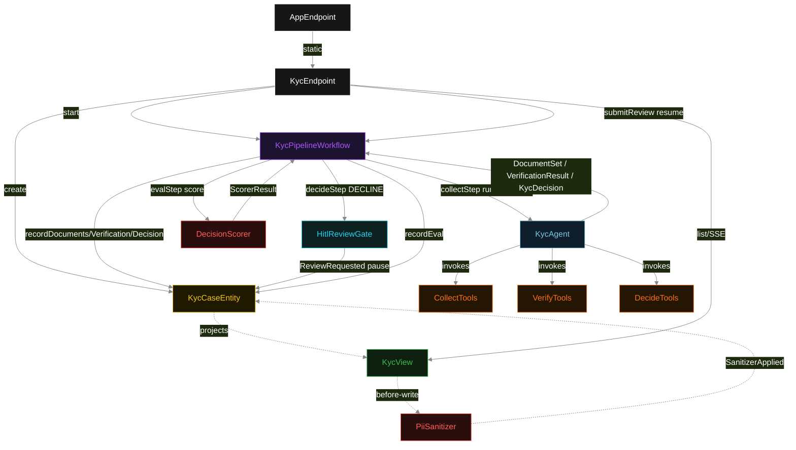
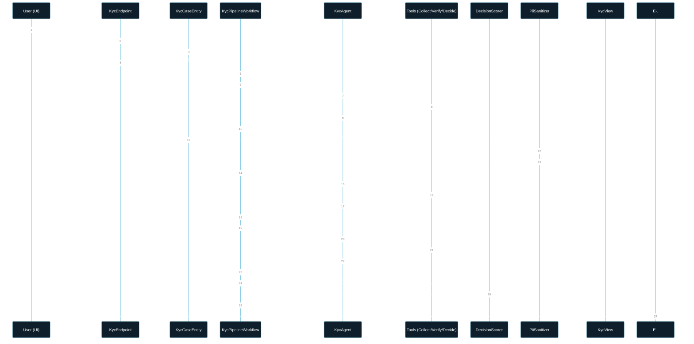
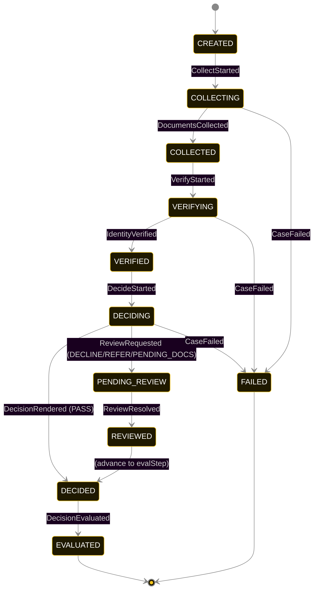
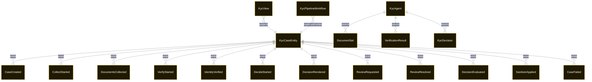

# PLAN — global-kyc-agent

Architectural sketch consumed by `/akka:plan` and rendered on the generated system's Architecture tab. The four mermaid diagrams below carry the theme variables and CSS overrides from Lesson 24; without them, state names render black-on-black and edge labels clip.

---

## Component graph

## Interaction sequence — J1 (happy path, PASS outcome)

## State machine — `KycCaseEntity`

`SanitizerApplied` is a side-event recorded on the entity for audit; it does not change the case status. `ReviewRequested` pauses the workflow but does not transition the status until the compliance officer posts a resolution.

## Entity model

## Component table — Java file targets

| Component | Path (generated) |
|---|---|
| `KycEndpoint` | `api/KycEndpoint.java` |
| `AppEndpoint` | `api/AppEndpoint.java` |
| `KycCaseEntity` | `application/KycCaseEntity.java` (state in `domain/KycCaseRecord.java`, events in `domain/KycCaseEvent.java`) |
| `KycPipelineWorkflow` | `application/KycPipelineWorkflow.java` |
| `KycAgent` | `application/KycAgent.java` (tasks in `application/KycTasks.java`) |
| `CollectTools` | `application/CollectTools.java` |
| `VerifyTools` | `application/VerifyTools.java` |
| `DecideTools` | `application/DecideTools.java` |
| `PiiSanitizer` | `application/PiiSanitizer.java` |
| `HitlReviewGate` | `application/HitlReviewGate.java` |
| `DecisionScorer` | `application/DecisionScorer.java` |
| `KycView` | `application/KycView.java` |
| `MockModelProvider` (option-a only) | `application/MockModelProvider.java` |
| Bootstrap | `Bootstrap.java` |

## Concurrency notes

- **Per-step timeout**: `collectStep` 60 s, `verifyStep` 60 s, `decideStep` 60 s, `evalStep` 5 s, `reviewStep` unbounded (human-paced), `error` 5 s. Default step recovery `maxRetries(2).failoverTo(KycPipelineWorkflow::error)`. The reviewStep uses `maxRetries(0)` — no automatic retry of a human review gate.
- **Idempotency**: each workflow uses `"kyc-" + caseId` as the workflow id; restart of the same caseId is rejected by the workflow runtime. The agent instance id is `"agent-" + caseId` so each case has its own per-task conversation memory.
- **One agent per case**: `KycAgent` runs three tasks per case — COLLECT, VERIFY, DECIDE — each with `capability(...).maxIterationsPerTask(4)`. The 4-iteration budget gives the agent room to self-correct within a phase.
- **HITL is a workflow pause, not an agent retry**: when `decideStep` returns a DECLINE outcome, `HitlReviewGate` transitions the workflow to `reviewStep`, which waits for external input via the workflow engine's `waitForInput()` mechanism. No additional LLM call is made during review. The compliance officer's POST to `/api/cases/{id}/review` is the resume signal.
- **PII sanitization is synchronous and deterministic**: `PiiSanitizer` runs inside the view table-updater. No LLM call, no external service. The same `DocumentSet` always produces the same tokens. The raw values are never written to the view.
- **Eval is synchronous and deterministic**: `DecisionScorer` runs in-process inside `evalStep`. No LLM call. The same decision always scores the same.
- **Task-boundary handoff is the dependency contract**: `collectStep` writes `DocumentsCollected` BEFORE returning; `verifyStep` reads the recorded `DocumentSet` from the entity to build its task's instruction context; `decideStep` reads both `DocumentSet` and `VerificationResult`. The agent is stateless across phases.
- **No saga / no compensation**: every step is either pure read, append-only event write, or a single-task agent call. A failed case stays at the last successful event; the UI shows the partial state.
