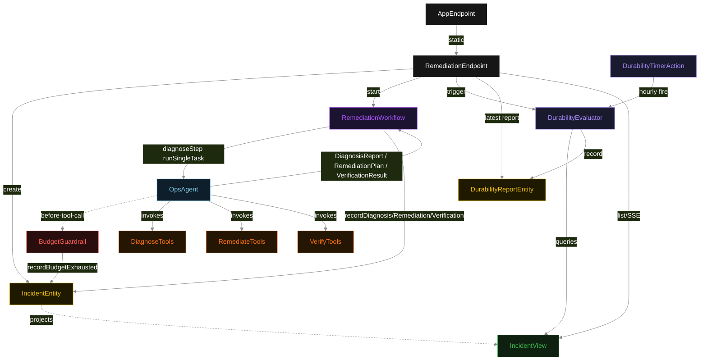
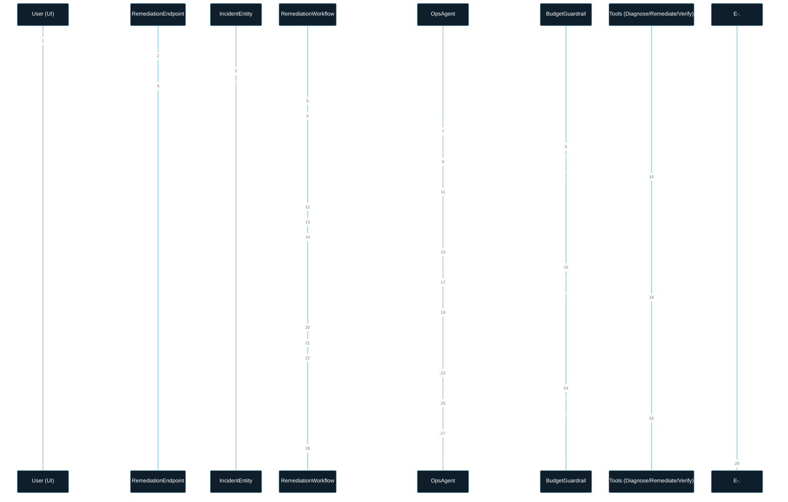
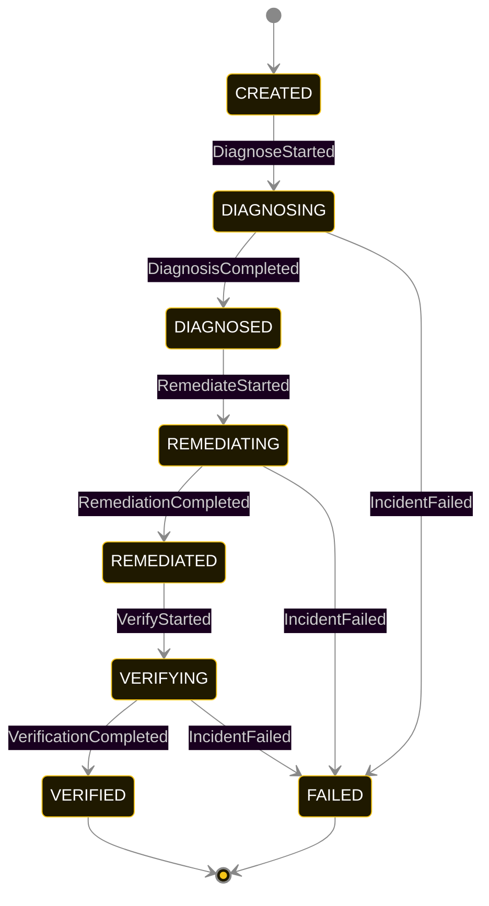
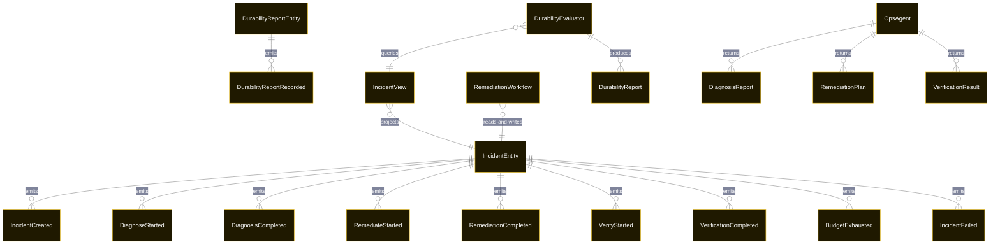

# PLAN — durable-workflow-backed-agent

Architectural sketch consumed by `/akka:plan` and rendered on the generated system's Architecture tab. The four mermaid diagrams below carry the theme variables and CSS overrides from Lesson 24; without them, state names render black-on-black and edge labels clip.

---

## Component graph

## Interaction sequence — J1 (happy path)

## State machine — `IncidentEntity`

`BudgetExhausted` is a side-event recorded on the entity for audit; it does not change the incident status — the agent's accumulated result is still used by the workflow step if the agent can return a partial typed output. Only an exhausted step-recovery budget or a step timeout transitions to `FAILED`.

## Entity model

## Component table — Java file targets

| Component | Path (generated) |
|---|---|
| `RemediationEndpoint` | `api/RemediationEndpoint.java` |
| `AppEndpoint` | `api/AppEndpoint.java` |
| `IncidentEntity` | `application/IncidentEntity.java` (state in `domain/IncidentRecord.java`, events in `domain/IncidentEvent.java`) |
| `DurabilityReportEntity` | `application/DurabilityReportEntity.java` |
| `RemediationWorkflow` | `application/RemediationWorkflow.java` |
| `OpsAgent` | `application/OpsAgent.java` (tasks in `application/OpsTasks.java`) |
| `DiagnoseTools` | `application/DiagnoseTools.java` |
| `RemediateTools` | `application/RemediateTools.java` |
| `VerifyTools` | `application/VerifyTools.java` |
| `BudgetGuardrail` | `application/BudgetGuardrail.java` |
| `DurabilityEvaluator` | `application/DurabilityEvaluator.java` |
| `DurabilityTimerAction` | `application/DurabilityTimerAction.java` |
| `IncidentView` | `application/IncidentView.java` |
| `MockModelProvider` (option-a only) | `application/MockModelProvider.java` |
| Bootstrap | `Bootstrap.java` |

## Concurrency notes

- **Per-step timeout**: `diagnoseStep` 90 s, `remediateStep` 90 s, `verifyStep` 60 s, `error` 5 s. Default step recovery `maxRetries(2).failoverTo(RemediationWorkflow::error)`. The 90 s on agent-calling steps accommodates LLM latency including tool round-trips (Lesson 4).
- **Idempotency**: each workflow uses `"remediation-" + incidentId` as the workflow id; restart of the same incidentId is rejected by the workflow runtime. The agent instance id is `"agent-" + incidentId` so each incident has its own per-task conversation memory.
- **One agent per incident**: `OpsAgent` runs three tasks per incident — DIAGNOSE, REMEDIATE, VERIFY — each with `capability(...).maxIterationsPerTask(4)`. The 4-iteration budget gives the budget guardrail room to fire and still allow the agent to return a partial result.
- **Budget-cap halt**: when `BudgetGuardrail` halts a tool call, the halt is returned as a structured error to the agent loop. The agent cannot issue further tool calls in this task; it must return with what it has. If the accumulated result does not satisfy the typed output, the step's default recovery retries up to 2 times; if all retries fail, the workflow transitions to `FAILED`.
- **Scheduled eval is asynchronous**: `DurabilityTimerAction` fires independently of any incident lifecycle. The manual trigger endpoint (`POST /api/durability/trigger`) fires the same `DurabilityEvaluator.evaluate` logic immediately, making the evaluation testable without an hourly wait.
- **Task-boundary handoff is the dependency contract**: `diagnoseStep` writes `DiagnosisCompleted` BEFORE returning; `remediateStep` reads the recorded `DiagnosisReport` from the entity to build its task's instruction context; `verifyStep` reads both `DiagnosisReport` and `RemediationPlan`. The agent itself is stateless across phases — it never holds diagnose + remediate + verify context in one conversation.
- **No saga / no compensation**: every step is either pure read, append-only event write, or a single-task agent call. A failed incident stays at the last successful event; the UI shows the partial state.
