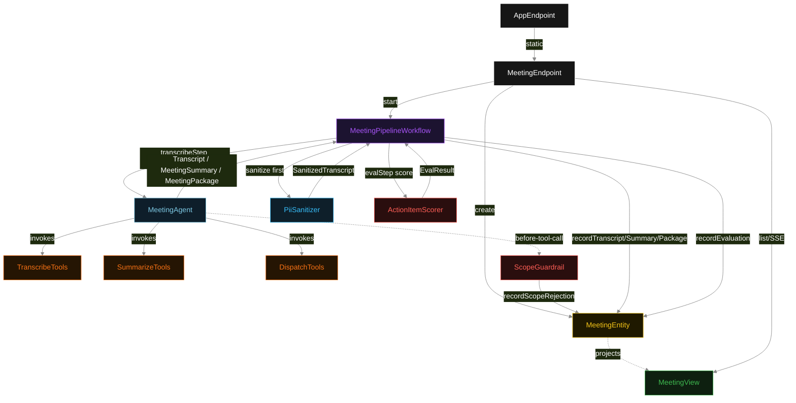
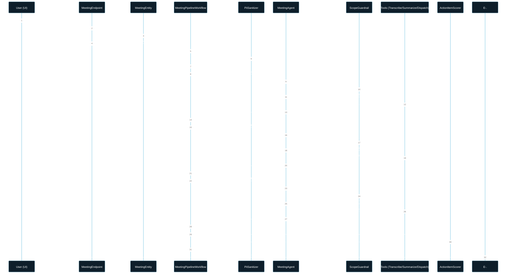
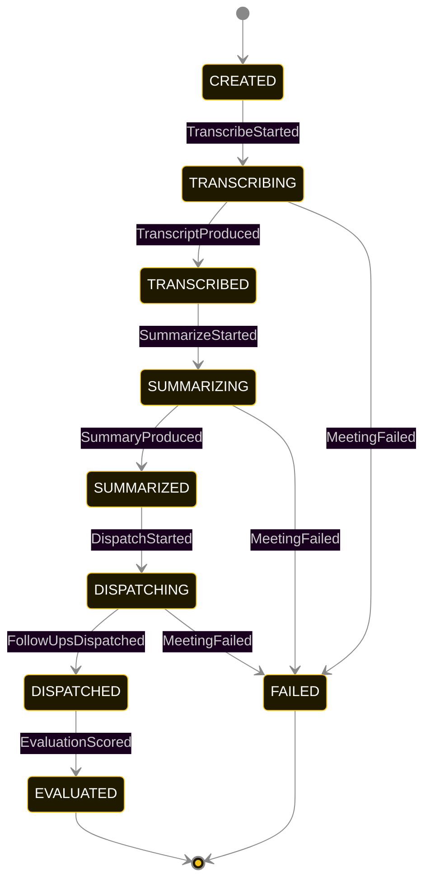
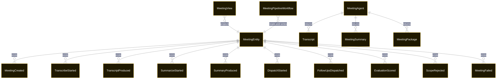

# PLAN — meeting-assistant-zoom

Architectural sketch consumed by `/akka:plan` and rendered on the generated system's Architecture tab. The four mermaid diagrams below carry the theme variables and CSS overrides from Lesson 24; without them, state names render black-on-black and edge labels clip.

---

## Component graph

## Interaction sequence — J1 (happy path)

## State machine — `MeetingEntity`

ScopeRejected is a side-event recorded on the entity for audit; it does not change the status — the agent's retry stays inside the same task, and the workflow's step continues. Only an exhausted retry budget or a step timeout transitions to FAILED.

## Entity model

## Component table — Java file targets

| Component | Path (generated) |
|---|---|
| `MeetingEndpoint` | `api/MeetingEndpoint.java` |
| `AppEndpoint` | `api/AppEndpoint.java` |
| `MeetingEntity` | `application/MeetingEntity.java` (state in `domain/MeetingRecord.java`, events in `domain/MeetingEvent.java`) |
| `MeetingPipelineWorkflow` | `application/MeetingPipelineWorkflow.java` |
| `MeetingAgent` | `application/MeetingAgent.java` (tasks in `application/MeetingTasks.java`) |
| `TranscribeTools` | `application/TranscribeTools.java` |
| `SummarizeTools` | `application/SummarizeTools.java` |
| `DispatchTools` | `application/DispatchTools.java` |
| `ScopeGuardrail` | `application/ScopeGuardrail.java` |
| `PiiSanitizer` | `application/PiiSanitizer.java` |
| `ActionItemScorer` | `application/ActionItemScorer.java` |
| `MeetingView` | `application/MeetingView.java` |
| `MockModelProvider` (option-a only) | `application/MockModelProvider.java` |
| Bootstrap | `Bootstrap.java` |

## Concurrency notes

- **Per-step timeout**: `transcribeStep` 90 s, `summarizeStep` 90 s, `dispatchStep` 90 s, `evalStep` 5 s, `error` 5 s. Default step recovery `maxRetries(2).failoverTo(MeetingPipelineWorkflow::error)`. The 90 s on each agent-calling step accommodates transcript segmentation plus LLM latency (Lesson 4).
- **Idempotency**: each workflow uses `"pipeline-" + meetingId` as the workflow id; restart of the same meetingId is rejected by the workflow runtime. The agent instance id is `"agent-" + meetingId` so each meeting has its own per-task conversation memory.
- **One agent per meeting**: `MeetingAgent` runs three tasks per meeting — TRANSCRIBE, SUMMARIZE, DISPATCH — each with `capability(...).maxIterationsPerTask(4)`. The 4-iteration budget gives the guardrail room to reject a misordered or out-of-scope call and still let the agent self-correct.
- **PiiSanitizer runs before the agent**: `transcribeStep` calls `PiiSanitizer.sanitize(rawTranscript)` synchronously before handing the sanitized text to `runSingleTask`. The LLM never sees the original. The redaction audit is recorded on the entity with `TranscribeStarted` so it is auditable independently of the transcript result.
- **Eval is synchronous and deterministic**: `ActionItemScorer` runs in-process inside `evalStep`. No LLM call, no external service — the same meeting package always scores the same.
- **Task-boundary handoff is the dependency contract**: `transcribeStep` writes `TranscriptProduced` BEFORE returning; `summarizeStep` reads the recorded `Transcript` from the entity to build its task's instruction context; `dispatchStep` reads both `Transcript` and `MeetingSummary`. The agent itself is stateless across phases.
- **No saga / no compensation**: every step is either pure read, append-only event write, or a single-task agent call. A failed meeting stays at the last successful event; the UI shows the partial state.
