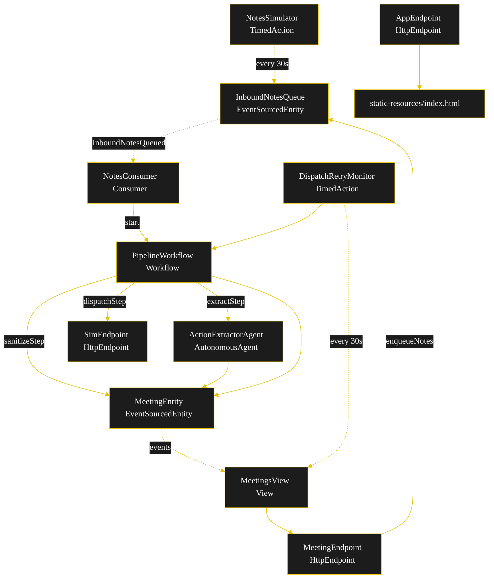
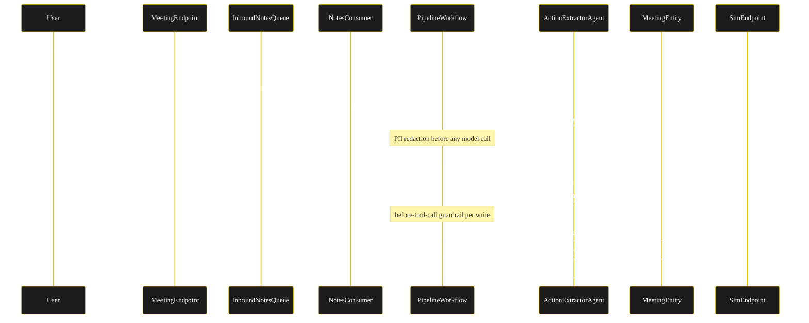
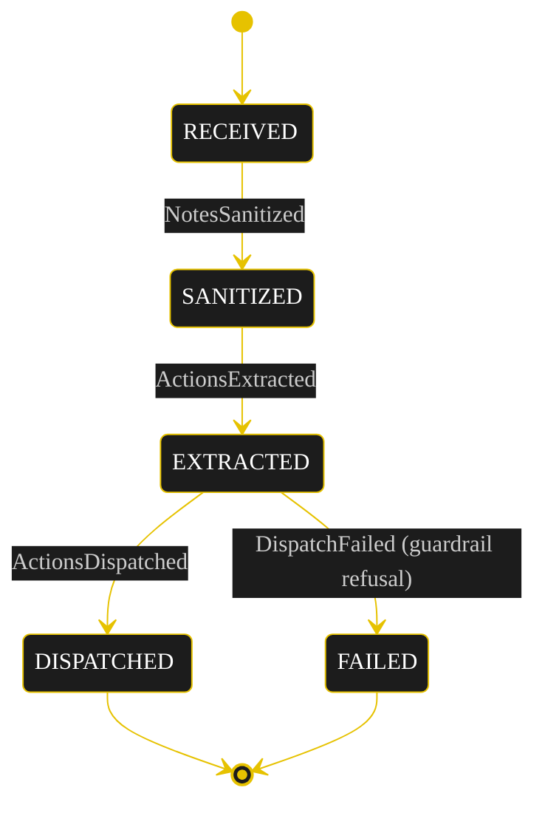
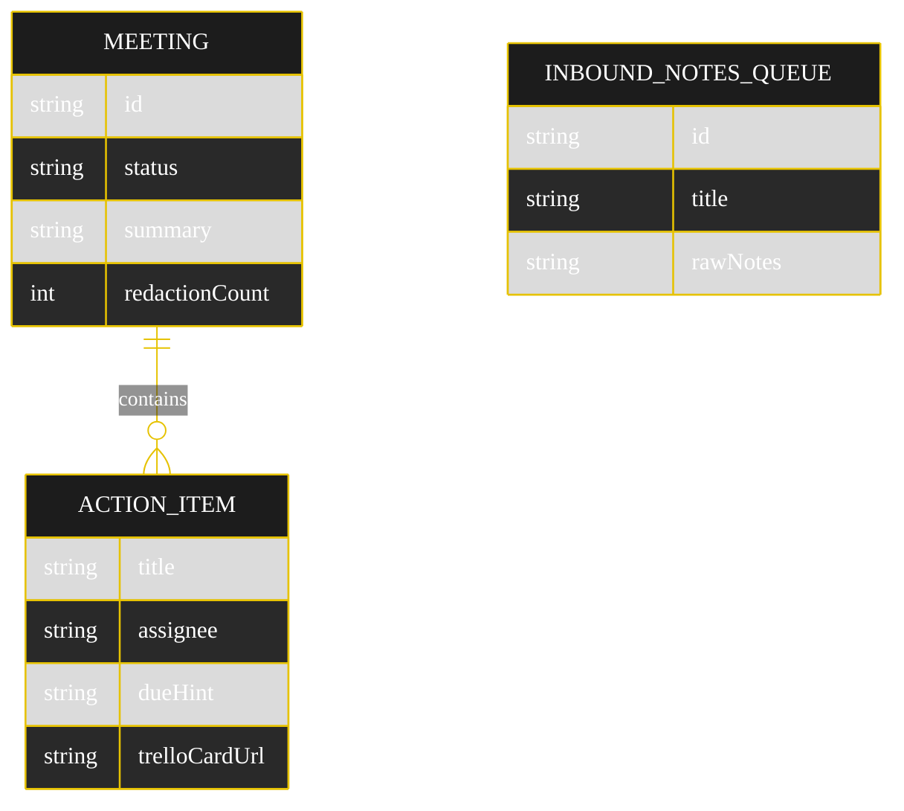

# Implementation Plan — `meeting-assistant`

The architecture this sample resolves to once `SPEC.md` runs through `/akka:specify` → `/akka:plan`.

---

## Component graph



Solid arrows are synchronous commands; dashed arrows are event subscriptions or scheduled ticks.

## Interaction sequence



## State machine



State labels and transition labels carry explicit colour via the Lesson 24 CSS overrides in the generated `index.html`:

```css
.diagram-card .mermaid .stateLabel,
.diagram-card .mermaid g.statediagram-state .label,
.diagram-card .mermaid g.statediagram-state .label *,
.diagram-card .mermaid g.statediagram-state text { color:#ffffff !important; fill:#ffffff !important; }
.diagram-card .mermaid .edgeLabel foreignObject { overflow:visible !important; }
```

## Entity model



## Component table

| Component | Kind | File | Purpose |
|---|---|---|---|
| `ActionExtractorAgent` | AutonomousAgent | `application/ActionExtractorAgent.java` | Redacted transcript → `ActionPlan`. |
| `ExtractionTasks` | task definitions | `application/ExtractionTasks.java` | `Task<ActionPlan> EXTRACT`. |
| `MeetingEntity` | EventSourcedEntity | `application/MeetingEntity.java` | Per-meeting lifecycle. |
| `InboundNotesQueue` | EventSourcedEntity | `application/InboundNotesQueue.java` | Inbound submissions. |
| `PipelineWorkflow` | Workflow | `application/PipelineWorkflow.java` | `sanitizeStep` → `extractStep` → `dispatchStep`. |
| `MeetingsView` | View | `application/MeetingsView.java` | Row type `Meeting`; one query + SSE stream. |
| `NotesConsumer` | Consumer | `application/NotesConsumer.java` | Starts a workflow per submission. |
| `NotesSimulator` | TimedAction | `application/NotesSimulator.java` | Drips canned notes every 30s. |
| `DispatchRetryMonitor` | TimedAction | `application/DispatchRetryMonitor.java` | Re-drives stuck `EXTRACTED` meetings. |
| `PiiRedactor` | helper | `application/PiiRedactor.java` | Deterministic PII redaction. |
| `TrelloClient` | helper | `application/TrelloClient.java` | Real Trello or in-process sim. |
| `SlackClient` | helper | `application/SlackClient.java` | Real Slack or in-process sim. |
| `MeetingEndpoint` | HttpEndpoint | `api/MeetingEndpoint.java` | `/api/*` + SSE + metadata. |
| `SimEndpoint` | HttpEndpoint | `api/SimEndpoint.java` | `/sim/trello/cards`, `/sim/slack/messages`. |
| `AppEndpoint` | HttpEndpoint | `api/AppEndpoint.java` | Serves the UI. |
| `Bootstrap` | service-setup | `Bootstrap.java` | Schedules the TimedActions. |

Component count: **3 http-endpoint · 2 timed-action · 1 view · 1 workflow · 1 service-setup · 1 autonomous-agent · 1 consumer · 2 event-sourced-entity**.

## Concurrency notes

- **Step timeouts.** `extractStep` calls the agent — set `stepTimeout(extractStep, 60s)` (Lesson 4). `dispatchStep` makes HTTP writes — `stepTimeout(dispatchStep, 30s)`. `defaultStepRecovery(maxRetries(2))`.
- **Idempotency.** Each dispatch carries the `meetingId` plus action index as an idempotency key so a workflow retry does not create duplicate Trello cards. The `SimEndpoint` dedupes on that key.
- **Compensation.** If the Slack post fails after Trello cards were created, `dispatchStep` records the partial result and `DispatchFailed`; the retry monitor re-drives only the missing writes, keyed by idempotency key — no card is recreated.
- **View indexing.** `MeetingsView` has no `WHERE status` clause; status filtering is client-side because Akka cannot auto-index enum columns (Lesson 2).
