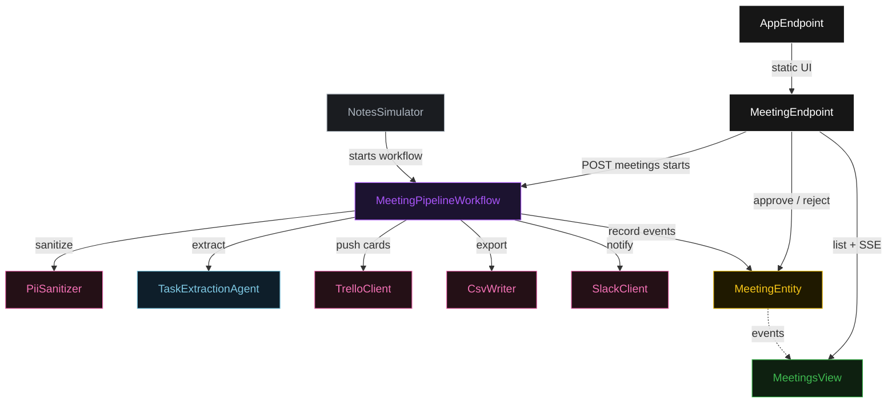
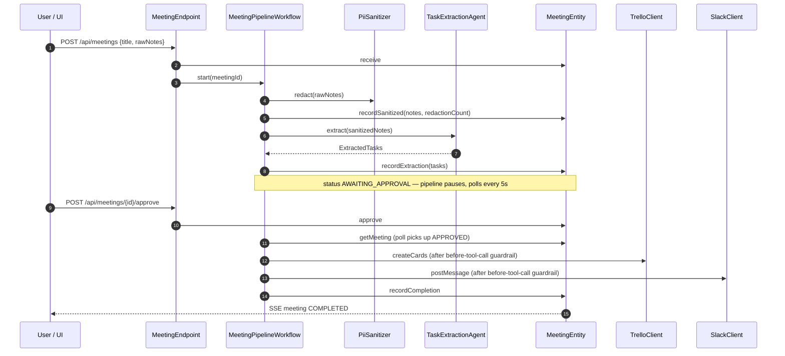
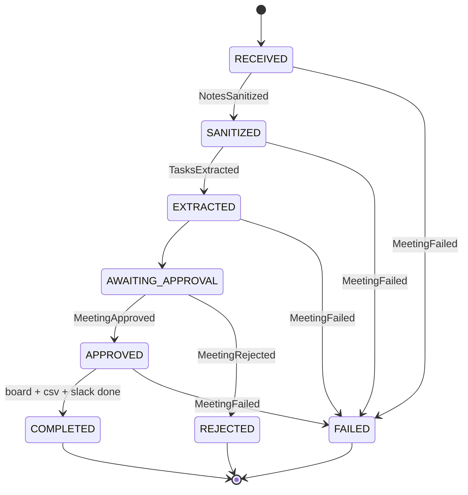
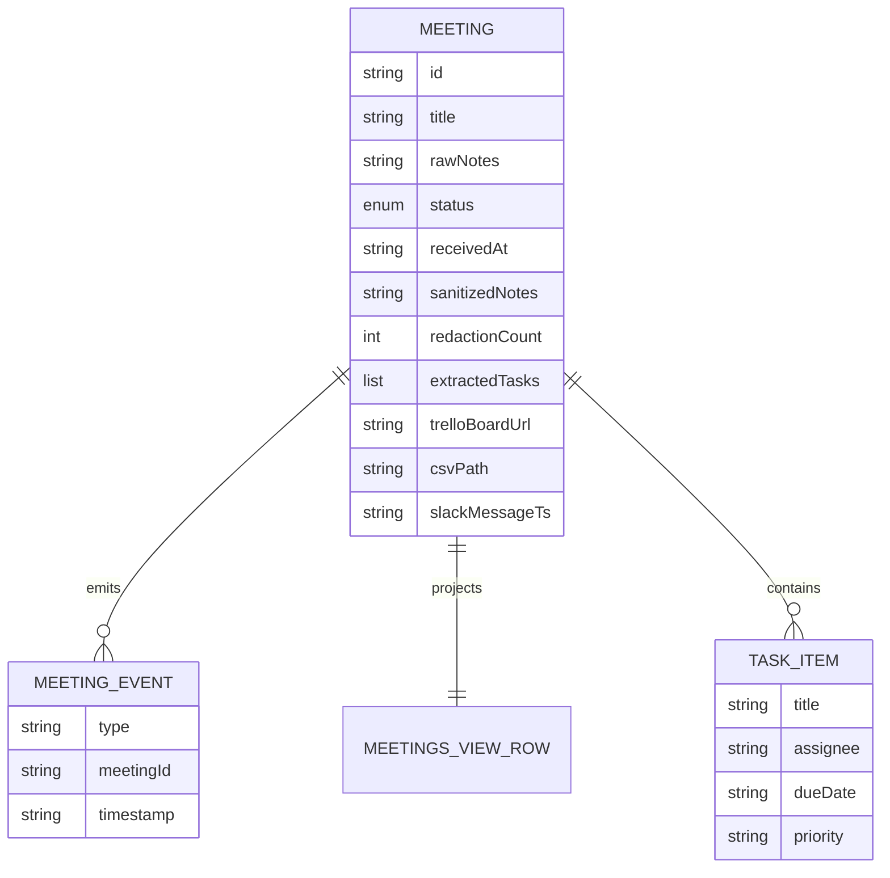

# PLAN — meeting-to-tasks

Architecture this blueprint resolves to once `SPEC.md` runs through `/akka:specify` → `/akka:plan`. All four mermaid diagrams and the component table are required. The generated UI renders these diagrams on the Architecture tab with the Lesson 24 CSS overrides.

---

## Component graph



Solid arrows are synchronous command calls; the dashed arrow is the event subscription that feeds the view.

## Interaction sequence



## State machine



CSS overrides (Lesson 24) the generated `index.html` must carry so the state names and transition labels stay visible:

```css
.diagram-card .mermaid .nodeLabel,
.diagram-card .mermaid .stateLabel,
.diagram-card .mermaid g.statediagram-state .label,
.diagram-card .mermaid g.statediagram-state .label *,
.diagram-card .mermaid g.statediagram-state text,
.diagram-card .mermaid .label foreignObject p { color:#fff !important; fill:#fff !important; }
.diagram-card .mermaid .edgeLabel foreignObject { overflow:visible !important; }
```

Plus `nodeTextColor`, `stateLabelColor`, and `transitionLabelColor: #cccccc` in `mermaid.initialize({themeVariables})`.

## Entity model



## Component table

| Component | Akka primitive | Path (generated) |
|---|---|---|
| TaskExtractionAgent | Agent | `application/TaskExtractionAgent.java` |
| MeetingPipelineWorkflow | Workflow | `application/MeetingPipelineWorkflow.java` |
| MeetingEntity | EventSourcedEntity | `application/MeetingEntity.java` |
| MeetingsView | View | `application/MeetingsView.java` |
| NotesSimulator | TimedAction | `application/NotesSimulator.java` |
| MeetingEndpoint | HttpEndpoint | `api/MeetingEndpoint.java` |
| AppEndpoint | HttpEndpoint | `api/AppEndpoint.java` |
| PiiSanitizer | helper | `application/PiiSanitizer.java` |
| TrelloClient | helper | `application/TrelloClient.java` |
| SlackClient | helper | `application/SlackClient.java` |
| CsvWriter | helper | `application/CsvWriter.java` |
| Meeting / MeetingStatus / MeetingEvent | domain | `domain/*.java` |
| Bootstrap | service-setup | `Bootstrap.java` |

Component count from the validator: **2 http-endpoint · 1 timed-action · 1 view · 1 workflow · 1 service-setup · 1 agent · 1 event-sourced-entity**.

## Concurrency notes

- **Step timeouts (Lesson 4).** `extractStep` calls the LLM; override `settings()` with `stepTimeout(MeetingPipelineWorkflow::extractStep, ofSeconds(60))`. `awaitApprovalStep` uses a short 10s step timeout and self-schedules a 5s resume poll while status is `AWAITING_APPROVAL`. `WorkflowSettings` is nested in `Workflow` — no import (Lesson 5).
- **Idempotency.** The workflow is keyed by `meetingId` (a fresh UUID per run). Each entity command is naturally idempotent on its event; re-delivery of `recordBoardPush` / `recordSlack` overwrites the same Optional fields with equal values.
- **Compensation.** The pipeline is forward-only. If `pushToBoardStep` or `notifyStep` fails after the guardrail passes, `defaultStepRecovery(maxRetries(2).failoverTo(error))` runs; the `error` step calls `MeetingEntity.markFailed(reason)` and the run ends in `FAILED`. No partial rollback of already-created Trello cards is attempted in the baseline — the failure reason records how far the run got.
- **Guardrail placement.** The before-tool-call guardrail runs inside `pushToBoardStep` and `notifyStep` immediately before the external client call, so a malformed or un-redacted payload blocks the write rather than failing after it.
