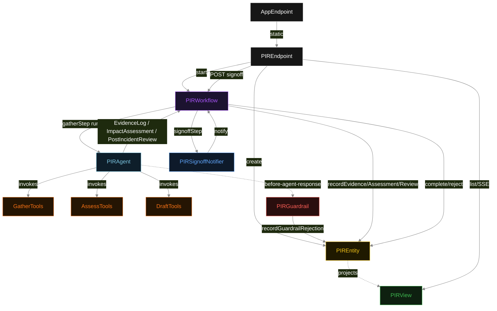
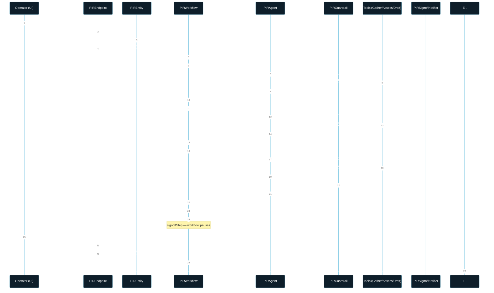
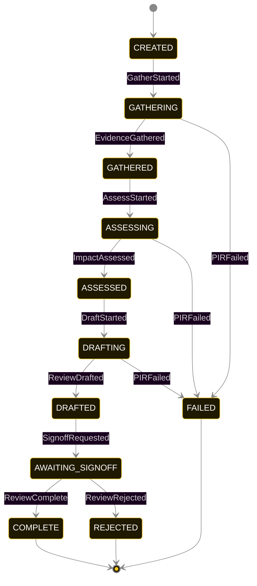
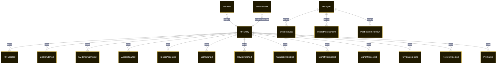

# PLAN — post-incident-reviewer

Architectural sketch consumed by `/akka:plan` and rendered on the generated system's Architecture tab. The four mermaid diagrams below carry the theme variables and CSS overrides from Lesson 24; without them, state names render black-on-black and edge labels clip.

---

## Component graph

## Interaction sequence — J1 (happy path)

## State machine — `PIREntity`

GuardrailRejected is a side-event recorded on the entity for audit; it does not change the status — the agent's retry stays inside the same task, and the workflow's draftStep continues. Only an exhausted retry budget or a step timeout transitions to FAILED. The AWAITING_SIGNOFF state waits indefinitely for a human decision; it never times out.

## Entity model

## Component table — Java file targets

| Component | Path (generated) |
|---|---|
| `PIREndpoint` | `api/PIREndpoint.java` |
| `AppEndpoint` | `api/AppEndpoint.java` |
| `PIREntity` | `application/PIREntity.java` (state in `domain/PIRRecord.java`, events in `domain/PIREvent.java`) |
| `PIRWorkflow` | `application/PIRWorkflow.java` |
| `PIRAgent` | `application/PIRAgent.java` (tasks in `application/PIRTasks.java`) |
| `GatherTools` | `application/GatherTools.java` |
| `AssessTools` | `application/AssessTools.java` |
| `DraftTools` | `application/DraftTools.java` |
| `PIRGuardrail` | `application/PIRGuardrail.java` |
| `PIRSignoffNotifier` | `application/PIRSignoffNotifier.java` |
| `PIRView` | `application/PIRView.java` |
| `MockModelProvider` (option-a only) | `application/MockModelProvider.java` |
| Bootstrap | `Bootstrap.java` |

## Concurrency notes

- **Per-step timeout**: `gatherStep` 60 s, `assessStep` 60 s, `draftStep` 90 s (extra budget for guardrail retries), `error` 5 s. `signoffStep` has no timeout — human accountability requires a human decision. Default step recovery `maxRetries(2).failoverTo(PIRWorkflow::error)`.
- **Idempotency**: each workflow uses `"pir-" + pirId` as the workflow id; restart of the same pirId is rejected by the workflow runtime. The agent instance id is `"agent-" + pirId`.
- **One agent per review**: `PIRAgent` runs three tasks per review — GATHER, ASSESS, DRAFT — each with `capability(...).maxIterationsPerTask(4)`. The 4-iteration budget gives the guardrail room to reject a non-compliant draft and still let the agent self-correct.
- **Guardrail-driven retry**: when `PIRGuardrail` rejects a draft response, the rejection is returned as a structured error to the agent loop. The agent retries within its iteration budget; if all 4 iterations fail, `draftStep` fails over to the `error` step.
- **HITL sign-off is indefinite**: `signoffStep` pauses the workflow thread. It does not consume resources while waiting — the workflow state is durable on the entity. The sign-off endpoint resumes the workflow when the incident owner acts.
- **Task-boundary handoff is the dependency contract**: `gatherStep` writes `EvidenceGathered` BEFORE returning; `assessStep` reads the recorded `EvidenceLog` from the entity to build its task's instruction context; `draftStep` reads both `EvidenceLog` and `ImpactAssessment`. The agent itself is stateless across phases.
- **No saga / no compensation**: every step is either pure read, append-only event write, or a single-task agent call. A failed review stays at the last successful event; the UI shows the partial state.
