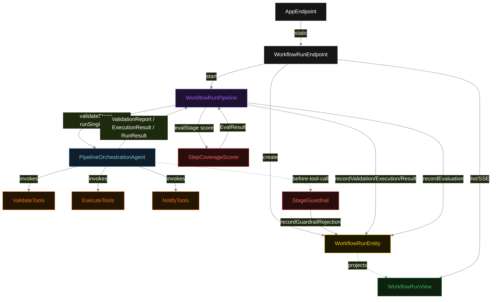
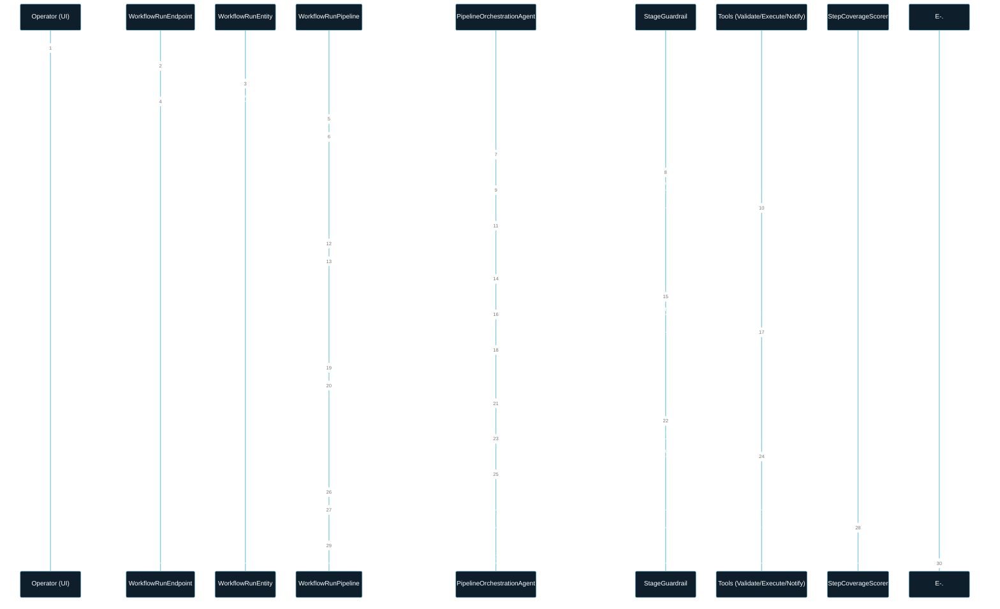
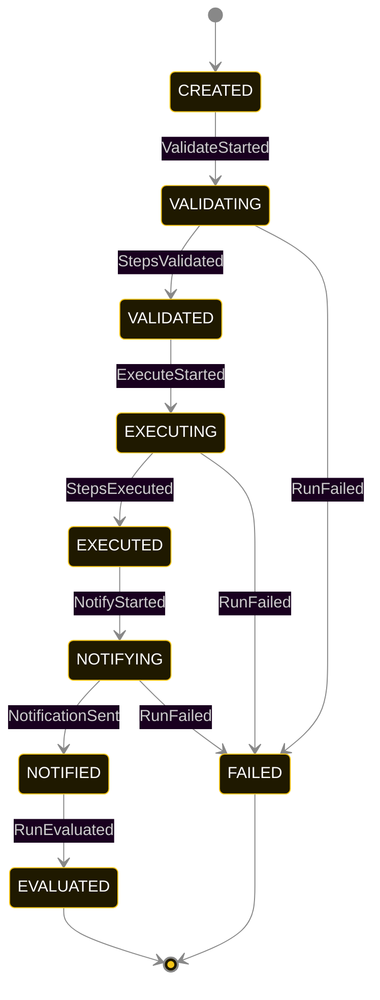
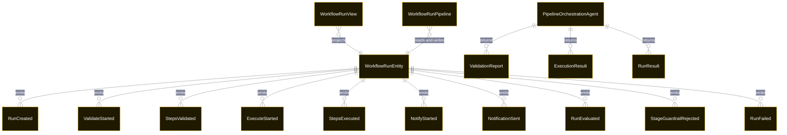

# PLAN — workflow-orchestration

Architectural sketch consumed by `/akka:plan` and rendered on the generated system's Architecture tab. The four mermaid diagrams below carry the theme variables and CSS overrides from Lesson 24; without them, state names render black-on-black and edge labels clip.

---

## Component graph

## Interaction sequence — J1 (happy path)

## State machine — `WorkflowRunEntity`

`StageGuardrailRejected` is a side-event recorded on the entity for audit; it does not change the status — the agent's retry stays inside the same task, and the workflow's stage continues. Only an exhausted retry budget or a step timeout transitions to FAILED.

## Entity model

## Component table — Java file targets

| Component | Path (generated) |
|---|---|
| `WorkflowRunEndpoint` | `api/WorkflowRunEndpoint.java` |
| `AppEndpoint` | `api/AppEndpoint.java` |
| `WorkflowRunEntity` | `application/WorkflowRunEntity.java` (state in `domain/WorkflowRunRecord.java`, events in `domain/WorkflowRunEvent.java`) |
| `WorkflowRunPipeline` | `application/WorkflowRunPipeline.java` |
| `PipelineOrchestrationAgent` | `application/PipelineOrchestrationAgent.java` (tasks in `application/WorkflowTasks.java`) |
| `ValidateTools` | `application/ValidateTools.java` |
| `ExecuteTools` | `application/ExecuteTools.java` |
| `NotifyTools` | `application/NotifyTools.java` |
| `StageGuardrail` | `application/StageGuardrail.java` |
| `StepCoverageScorer` | `application/StepCoverageScorer.java` |
| `WorkflowRunView` | `application/WorkflowRunView.java` |
| `MockModelProvider` (option-a only) | `application/MockModelProvider.java` |
| Bootstrap | `Bootstrap.java` |

## Concurrency notes

- **Per-stage timeout**: `validateStage` 60 s, `executeStage` 60 s, `notifyStage` 60 s, `evalStage` 5 s, `error` 5 s. Default step recovery `maxRetries(2).failoverTo(WorkflowRunPipeline::error)`. The 60 s on each agent-calling stage accommodates LLM latency including tool round-trips (Lesson 4).
- **Idempotency**: each workflow uses `"pipeline-" + runId` as the workflow id; restart of the same runId is rejected by the workflow runtime. The agent instance id is `"agent-" + runId` so each run has its own per-task conversation memory.
- **One agent per run**: `PipelineOrchestrationAgent` runs three tasks per run — VALIDATE, EXECUTE, NOTIFY — each with `capability(...).maxIterationsPerTask(4)`. The 4-iteration budget gives the guardrail room to reject a misordered tool call and still let the agent self-correct.
- **Guardrail-driven retry**: when `StageGuardrail` rejects a tool call, the rejection is returned as a structured error to the agent loop. The loop counts toward `maxIterationsPerTask`; if all 4 iterations fail validation, the workflow stage fails over to `error` and the entity transitions to `FAILED`.
- **Eval is synchronous and deterministic**: `StepCoverageScorer` runs in-process inside `evalStage`. No LLM call, no external service — the same run always scores the same. This is a deliberate single-agent invariant.
- **Stage-boundary handoff is the dependency contract**: `validateStage` writes `StepsValidated` BEFORE returning; `executeStage` reads the recorded `ValidationReport` from the entity to build its task's instruction context; `notifyStage` reads both `ValidationReport` and `ExecutionResult`. The agent itself is stateless across stages.
- **No saga / no compensation**: every stage is either pure read, append-only event write, or a single-task agent call. A failed run stays at the last successful event; the UI shows the partial state for the operator.
