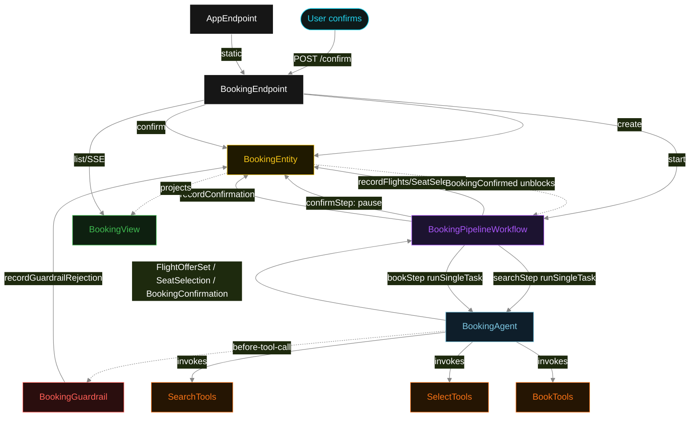
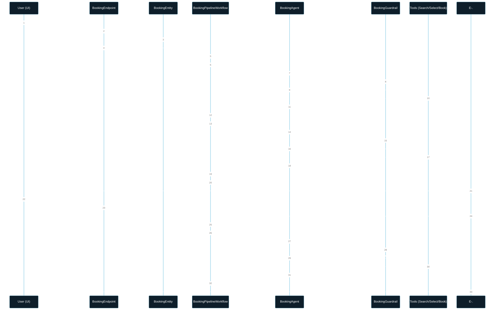
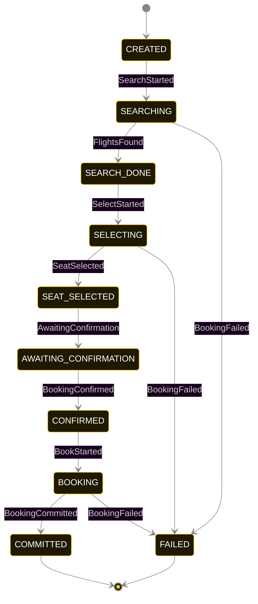
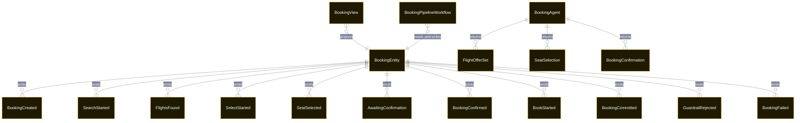

# PLAN — flight-booking-pipeline

Architectural sketch consumed by `/akka:plan` and rendered on the generated system's Architecture tab. The four mermaid diagrams below carry the theme variables and CSS overrides from Lesson 24; without them, state names render black-on-black and edge labels clip.

---

## Component graph

## Interaction sequence — J1 (happy path)

## State machine — `BookingEntity`

`GuardrailRejected` is a side-event recorded on the entity for audit; it does not change the status — the agent's retry stays inside the same task, and the workflow's step continues. Only an exhausted retry budget or a step timeout transitions to FAILED.

## Entity model

## Component table — Java file targets

| Component | Path (generated) |
|---|---|
| `BookingEndpoint` | `api/BookingEndpoint.java` |
| `AppEndpoint` | `api/AppEndpoint.java` |
| `BookingEntity` | `application/BookingEntity.java` (state in `domain/BookingRecord.java`, events in `domain/BookingEvent.java`) |
| `BookingPipelineWorkflow` | `application/BookingPipelineWorkflow.java` |
| `BookingAgent` | `application/BookingAgent.java` (tasks in `application/BookingTasks.java`) |
| `SearchTools` | `application/SearchTools.java` |
| `SelectTools` | `application/SelectTools.java` |
| `BookTools` | `application/BookTools.java` |
| `BookingGuardrail` | `application/BookingGuardrail.java` |
| `BookingView` | `application/BookingView.java` |
| `MockModelProvider` (option-a only) | `application/MockModelProvider.java` |
| Bootstrap | `Bootstrap.java` |

## Concurrency notes

- **Per-step timeout**: `searchStep` 60 s, `selectStep` 60 s, `confirmStep` 3600 s (human confirmation window), `bookStep` 60 s, `error` 5 s. Default step recovery `maxRetries(2).failoverTo(BookingPipelineWorkflow::error)`. The 60 s on each agent-calling step accommodates LLM latency including tool round-trips (Lesson 4). The 3600 s on `confirmStep` gives a human an hour to review and confirm the itinerary before the workflow fails.
- **Idempotency**: each workflow uses `"pipeline-" + bookingId` as the workflow id; restart of the same bookingId is rejected by the workflow runtime. The agent instance id is `"agent-" + bookingId` so each booking has its own per-task conversation memory.
- **One agent per booking**: `BookingAgent` runs three tasks per booking — SEARCH, SELECT, BOOK — each with `capability(...).maxIterationsPerTask(4)`. The 4-iteration budget gives the guardrail room to reject a misordered or unconfirmed tool call and still let the agent self-correct.
- **Guardrail-driven retry**: when `BookingGuardrail` rejects a tool call, the rejection is returned as a structured error to the agent loop. The loop counts toward `maxIterationsPerTask`; if all 4 iterations fail validation, the workflow step fails over to `error` and the entity transitions to `FAILED`.
- **Confirmation gate is synchronous to the user, asynchronous to the workflow**: `confirmStep` suspends the workflow. The workflow resumes only after the user's `POST /confirm` call writes `BookingConfirmed` onto the entity. No polling loop, no timeout below the 1-hour limit.
- **Task-boundary handoff is the dependency contract**: `searchStep` writes `FlightsFound` BEFORE returning; `selectStep` reads the recorded `FlightOfferSet` from the entity to build its task's instruction context; `bookStep` reads `SeatSelection`. The agent itself is stateless across phases — it never holds search + select + book context in one conversation.
- **No saga / no compensation**: every step is either pure read, append-only event write, or a single-task agent call. A failed booking stays at the last successful event; the UI shows the partial state for the user. Reservation rollback is out of scope for this blueprint.
