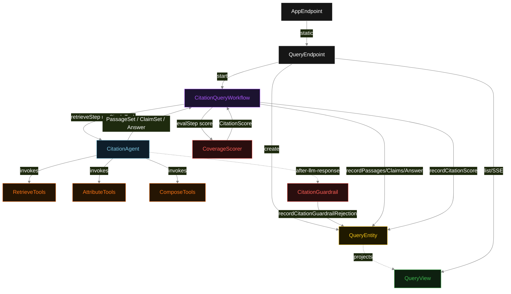
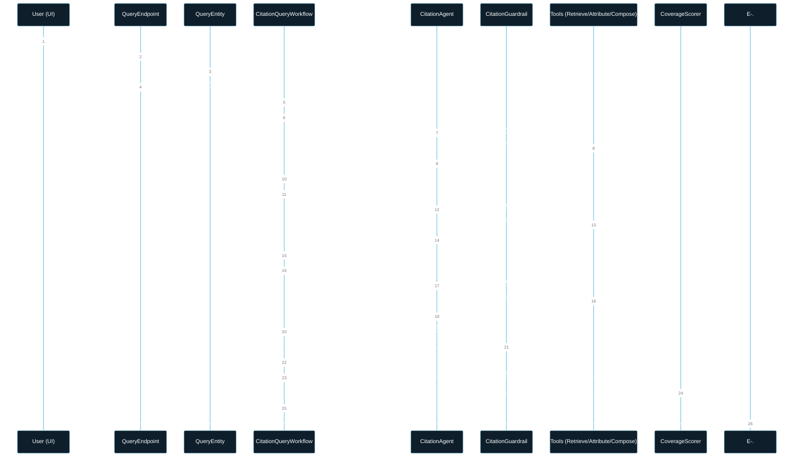
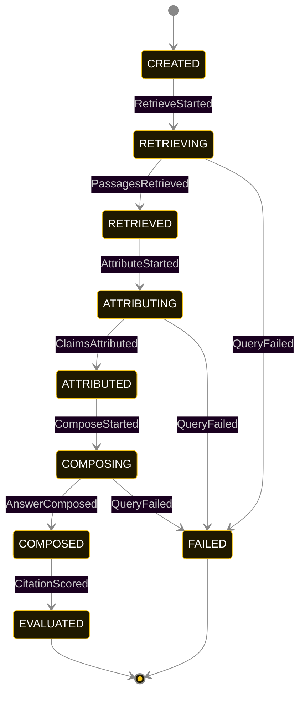
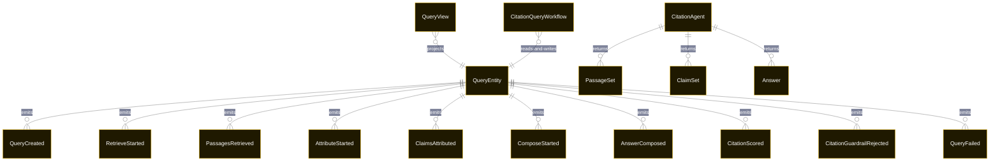

# PLAN — citation-rag

Architectural sketch consumed by `/akka:plan` and rendered on the generated system's Architecture tab. The four mermaid diagrams below carry the theme variables and CSS overrides from Lesson 24; without them, state names render black-on-black and edge labels clip.

---

## Component graph

## Interaction sequence — J1 (happy path)

## State machine — `QueryEntity`

`CitationGuardrailRejected` is a side-event recorded on the entity for audit; it does not change the status — the agent's retry stays inside the same COMPOSE task, and the workflow's `composeStep` continues. Only an exhausted retry budget or a step timeout transitions to FAILED.

## Entity model

## Component table — Java file targets

| Component | Path (generated) |
|---|---|
| `QueryEndpoint` | `api/QueryEndpoint.java` |
| `AppEndpoint` | `api/AppEndpoint.java` |
| `QueryEntity` | `application/QueryEntity.java` (state in `domain/QueryRecord.java`, events in `domain/QueryEvent.java`) |
| `CitationQueryWorkflow` | `application/CitationQueryWorkflow.java` |
| `CitationAgent` | `application/CitationAgent.java` (tasks in `application/CitationTasks.java`) |
| `RetrieveTools` | `application/RetrieveTools.java` |
| `AttributeTools` | `application/AttributeTools.java` |
| `ComposeTools` | `application/ComposeTools.java` |
| `CitationGuardrail` | `application/CitationGuardrail.java` |
| `CoverageScorer` | `application/CoverageScorer.java` |
| `QueryView` | `application/QueryView.java` |
| `MockModelProvider` (option-a only) | `application/MockModelProvider.java` |
| Bootstrap | `Bootstrap.java` |

## Concurrency notes

- **Per-step timeout**: `retrieveStep` 60 s, `attributeStep` 60 s, `composeStep` 60 s, `evalStep` 5 s, `error` 5 s. Default step recovery `maxRetries(2).failoverTo(CitationQueryWorkflow::error)`. The 60 s on each agent-calling step accommodates LLM latency including tool round-trips (Lesson 4).
- **Idempotency**: each workflow uses `"citation-" + queryId` as the workflow id; restart of the same queryId is rejected by the workflow runtime. The agent instance id is `"agent-" + queryId` so each query has its own per-task conversation memory.
- **One agent per query**: `CitationAgent` runs three tasks per query — RETRIEVE, ATTRIBUTE, COMPOSE — each with `capability(...).maxIterationsPerTask(4)`. The 4-iteration budget gives the citation guardrail room to reject an uncited answer and still let the agent self-correct.
- **Guardrail-driven retry**: when `CitationGuardrail` rejects a COMPOSE response, the structured error is returned to the agent loop. The loop counts toward `maxIterationsPerTask`; if all 4 iterations fail validation, the workflow step fails over to `error` and the entity transitions to FAILED.
- **Eval is synchronous and deterministic**: `CoverageScorer` runs in-process inside `evalStep`. No LLM call, no external service — the same answer always scores the same. This is a deliberate single-agent invariant.
- **Task-boundary handoff is the dependency contract**: `retrieveStep` writes `PassagesRetrieved` BEFORE returning; `attributeStep` reads the recorded `PassageSet` from the entity to build its task's instruction context; `composeStep` reads both `PassageSet` and `ClaimSet`. The agent itself is stateless across phases.
- **No saga / no compensation**: every step is either pure read, append-only event write, or a single-task agent call. A failed query stays at the last successful event; the UI shows the partial state for the user.
