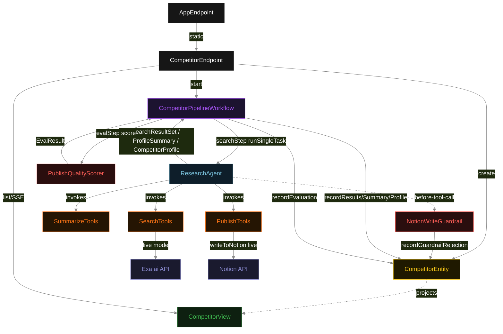
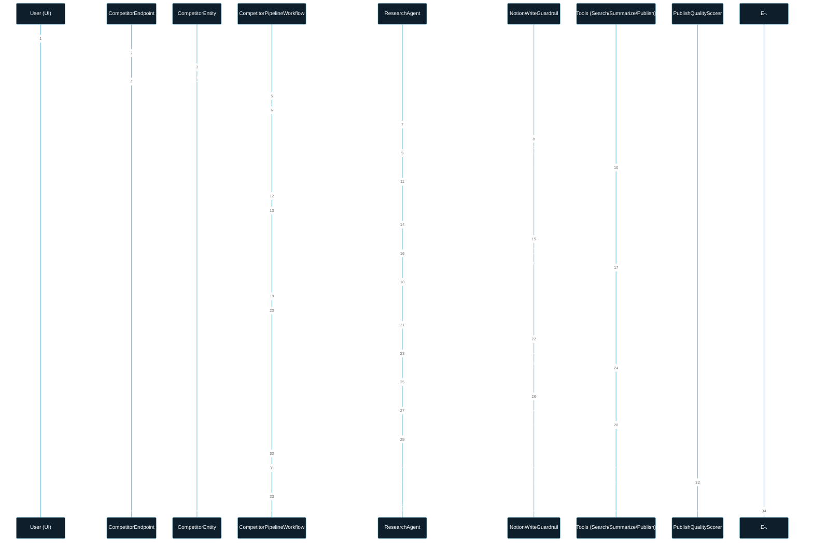
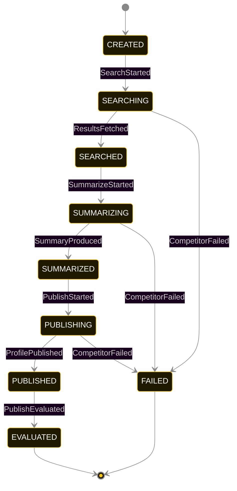
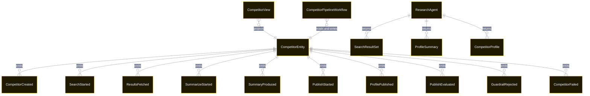

# PLAN — competitor-research-pipeline

Architectural sketch consumed by `/akka:plan` and rendered on the generated system's Architecture tab. The four mermaid diagrams below carry the theme variables and CSS overrides from Lesson 24; without them, state names render black-on-black and edge labels clip.

---

## Component graph

## Interaction sequence — J1 (happy path)

## State machine — `CompetitorEntity`

`GuardrailRejected` is a side-event recorded on the entity for audit; it does not change the status — the agent's retry stays inside the same task, and the workflow's step continues. Only an exhausted retry budget or a step timeout transitions to `FAILED`.

## Entity model

## Component table — Java file targets

| Component | Path (generated) |
|---|---|
| `CompetitorEndpoint` | `api/CompetitorEndpoint.java` |
| `AppEndpoint` | `api/AppEndpoint.java` |
| `CompetitorEntity` | `application/CompetitorEntity.java` (state in `domain/CompetitorRecord.java`, events in `domain/CompetitorEvent.java`) |
| `CompetitorPipelineWorkflow` | `application/CompetitorPipelineWorkflow.java` |
| `ResearchAgent` | `application/ResearchAgent.java` (tasks in `application/ResearchTasks.java`) |
| `SearchTools` | `application/SearchTools.java` |
| `SummarizeTools` | `application/SummarizeTools.java` |
| `PublishTools` | `application/PublishTools.java` |
| `NotionWriteGuardrail` | `application/NotionWriteGuardrail.java` |
| `NotionSchema` | `application/NotionSchema.java` |
| `PublishQualityScorer` | `application/PublishQualityScorer.java` |
| `CompetitorView` | `application/CompetitorView.java` |
| `MockModelProvider` (option-a only) | `application/MockModelProvider.java` |
| Bootstrap | `Bootstrap.java` |

## Concurrency notes

- **Per-step timeout**: `searchStep` 90 s, `summarizeStep` 90 s, `publishStep` 90 s, `evalStep` 5 s, `error` 5 s. Default step recovery `maxRetries(2).failoverTo(CompetitorPipelineWorkflow::error)`. The 90 s on each agent-calling step accommodates LLM latency plus the round-trip to Exa.ai or Notion (Lesson 4).
- **Idempotency**: each workflow uses `"pipeline-" + competitorId` as the workflow id; restart of the same competitorId is rejected by the workflow runtime. The agent instance id is `"agent-" + competitorId` so each competitor has its own per-task conversation memory.
- **One agent per competitor**: `ResearchAgent` runs three tasks per competitor — SEARCH, SUMMARIZE, PUBLISH — each with `capability(...).maxIterationsPerTask(4)`. The 4-iteration budget gives the guardrail room to reject a misordered or schema-violating call and still let the agent self-correct.
- **Guardrail-driven retry**: when `NotionWriteGuardrail` rejects a tool call (phase-violation or schema-violation), the rejection is returned as a structured error to the agent loop. The loop counts toward `maxIterationsPerTask`; if all 4 iterations fail validation, the workflow step fails over to `error` and the entity transitions to `FAILED`.
- **Eval is synchronous and deterministic**: `PublishQualityScorer` runs in-process inside `evalStep`. No LLM call, no external service — the same profile always scores the same.
- **Task-boundary handoff is the dependency contract**: `searchStep` writes `ResultsFetched` BEFORE returning; `summarizeStep` reads the recorded `SearchResultSet` from the entity to build its task's instruction context; `publishStep` reads both `SearchResultSet` and `ProfileSummary`. The agent itself is stateless across phases.
- **No saga / no compensation**: every step is either pure read, append-only event write, or a single-task agent call. A failed competitor stays at the last successful event; the UI shows the partial state for the user.
