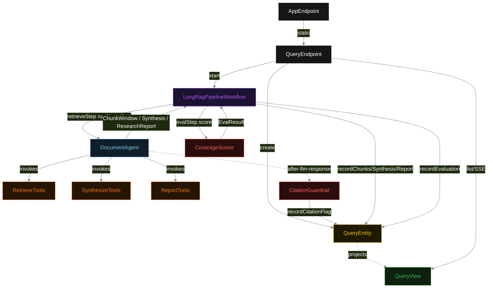
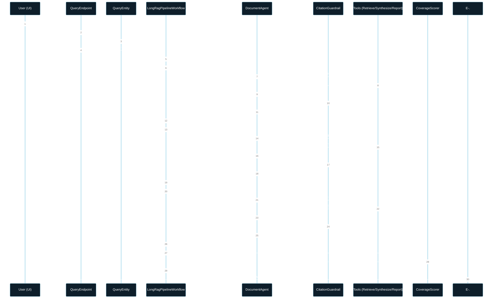
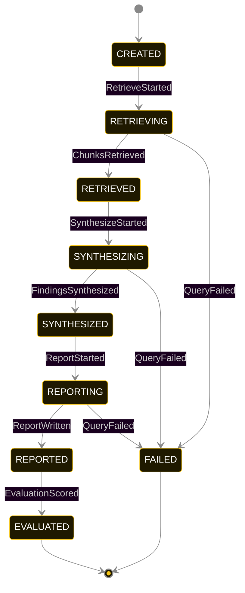
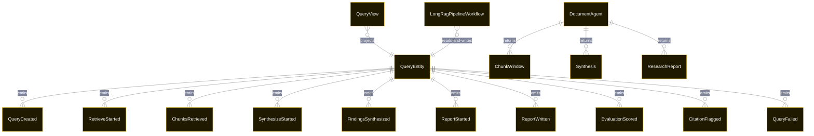

# PLAN — long-rag-workflow

Architectural sketch consumed by `/akka:plan` and rendered on the generated system's Architecture tab. The four mermaid diagrams below carry the theme variables and CSS overrides from Lesson 24; without them, state names render black-on-black and edge labels clip.

---

## Component graph

## Interaction sequence — J1 (happy path)

## State machine — `QueryEntity`

CitationFlagged is a side-event recorded on the entity for audit; it does not change the status — the agent's revision stays inside the same task, and the workflow's step continues. Only an exhausted retry budget or a step timeout transitions to FAILED.

## Entity model

## Component table — Java file targets

| Component | Path (generated) |
|---|---|
| `QueryEndpoint` | `api/QueryEndpoint.java` |
| `AppEndpoint` | `api/AppEndpoint.java` |
| `QueryEntity` | `application/QueryEntity.java` (state in `domain/QueryRecord.java`, events in `domain/QueryEvent.java`) |
| `LongRagPipelineWorkflow` | `application/LongRagPipelineWorkflow.java` |
| `DocumentAgent` | `application/DocumentAgent.java` (tasks in `application/DocumentTasks.java`) |
| `RetrieveTools` | `application/RetrieveTools.java` |
| `SynthesizeTools` | `application/SynthesizeTools.java` |
| `ReportTools` | `application/ReportTools.java` |
| `CitationGuardrail` | `application/CitationGuardrail.java` |
| `CoverageScorer` | `application/CoverageScorer.java` |
| `QueryView` | `application/QueryView.java` |
| `MockModelProvider` (option-a only) | `application/MockModelProvider.java` |
| Bootstrap | `Bootstrap.java` |

## Concurrency notes

- **Per-step timeout**: `retrieveStep` 90 s, `synthesizeStep` 90 s, `reportStep` 90 s, `evalStep` 5 s, `error` 5 s. Default step recovery `maxRetries(2).failoverTo(LongRagPipelineWorkflow::error)`. The 90 s on each agent-calling step accommodates LLM latency on long-context inputs including tool round-trips (Lesson 4).
- **Idempotency**: each workflow uses `"rag-" + queryId` as the workflow id; restart of the same queryId is rejected by the workflow runtime. The agent instance id is `"agent-" + queryId` so each query has its own per-task conversation memory.
- **One agent per query**: `DocumentAgent` runs three tasks per query — RETRIEVE, SYNTHESIZE, REPORT — each with `capability(...).maxIterationsPerTask(5)`. The 5-iteration budget gives the citation guardrail room to flag a missing citation and still let the agent self-correct.
- **Guardrail-driven revision**: when `CitationGuardrail` returns a citation-gap revision instruction, the instruction is fed back to the agent loop. The loop counts toward `maxIterationsPerTask`; if all 5 iterations fail citation checks, the workflow step fails over to `error` and the entity transitions to `FAILED`.
- **Eval is synchronous and deterministic**: `CoverageScorer` runs in-process inside `evalStep`. No LLM call — the same report always scores the same. This is the single-agent invariant.
- **Task-boundary handoff is the dependency contract**: `retrieveStep` writes `ChunksRetrieved` BEFORE returning; `synthesizeStep` reads the recorded `ChunkWindow` from the entity to build its task's instruction context; `reportStep` reads both `ChunkWindow` and `Synthesis`. The agent is stateless across phases.
- **No saga / no compensation**: every step is either a pure read, an append-only event write, or a single-task agent call. A failed query stays at the last successful event; the UI shows the partial state.
- **Long-document retrieval**: `RetrieveTools.searchChunks` uses a sliding-window strategy with 20% chunk overlap. The window size (default 512 tokens) and overlap percentage are configurable in `application.conf` under `long-rag.chunk-size` and `long-rag.overlap-pct`. The in-process corpus mock ignores these at runtime but the conf keys are wired for deployer override.
