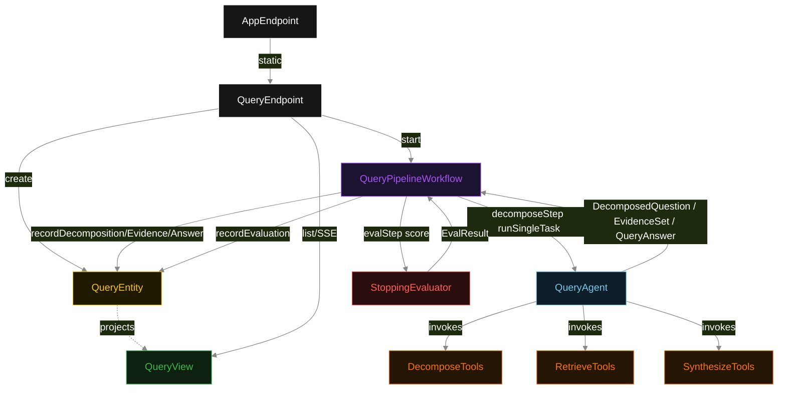
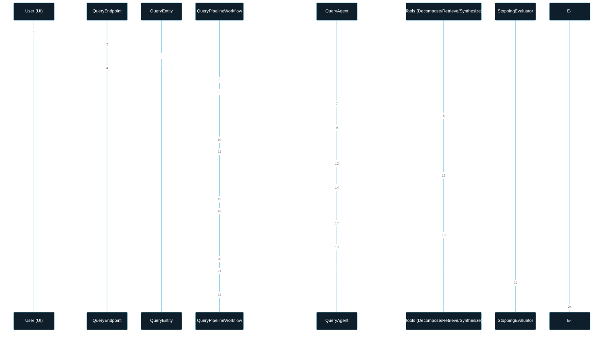
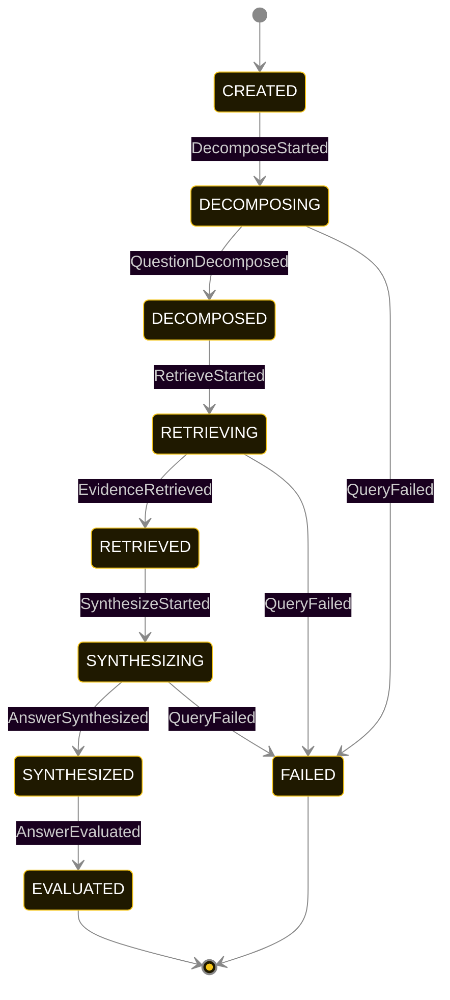
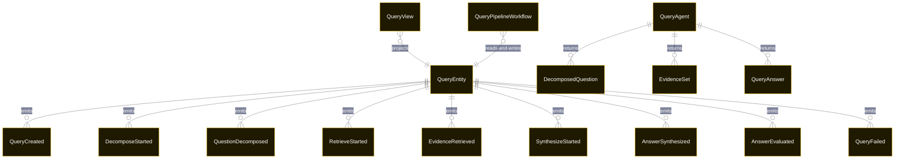

# PLAN — multi-step-query-engine

Architectural sketch consumed by `/akka:plan` and rendered on the generated system's Architecture tab. The four mermaid diagrams below carry the theme variables and CSS overrides from Lesson 24; without them, state names render black-on-black and edge labels clip.

---

## Component graph

## Interaction sequence — J1 (happy path)

## State machine — `QueryEntity`

`AnswerEvaluated` is always recorded regardless of the score value — a score of 1 is still a valid terminal state. Only step timeout exhaustion or unrecoverable agent failure transitions to `FAILED`.

## Entity model

## Component table — Java file targets

| Component | Path (generated) |
|---|---|
| `QueryEndpoint` | `api/QueryEndpoint.java` |
| `AppEndpoint` | `api/AppEndpoint.java` |
| `QueryEntity` | `application/QueryEntity.java` (state in `domain/QueryRecord.java`, events in `domain/QueryEvent.java`) |
| `QueryPipelineWorkflow` | `application/QueryPipelineWorkflow.java` |
| `QueryAgent` | `application/QueryAgent.java` (tasks in `application/QueryTasks.java`) |
| `DecomposeTools` | `application/DecomposeTools.java` |
| `RetrieveTools` | `application/RetrieveTools.java` |
| `SynthesizeTools` | `application/SynthesizeTools.java` |
| `StoppingEvaluator` | `application/StoppingEvaluator.java` |
| `QueryView` | `application/QueryView.java` |
| `MockModelProvider` (option-a only) | `application/MockModelProvider.java` |
| Bootstrap | `Bootstrap.java` |

## Concurrency notes

- **Per-step timeout**: `decomposeStep` 60 s, `retrieveStep` 60 s, `synthesizeStep` 60 s, `evalStep` 5 s, `error` 5 s. Default step recovery `maxRetries(2).failoverTo(QueryPipelineWorkflow::error)`. The 60 s on each agent-calling step accommodates LLM latency including tool round-trips (Lesson 4).
- **Idempotency**: each workflow uses `"pipeline-" + queryId` as the workflow id; restart of the same queryId is rejected by the workflow runtime. The agent instance id is `"agent-" + queryId` so each query has its own per-task conversation memory.
- **One agent per query**: `QueryAgent` runs three tasks per query — DECOMPOSE, RETRIEVE, SYNTHESIZE — each with `capability(...).maxIterationsPerTask(4)`. The 4-iteration budget gives the agent room to self-correct if a tool returns an empty result or an out-of-order call is made.
- **Eval is synchronous and deterministic**: `StoppingEvaluator` runs in-process inside `evalStep`. No LLM call, no external service — the same answer always scores the same. This is a deliberate single-agent invariant.
- **Task-boundary handoff is the dependency contract**: `decomposeStep` writes `QuestionDecomposed` BEFORE returning; `retrieveStep` reads the recorded `DecomposedQuestion` from the entity to build its task's instruction context; `synthesizeStep` reads both `DecomposedQuestion` and `EvidenceSet`. The agent itself is stateless across phases — it never holds decompose + retrieve + synthesize context in one conversation.
- **No saga / no compensation**: every step is either pure read, append-only event write, or a single-task agent call. A failed query stays at the last successful event; the UI shows the partial state for the user.
