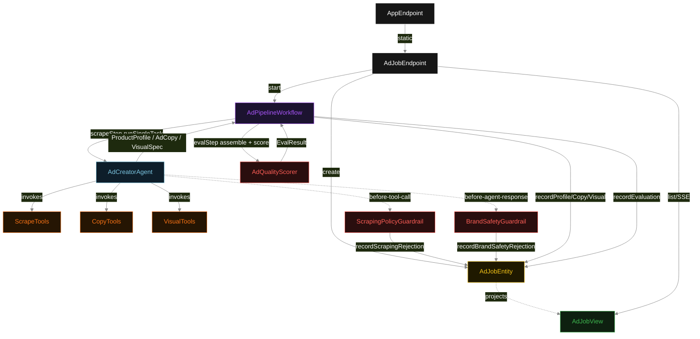
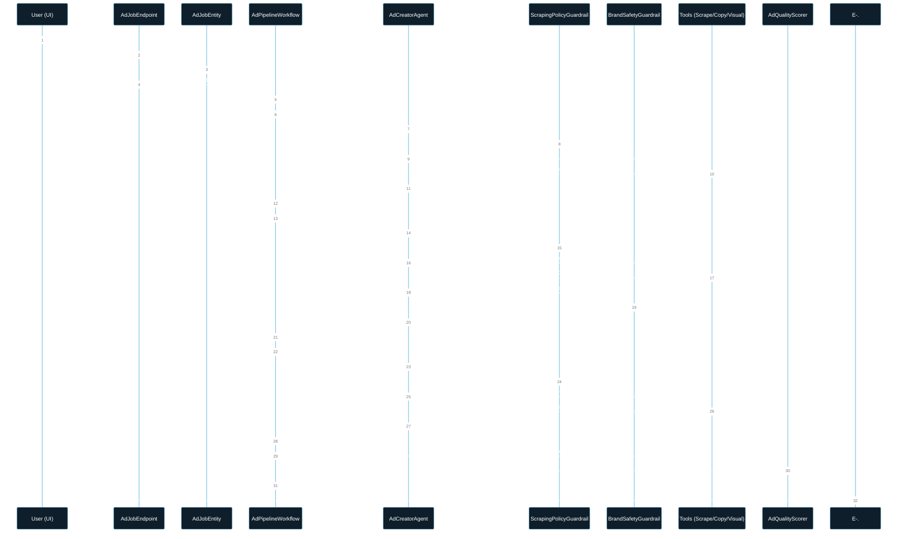
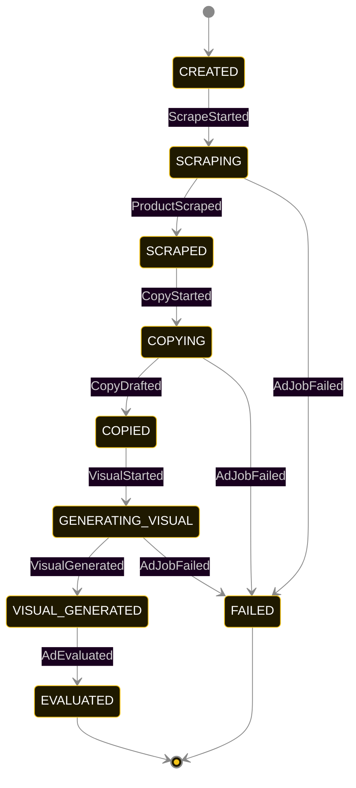
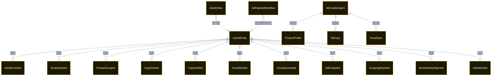

# PLAN — ad-creator-pipeline

Architectural sketch consumed by `/akka:plan` and rendered on the generated system's Architecture tab. The four mermaid diagrams below carry the theme variables and CSS overrides from Lesson 24; without them, state names render black-on-black and edge labels clip.

---

## Component graph

## Interaction sequence — J1 (happy path)

## State machine — `AdJobEntity`

`ScrapingRejected` and `BrandSafetyRejected` are side-events recorded on the entity for audit; they do not change the status. Only an exhausted retry budget or a step timeout transitions to `FAILED`.

## Entity model

## Component table — Java file targets

| Component | Path (generated) |
|---|---|
| `AdJobEndpoint` | `api/AdJobEndpoint.java` |
| `AppEndpoint` | `api/AppEndpoint.java` |
| `AdJobEntity` | `application/AdJobEntity.java` (state in `domain/AdJobRecord.java`, events in `domain/AdJobEvent.java`) |
| `AdPipelineWorkflow` | `application/AdPipelineWorkflow.java` |
| `AdCreatorAgent` | `application/AdCreatorAgent.java` (tasks in `application/AdTasks.java`) |
| `ScrapeTools` | `application/ScrapeTools.java` |
| `CopyTools` | `application/CopyTools.java` |
| `VisualTools` | `application/VisualTools.java` |
| `ScrapingPolicyGuardrail` | `application/ScrapingPolicyGuardrail.java` |
| `BrandSafetyGuardrail` | `application/BrandSafetyGuardrail.java` |
| `AdQualityScorer` | `application/AdQualityScorer.java` |
| `AdJobView` | `application/AdJobView.java` |
| `MockModelProvider` (option-a only) | `application/MockModelProvider.java` |
| Bootstrap | `Bootstrap.java` |

## Concurrency notes

- **Per-step timeout**: `scrapeStep` 60 s, `copyStep` 60 s, `visualStep` 60 s, `evalStep` 5 s, `error` 5 s. Default step recovery `maxRetries(2).failoverTo(AdPipelineWorkflow::error)`. The 60 s on each agent-calling step accommodates LLM latency including tool round-trips and guardrail-driven rewrites (Lesson 4).
- **Idempotency**: each workflow uses `"pipeline-" + adJobId` as the workflow id; restart of the same adJobId is rejected by the workflow runtime. The agent instance id is `"agent-" + adJobId` so each job has its own per-task conversation memory.
- **One agent per job**: `AdCreatorAgent` runs three tasks per job — SCRAPE, COPY, VISUAL — each with `capability(...).maxIterationsPerTask(4)`. The 4-iteration budget gives both guardrails room to reject on the first iteration and still let the agent self-correct.
- **Dual guardrail interaction**: `ScrapingPolicyGuardrail` fires before tool calls; `BrandSafetyGuardrail` fires before agent responses. Both are registered on the same agent. A rejection from either counts as one iteration toward `maxIterationsPerTask`. The guardrails are independent — a clean tool call can still produce a brand-safety rejection, and vice versa.
- **Eval is synchronous and deterministic**: `AdQualityScorer` runs in-process inside `evalStep`. No LLM call — the same ad package always scores the same. This is a deliberate single-agent invariant.
- **Task-boundary handoff is the dependency contract**: `scrapeStep` writes `ProductScraped` BEFORE returning; `copyStep` reads the recorded `ProductProfile` from the entity to build its task's instruction context; `visualStep` reads both `ProductProfile` and `AdCopy`. The agent itself is stateless across phases.
- **No saga / no compensation**: every step is either pure read, append-only event write, or a single-task agent call. A failed job stays at the last successful event; the UI shows the partial state for the user.
