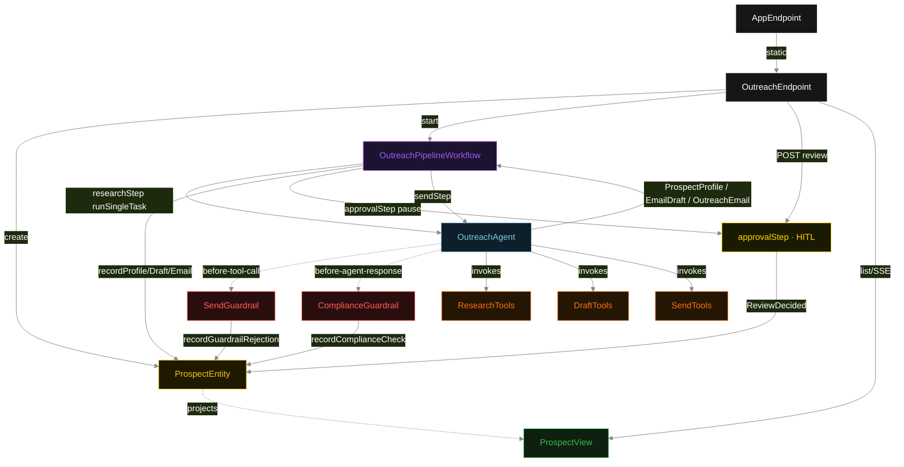
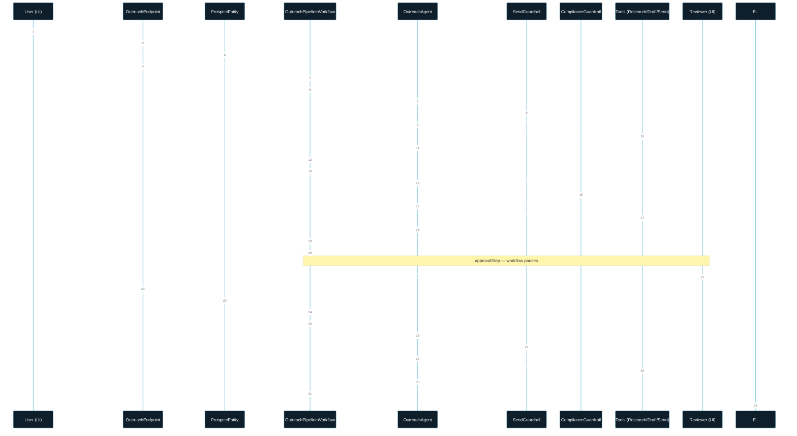
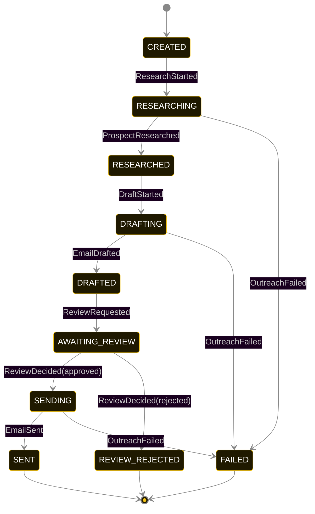
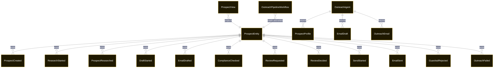

# PLAN — cold-outreach

Architectural sketch consumed by `/akka:plan` and rendered on the generated system's Architecture tab. The four mermaid diagrams below carry the theme variables and CSS overrides from Lesson 24; without them, state names render black-on-black and edge labels clip.

---

## Component graph

## Interaction sequence — J1 (happy path)

## State machine — `ProspectEntity`

`GuardrailRejected` is a side-event recorded on the entity for audit; it does not change the status. Only an exhausted retry budget or a step timeout transitions to `FAILED`. The `ComplianceChecked` event is also audit-only when compliance passes; the entity status advances through `DRAFTED` regardless.

## Entity model

## Component table — Java file targets

| Component | Path (generated) |
|---|---|
| `OutreachEndpoint` | `api/OutreachEndpoint.java` |
| `AppEndpoint` | `api/AppEndpoint.java` |
| `ProspectEntity` | `application/ProspectEntity.java` (state in `domain/ProspectRecord.java`, events in `domain/OutreachEvent.java`) |
| `OutreachPipelineWorkflow` | `application/OutreachPipelineWorkflow.java` |
| `OutreachAgent` | `application/OutreachAgent.java` (tasks in `application/OutreachTasks.java`) |
| `ResearchTools` | `application/ResearchTools.java` |
| `DraftTools` | `application/DraftTools.java` |
| `SendTools` | `application/SendTools.java` |
| `SendGuardrail` | `application/SendGuardrail.java` |
| `ComplianceGuardrail` | `application/ComplianceGuardrail.java` |
| `ProspectView` | `application/ProspectView.java` |
| `MockModelProvider` (option-a only) | `application/MockModelProvider.java` |
| Bootstrap | `Bootstrap.java` |

## Concurrency notes

- **Per-step timeout**: `researchStep` 60 s, `draftStep` 60 s, `approvalStep` 86400 s (24 h), `sendStep` 30 s, `error` 5 s. Default step recovery `maxRetries(2).failoverTo(OutreachPipelineWorkflow::error)`. The 60 s on agent-calling steps accommodates LLM latency including tool round-trips (Lesson 4). The 24 h on `approvalStep` gives a human reviewer a full workday; deployers can tighten this.
- **Idempotency**: each workflow uses `"pipeline-" + prospectId` as the workflow id; restart of the same prospectId is rejected by the workflow runtime. The agent instance id is `"agent-" + prospectId` so each prospect has its own per-task conversation memory.
- **One agent per prospect**: `OutreachAgent` runs three tasks per prospect — RESEARCH, DRAFT, SEND — each with `capability(...).maxIterationsPerTask(4)`. The 4-iteration budget gives both guardrails room to reject and let the agent self-correct.
- **HITL gate is synchronous in the workflow**: `approvalStep` records `ReviewRequested` on the entity and then blocks on a workflow timer. When the reviewer POSTs to `/api/outreach/{id}/review`, the endpoint writes `ReviewDecided` to the entity, and the workflow detects the state change on next poll. If the 24 h timer expires without a decision, the step fails over to `error` and the entity transitions to `FAILED`.
- **Two guardrails, one agent**: both `SendGuardrail` and `ComplianceGuardrail` are registered on `OutreachAgent`. `SendGuardrail` fires on every tool call but only acts on `sendEmail`. `ComplianceGuardrail` fires on every agent response but only acts during the DRAFT task (phase metadata check).
- **No saga / no compensation**: every step is either pure read, append-only event write, or a single-task agent call. A failed prospect stays at the last successful event; the UI shows the partial state for the user.
