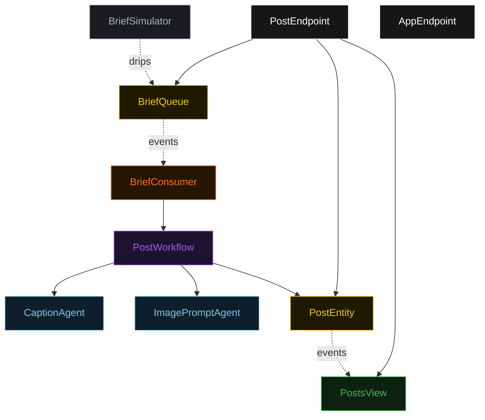
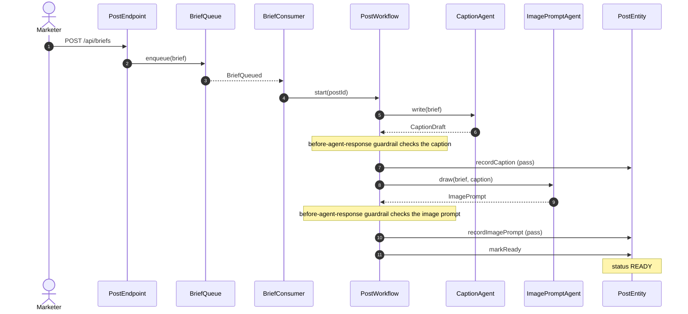
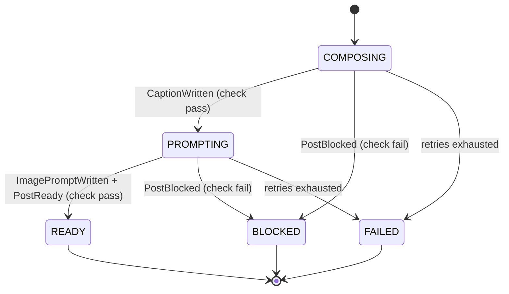
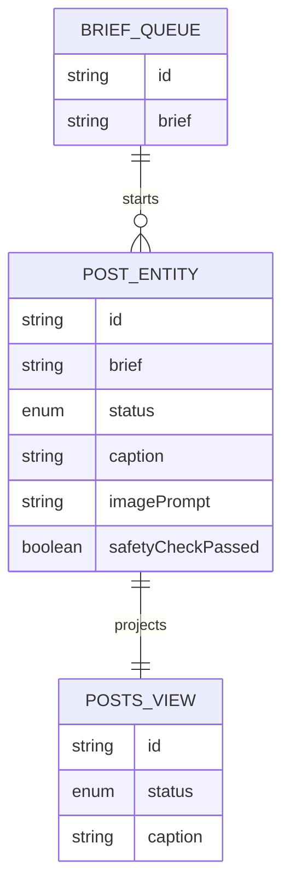

# PLAN — instagram-post-team

Architectural sketch. All four mermaid diagrams + the component table.

---

## Component graph

## Interaction sequence

## State machine

## Entity model

## Component table

| Component | Path (generated) |
|---|---|
| CaptionAgent | `application/CaptionAgent.java` |
| ImagePromptAgent | `application/ImagePromptAgent.java` |
| PostWorkflow | `application/PostWorkflow.java` |
| PostEntity | `domain/PostEntity.java` |
| BriefQueue | `domain/BriefQueue.java` |
| PostsView | `application/PostsView.java` |
| BriefConsumer | `application/BriefConsumer.java` |
| BriefSimulator | `application/BriefSimulator.java` |
| PostEndpoint | `api/PostEndpoint.java` |
| AppEndpoint | `api/AppEndpoint.java` |

## Concurrency notes

- Workflow step timeouts: 60s on `captionStep` and `imagePromptStep` (agent calls take 10–30s — the 5s default would retry forever, Lesson 4). `finalizeStep` is a local entity write and needs no override.
- Idempotency: the workflow id is the post id; re-delivery of `BriefQueued` reuses the same workflow instance. Entity commands are guarded by current status, so a duplicate `markReady` after `READY` is a no-op.
- Compensation: a failed before-agent-response check transitions the post to `BLOCKED` with the check notes as the block reason — no further step runs. `defaultStepRecovery(maxRetries(2).failoverTo(error))` ends the workflow on exhausted retries; the post stays at its last recorded status (`FAILED` on the error path) for operator inspection.
