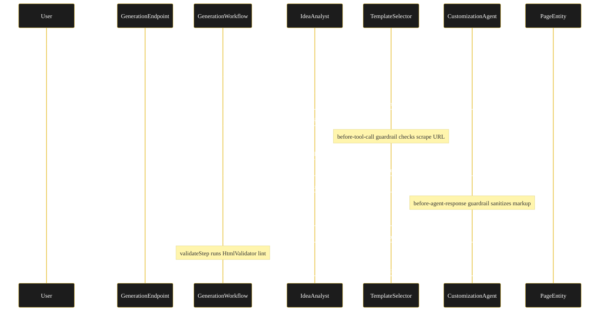
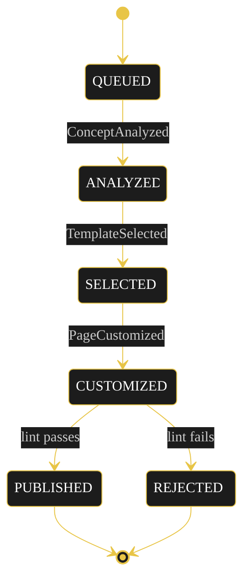
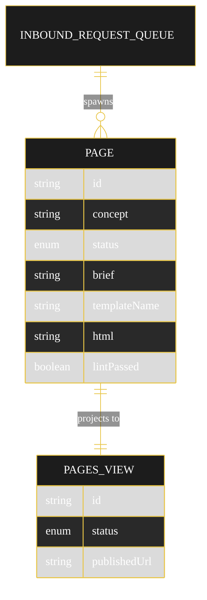

# Implementation Plan — `landing-page-builder`

The architecture this blueprint resolves to once `SPEC.md` runs through `/akka:specify` → `/akka:plan`.

---

## Component graph

```mermaid
%%{init: {'theme':'base','themeVariables':{'primaryColor':'#1c1c1c','primaryTextColor':'#ffffff','primaryBorderColor':'#e8c547','lineColor':'#e8c547','nodeTextColor':'#ffffff','fontFamily':'Instrument Sans, sans-serif'}}}%%
flowchart TB
  Sim[RequestSimulator<br/>TimedAction] -.->|every 30s| Queue[InboundRequestQueue<br/>EventSourcedEntity]
  GenEP[GenerationEndpoint<br/>HttpEndpoint] -->|enqueueConcept| Queue
  Queue -.->|ConceptQueued| Consumer[RequestConsumer<br/>Consumer]
  Consumer -->|start| WF[GenerationWorkflow<br/>Workflow]
  WF -->|runSingleTask| IA[IdeaAnalyst<br/>AutonomousAgent]
  WF -->|runSingleTask| TS[TemplateSelector<br/>AutonomousAgent]
  WF -->|runSingleTask| CA[CustomizationAgent<br/>AutonomousAgent]
  TS -->|scrape tool| Scraper[ScraperEndpoint<br/>HttpEndpoint]
  WF -->|record*/publish/reject| Page[PageEntity<br/>EventSourcedEntity]
  Page -.->|events| View[PagesView<br/>View]
  GenEP -->|getAllPages / SSE| View
  App[AppEndpoint<br/>HttpEndpoint] --> UI[(static-resources)]

  classDef agent fill:#2a2118,stroke:#e8c547;
  classDef entity fill:#1c2a1c,stroke:#7ec97e;
  classDef other fill:#1c1c1c,stroke:#888;
  class IA,TS,CA agent;
  class Page,Queue entity;
  class WF,View,Consumer,Sim,GenEP,Scraper,App other;
```

Solid arrows are synchronous commands, dashed arrows are event subscriptions, dotted arrows are scheduled ticks.

## Interaction sequence

## State machine

State-label and transition-label colours are set both via theme variables and the CSS overrides in `index.html` (Lesson 24): theme variables alone leave state names black-on-black and clip edge labels.

## Entity model

## Component table

| Component | Kind | File |
|---|---|---|
| IdeaAnalyst | AutonomousAgent | `application/IdeaAnalyst.java` |
| TemplateSelector | AutonomousAgent | `application/TemplateSelector.java` |
| CustomizationAgent | AutonomousAgent | `application/CustomizationAgent.java` |
| GenerationTasks | task definitions | `application/GenerationTasks.java` |
| GenerationWorkflow | Workflow | `application/GenerationWorkflow.java` |
| HtmlValidator | helper | `application/HtmlValidator.java` |
| PageEntity | EventSourcedEntity | `application/PageEntity.java` |
| InboundRequestQueue | EventSourcedEntity | `application/InboundRequestQueue.java` |
| PagesView | View | `application/PagesView.java` |
| RequestConsumer | Consumer | `application/RequestConsumer.java` |
| RequestSimulator | TimedAction | `application/RequestSimulator.java` |
| GenerationEndpoint | HttpEndpoint | `api/GenerationEndpoint.java` |
| ScraperEndpoint | HttpEndpoint | `api/ScraperEndpoint.java` |
| AppEndpoint | HttpEndpoint | `api/AppEndpoint.java` |
| Page / PageStatus / PageEvent | domain | `domain/*.java` |
| Bootstrap | service-setup | `Bootstrap.java` |

Component count: 3 http-endpoint · 1 timed-action · 1 view · 1 workflow · 1 service-setup · 3 autonomous-agent · 1 consumer · 2 event-sourced-entity.

## Concurrency notes

- **Step timeouts.** `analyzeStep`, `selectStep`, `customizeStep` each call an agent; override the 5s default with `stepTimeout(60s)` (Lesson 4). `validateStep` is in-process and keeps the default.
- **Idempotency.** The workflow id is the `pageId` (a UUID minted by `RequestConsumer` per `ConceptQueued`). Re-delivery of the same queued event reuses the id, so a restarted workflow resumes rather than duplicates.
- **Compensation.** No external side effects, so no saga compensation is needed. A lint failure in `validateStep` is a forward transition to `REJECTED`, not a rollback. A guardrail block in `selectStep` falls back to a canned template rather than failing the run.
- **View indexing.** `PagesView` exposes one unfiltered `getAllPages` query; status filtering is client-side because Akka cannot auto-index the enum column (Lesson 2).
