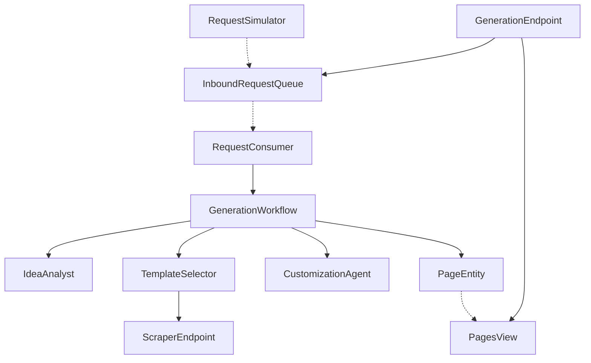

# Architecture — landing-page-builder

The four diagrams below are the source the generated system renders on the
Architecture tab. They are also in `PLAN.md`; this file gives the narrative.

## Component graph

A concept enters either from a user POST to `GenerationEndpoint` or from the
`RequestSimulator` timer. Both call `InboundRequestQueue.enqueueConcept`, which
emits `ConceptQueued`. `RequestConsumer` subscribes to that event and starts one
`GenerationWorkflow` per concept, keyed by a fresh page id. The workflow drives
the three agents in sequence and writes each result onto `PageEntity`, whose
events project into `PagesView`. The endpoint reads and streams the view.

## Interaction sequence

The primary journey: submit → analyze → select → customize → validate. The two
`Note over` blocks mark where the before-tool-call and before-agent-response
guardrails fire. `validateStep` runs the in-process lint and forks to publish or
reject. The full sequence is in `PLAN.md`.

## State machine

`PageStatus` moves strictly forward: `QUEUED → ANALYZED → SELECTED → CUSTOMIZED`,
then `PUBLISHED` if the lint passes or `REJECTED` if it fails. Both terminals are
absorbing. State-label and edge-label colours need the Lesson 24 CSS overrides in
`index.html`; theme variables alone leave state names unreadable.

## Entity model

`InboundRequestQueue` spawns `Page` instances; each `PageEntity` projects to one
`PagesView` row. The view row carries the same `Page` record (with `Optional`
lifecycle fields per Lesson 6) so the endpoint can serve and stream it directly.
