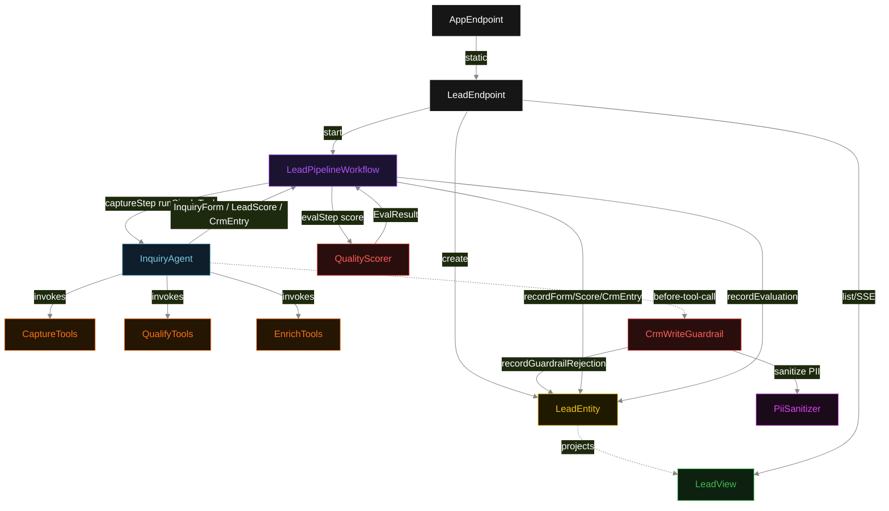
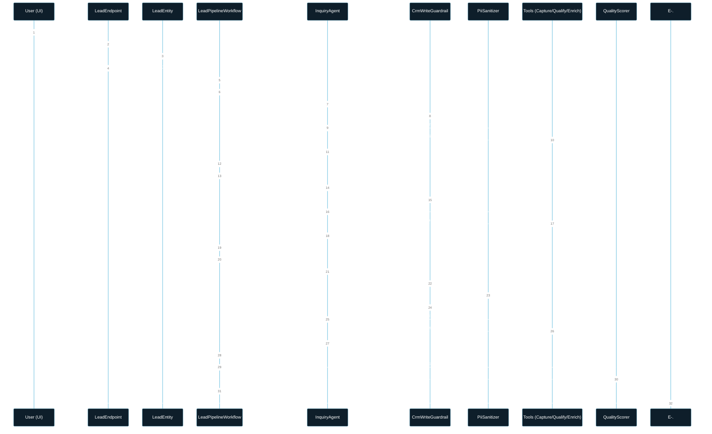
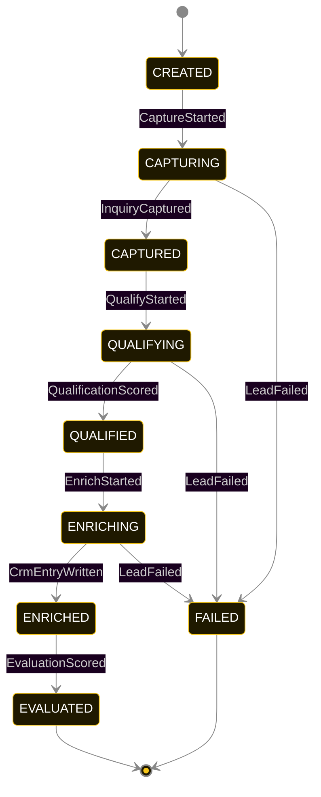
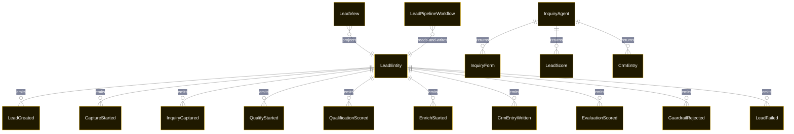

# PLAN — lead-qualifier

Architectural sketch consumed by `/akka:plan` and rendered on the generated system's Architecture tab. The four mermaid diagrams below carry the theme variables and CSS overrides from Lesson 24; without them, state names render black-on-black and edge labels clip.

---

## Component graph

## Interaction sequence — J1 (happy path)

## State machine — `LeadEntity`

GuardrailRejected is a side-event recorded on the entity for audit; it does not change the status — the agent's retry stays inside the same task, and the workflow's step continues. Only an exhausted retry budget or a step timeout transitions to FAILED.

## Entity model

## Component table — Java file targets

| Component | Path (generated) |
|---|---|
| `LeadEndpoint` | `api/LeadEndpoint.java` |
| `AppEndpoint` | `api/AppEndpoint.java` |
| `LeadEntity` | `application/LeadEntity.java` (state in `domain/LeadRecord.java`, events in `domain/LeadEvent.java`) |
| `LeadPipelineWorkflow` | `application/LeadPipelineWorkflow.java` |
| `InquiryAgent` | `application/InquiryAgent.java` (tasks in `application/LeadTasks.java`) |
| `CaptureTools` | `application/CaptureTools.java` |
| `QualifyTools` | `application/QualifyTools.java` |
| `EnrichTools` | `application/EnrichTools.java` |
| `CrmWriteGuardrail` | `application/CrmWriteGuardrail.java` |
| `PiiSanitizer` | `application/PiiSanitizer.java` |
| `QualityScorer` | `application/QualityScorer.java` |
| `LeadView` | `application/LeadView.java` |
| `MockModelProvider` (option-a only) | `application/MockModelProvider.java` |
| Bootstrap | `Bootstrap.java` |

## Concurrency notes

- **Per-step timeout**: `captureStep` 60 s, `qualifyStep` 60 s, `enrichStep` 60 s, `evalStep` 5 s, `error` 5 s. Default step recovery `maxRetries(2).failoverTo(LeadPipelineWorkflow::error)`. The 60 s on each agent-calling step accommodates LLM latency including tool round-trips (Lesson 4).
- **Idempotency**: each workflow uses `"pipeline-" + leadId` as the workflow id; restart of the same leadId is rejected by the workflow runtime. The agent instance id is `"agent-" + leadId` so each lead has its own per-task conversation memory.
- **One agent per lead**: `InquiryAgent` runs three tasks per lead — CAPTURE, QUALIFY, ENRICH — each with `capability(...).maxIterationsPerTask(4)`. The 4-iteration budget gives the guardrail room to reject a misordered or schema-invalid tool call and still let the agent self-correct.
- **Guardrail-driven retry**: when `CrmWriteGuardrail` rejects a tool call (phase-violation or schema-violation), the rejection is returned as a structured error to the agent loop. If all 4 iterations fail, the workflow step fails over to `error` and the entity transitions to `FAILED`.
- **PII masking is synchronous**: `PiiSanitizer` runs in-process inside `CrmWriteGuardrail` before the tool body executes. No async path exists between guardrail accept and tool invocation, so no unmasked payload can escape even on race conditions.
- **Eval is synchronous and deterministic**: `QualityScorer` runs in-process inside `evalStep`. No LLM call, no external service — the same CRM entry always scores the same. Single-agent invariant is preserved.
- **Task-boundary handoff is the dependency contract**: `captureStep` writes `InquiryCaptured` BEFORE returning; `qualifyStep` reads the recorded `InquiryForm` from the entity to build its task's instruction context; `enrichStep` reads both `InquiryForm` and `LeadScore`. The agent is stateless across phases.
- **No saga / no compensation**: every step is either pure read, append-only event write, or a single-task agent call. A failed lead stays at the last successful event; the UI shows partial state.
