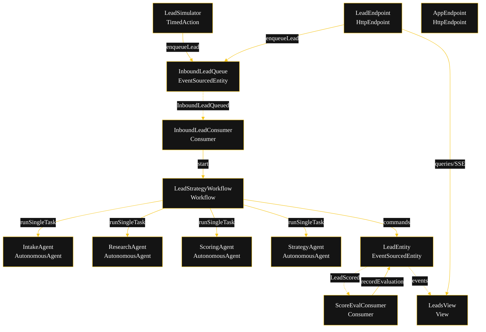
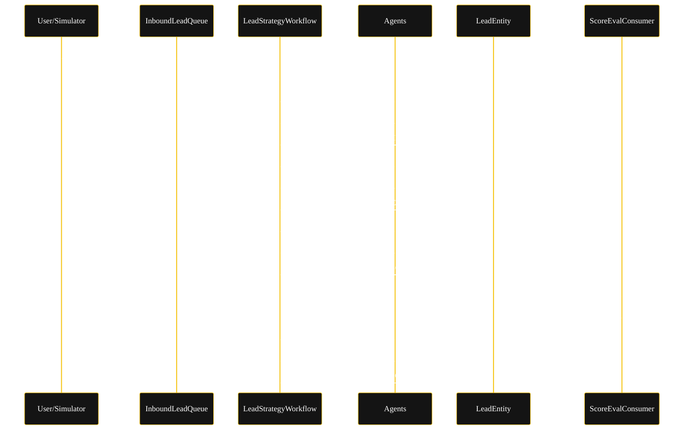
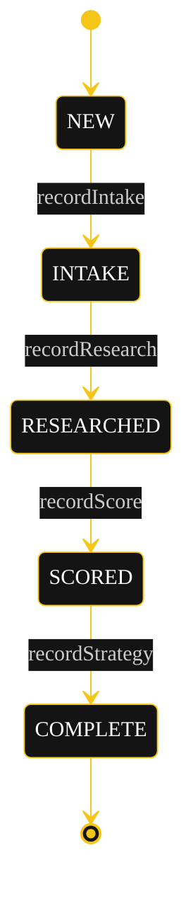
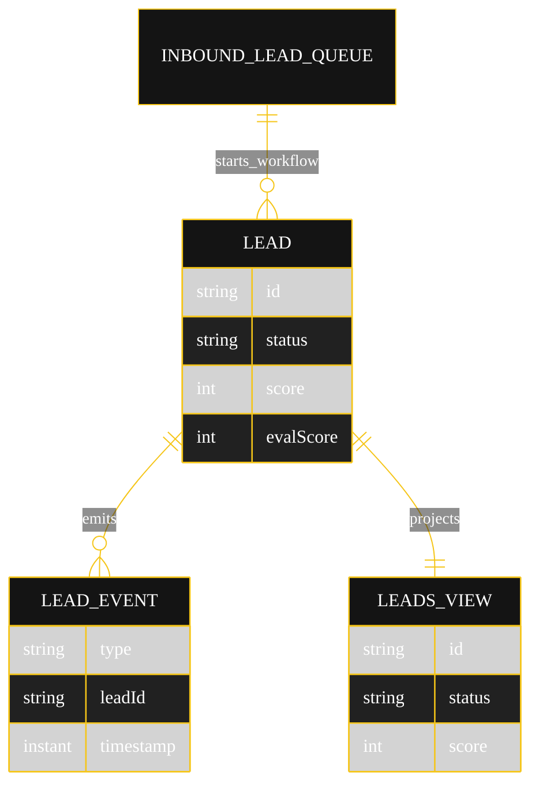

# Implementation Plan — Lead Scoring Strategy

The architecture `SPEC.md` resolves to once run through `/akka:specify` → `/akka:plan`. Diagrams render on the Architecture tab; they carry the Akka theme variables plus the CSS overrides for state-diagram labels and edge-label `foreignObject` overflow (Lesson 24).

---

## Component graph

Solid arrows are synchronous commands; dashed arrows are event subscriptions.

## Interaction sequence

## State machine

`recordEvaluation` fires on the `SCORED` state from `ScoreEvalConsumer` and sets the eval fields without changing the status. State labels need the CSS overrides from Lesson 24 — the `g.statediagram-state .label` path does not inherit `primaryTextColor`, and edge labels clip without `overflow:visible` on their `foreignObject`.

## Entity model

## Component table

| Component | Kind | File |
|---|---|---|
| `IntakeAgent` | AutonomousAgent | `application/IntakeAgent.java` |
| `ResearchAgent` | AutonomousAgent | `application/ResearchAgent.java` |
| `ScoringAgent` | AutonomousAgent | `application/ScoringAgent.java` |
| `StrategyAgent` | AutonomousAgent | `application/StrategyAgent.java` |
| `LeadStrategyTasks` | task definitions | `application/LeadStrategyTasks.java` |
| `PiiSanitizer` | helper | `application/PiiSanitizer.java` |
| `LeadStrategyWorkflow` | Workflow | `application/LeadStrategyWorkflow.java` |
| `LeadEntity` | EventSourcedEntity | `application/LeadEntity.java` |
| `InboundLeadQueue` | EventSourcedEntity | `application/InboundLeadQueue.java` |
| `LeadsView` | View | `application/LeadsView.java` |
| `InboundLeadConsumer` | Consumer | `application/InboundLeadConsumer.java` |
| `ScoreEvalConsumer` | Consumer | `application/ScoreEvalConsumer.java` |
| `LeadSimulator` | TimedAction | `application/LeadSimulator.java` |
| `LeadEndpoint` | HttpEndpoint | `api/LeadEndpoint.java` |
| `AppEndpoint` | HttpEndpoint | `api/AppEndpoint.java` |
| `Bootstrap` | service-setup | `Bootstrap.java` |
| `Lead`, `LeadStatus`, `LeadEvent` | domain | `domain/*.java` |

## Concurrency notes

- **Step timeouts (Lesson 4).** `intakeStep`, `researchStep`, `scoreStep`, `strategyStep` set `stepTimeout(60s)` because they call agents. The pipeline is linear with no waiting step.
- **Idempotency.** Each workflow instance is keyed by `leadId`; agent calls use `forAutonomousAgent(Agent.class, role + leadId)` so retries reuse the same session. `recordEvaluation` from `ScoreEvalConsumer` is keyed by `leadId` and is a no-op if the eval is already recorded.
- **Eval decoupling.** `ScoreEvalConsumer` reacts to `LeadScored` asynchronously and does not block the workflow; the strategy step runs independently. The eval result and the strategy may land in either order over SSE.
- **No saga.** All side effects are in-process EventSourcedEntity commands; there is nothing external to compensate. `COMPLETE` is terminal.
- **View indexing (Lesson 2).** `LeadsView` has one query with no `WHERE status` clause; status filtering happens client-side in `LeadEndpoint`.
