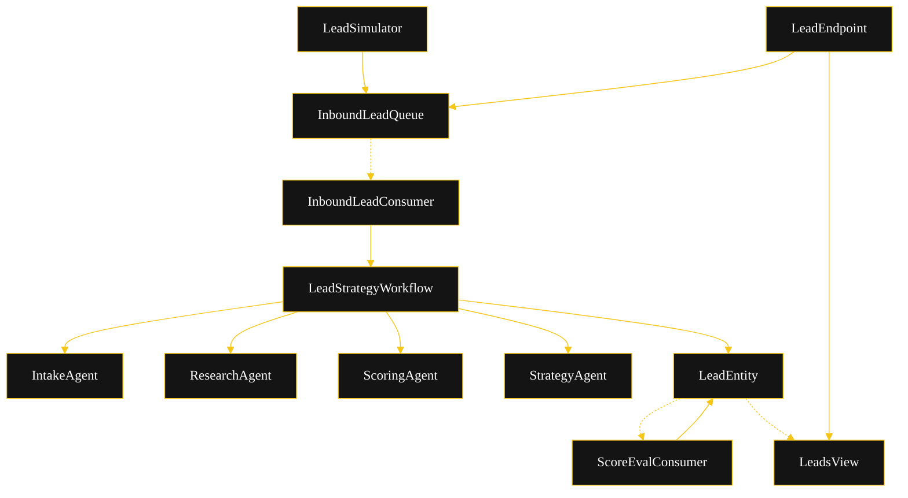
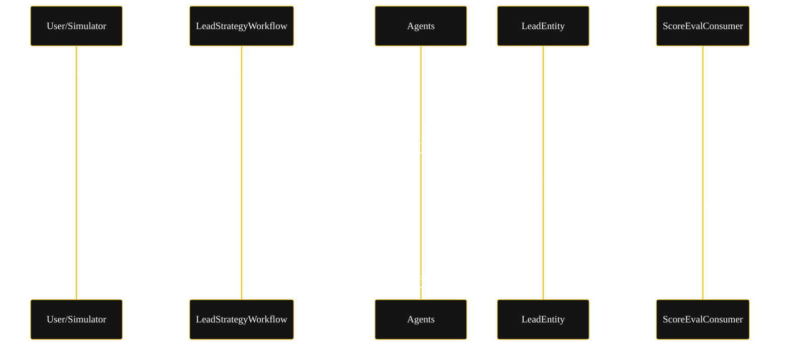
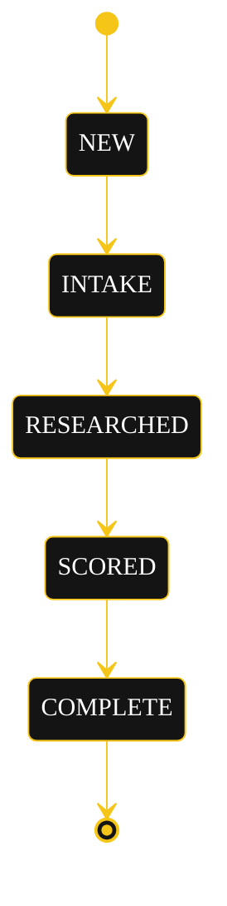
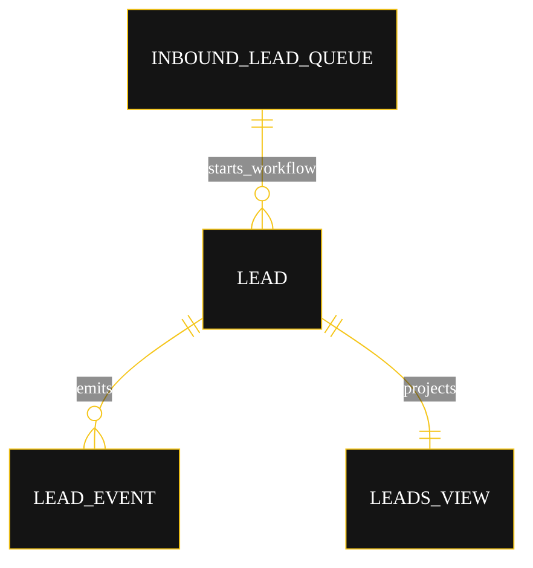

# Architecture — Lead Scoring Strategy

The diagrams below are the source the generated system renders on the Architecture tab. All four use the Akka theme variables; the state diagram additionally needs the CSS label overrides from Lesson 24 (state names render black-on-black and edge labels clip without them).

## Component graph

Every inbound lead flows from `LeadSimulator` or `LeadEndpoint` into `InboundLeadQueue`. `InboundLeadConsumer` reacts to each `InboundLeadQueued` event and starts one `LeadStrategyWorkflow`. The workflow drives the four agents in sequence and writes their results to `LeadEntity`. `ScoreEvalConsumer` reacts to the `LeadScored` event and records an automatic eval. `LeadsView` projects entity events for the UI.

## Interaction sequence

The primary journey: a lead is taken in (after PII sanitization), researched, and scored; an eval fires on the score; a strategy is drafted; the lead completes.

## State machine

`LeadEntity` lifecycle. `recordEvaluation` fires on `SCORED` and sets the eval fields without changing the status.

## Entity model

`InboundLeadQueue` starts a `LeadStrategyWorkflow` per inbound lead; the workflow drives `LeadEntity`, whose events project into `LeadsView`.

