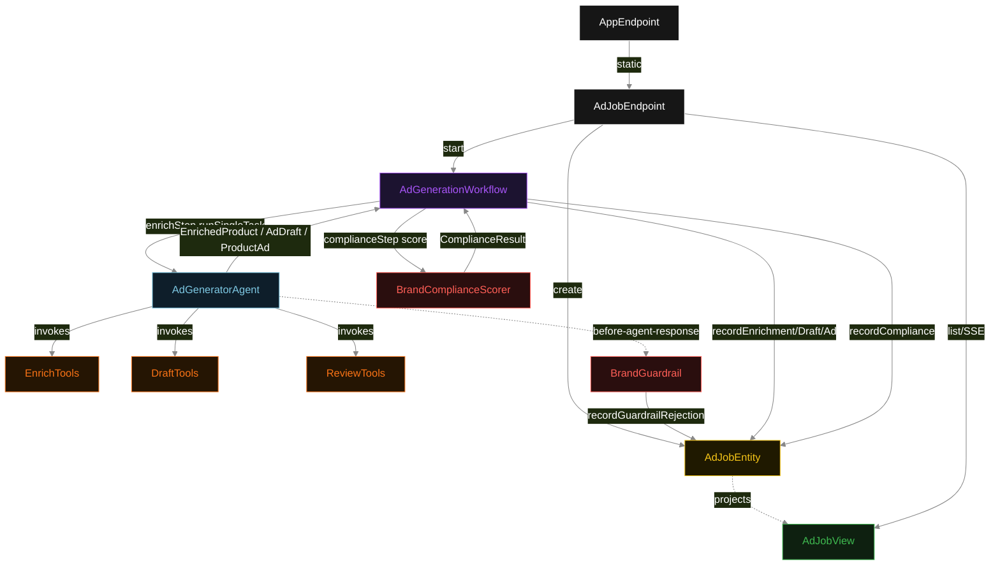
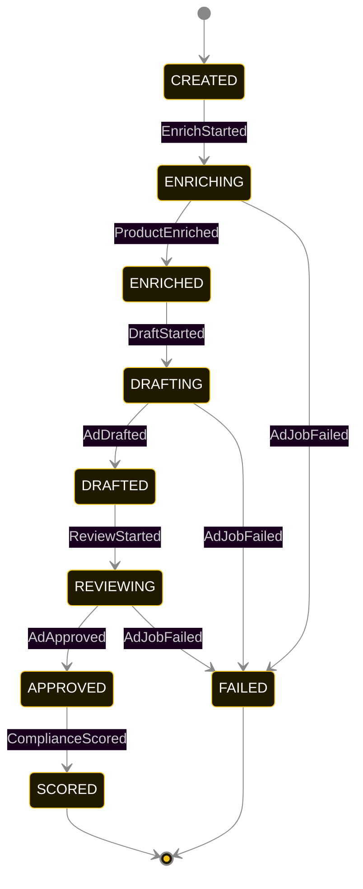
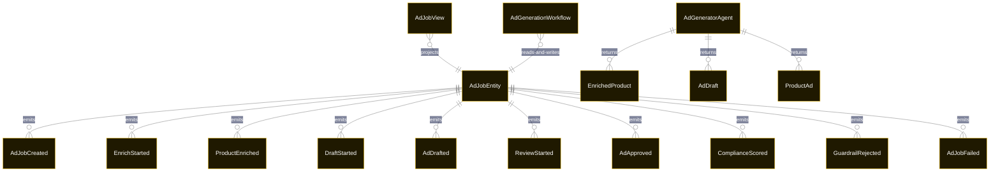

# PLAN — product-catalog-ad-generation

Architectural sketch consumed by `/akka:plan` and rendered on the generated system's Architecture tab. The four mermaid diagrams below carry the theme variables and CSS overrides from Lesson 24; without them, state names render black-on-black and edge labels clip.

---

## Component graph



## Interaction sequence — J1 (happy path)

```mermaid
%%{init: {'theme':'base','themeVariables':{'primaryColor':'#0e1e2a','primaryTextColor':'#ffffff','primaryBorderColor':'#7EC8E3','lineColor':'#888','nodeTextColor':'#ffffff','stateLabelColor':'#ffffff','transitionLabelColor':'#cccccc'}}}%%
sequenceDiagram
  autonumber
  participant U as User (UI)
  participant API as AdJobEndpoint
  participant E as AdJobEntity
  participant W as AdGenerationWorkflow
  participant A as AdGeneratorAgent
  participant G as BrandGuardrail
  participant T as Tools (Enrich/Draft/Review)
  participant Sc as BrandComplianceScorer

  U->>API: POST /api/ad-jobs { productName }
  API->>E: create(productName)
  E-->>API: { jobId }
  API->>W: start(jobId, productName)
  W->>E: startEnrich
  W->>A: runSingleTask(ENRICH_PRODUCT, productName)
  A->>T: lookupCategory + inferAttributes
  T-->>A: EnrichedProduct
  A->>G: before-agent-response(EnrichedProduct)
  G-->>A: accept (ENRICH response; no brand rules apply)
  A-->>W: EnrichedProduct
  W->>E: recordEnrichment
  W->>A: runSingleTask(DRAFT_AD, enrichedProduct)
  A->>T: composeHeadline + composeCopy (×placements)
  T-->>A: AdDraft
  A->>G: before-agent-response(AdDraft)
  G-->>A: accept (headline element OK, no prohibited words)
  A-->>W: AdDraft
  W->>E: recordDraft
  W->>A: runSingleTask(REVIEW_AD, adDraft)
  A->>T: checkBrandElements + finaliseAd
  T-->>A: PolicyViolation[] + ProductAd
  A->>G: before-agent-response(ProductAd)
  G-->>A: accept (final ad passes all rules)
  A-->>W: ProductAd
  W->>E: recordAd
  W->>Sc: score(productAd, adDraft, enrichedProduct)
  Sc-->>W: ComplianceResult
  W->>E: recordCompliance
  E-.->>U: SSE event(SCORED)
```

## State machine — `AdJobEntity`



GuardrailRejected is a side-event recorded on the entity for audit; it does not change the status — the agent's retry stays inside the same task, and the workflow's step continues. Only an exhausted retry budget or a step timeout transitions to FAILED.

## Entity model



## Component table — Java file targets

| Component | Path (generated) |
|---|---|
| `AdJobEndpoint` | `api/AdJobEndpoint.java` |
| `AppEndpoint` | `api/AppEndpoint.java` |
| `AdJobEntity` | `application/AdJobEntity.java` (state in `domain/AdJobRecord.java`, events in `domain/AdJobEvent.java`) |
| `AdGenerationWorkflow` | `application/AdGenerationWorkflow.java` |
| `AdGeneratorAgent` | `application/AdGeneratorAgent.java` (tasks in `application/AdTasks.java`) |
| `EnrichTools` | `application/EnrichTools.java` |
| `DraftTools` | `application/DraftTools.java` |
| `ReviewTools` | `application/ReviewTools.java` |
| `BrandGuardrail` | `application/BrandGuardrail.java` |
| `BrandComplianceScorer` | `application/BrandComplianceScorer.java` |
| `AdJobView` | `application/AdJobView.java` |
| `MockModelProvider` (option-a only) | `application/MockModelProvider.java` |
| Bootstrap | `Bootstrap.java` |

## Concurrency notes

- **Per-step timeout**: `enrichStep` 60 s, `draftStep` 60 s, `reviewStep` 60 s, `complianceStep` 5 s, `error` 5 s. Default step recovery `maxRetries(2).failoverTo(AdGenerationWorkflow::error)`. The 60 s on each agent-calling step accommodates LLM latency including tool round-trips (Lesson 4).
- **Idempotency**: each workflow uses `"pipeline-" + jobId` as the workflow id; restart of the same jobId is rejected by the workflow runtime. The agent instance id is `"agent-" + jobId` so each job has its own per-task conversation memory.
- **One agent per job**: `AdGeneratorAgent` runs three tasks per job — ENRICH, DRAFT, REVIEW — each with `capability(...).maxIterationsPerTask(4)`. The 4-iteration budget gives the brand guardrail room to reject a non-compliant draft and still let the agent self-correct.
- **Guardrail-driven retry**: when `BrandGuardrail` rejects a response, the rejection is returned as a structured `BrandRejection{violations}` to the agent loop. The loop counts toward `maxIterationsPerTask`; if all 4 iterations fail validation, the workflow step fails over to `error` and the entity transitions to `FAILED`.
- **Compliance eval is synchronous and deterministic**: `BrandComplianceScorer` runs in-process inside `complianceStep`. No LLM call, no external service — the same ad always scores the same. This is a deliberate single-agent invariant.
- **Task-boundary handoff is the dependency contract**: `enrichStep` writes `ProductEnriched` BEFORE returning; `draftStep` reads the recorded `EnrichedProduct` from the entity to build its task's instruction context; `reviewStep` reads both `EnrichedProduct` and `AdDraft`. The agent itself is stateless across phases — it never holds enrich + draft + review context in one conversation.
- **No saga / no compensation**: every step is either a pure read, an append-only event write, or a single-task agent call. A failed job stays at the last successful event; the UI shows the partial state for the user.
