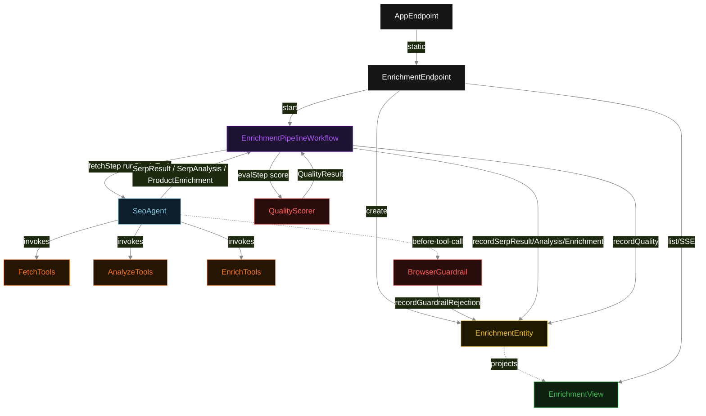
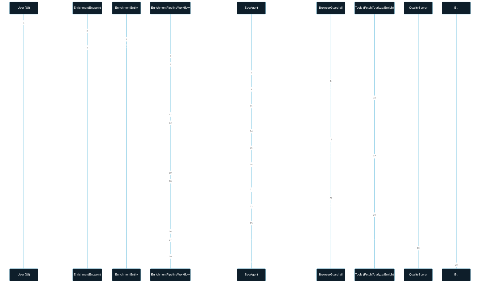
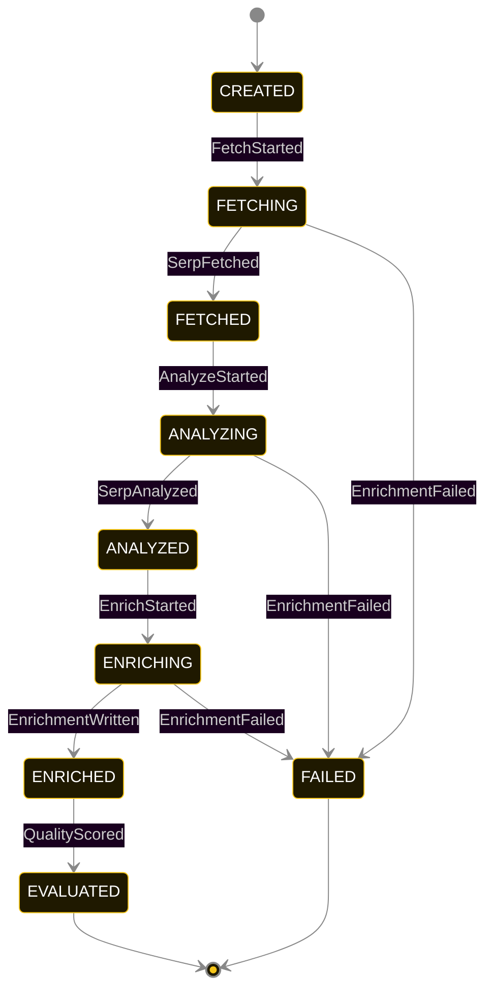
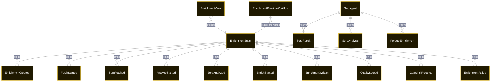

# PLAN — product-seo-enricher

Architectural sketch consumed by `/akka:plan` and rendered on the generated system's Architecture tab. The four mermaid diagrams below carry the theme variables and CSS overrides from Lesson 24; without them, state names render black-on-black and edge labels clip.

---

## Component graph

## Interaction sequence — J1 (happy path)

## State machine — `EnrichmentEntity`

GuardrailRejected is a side-event recorded on the entity for audit; it does not change the status — the agent's retry stays inside the same task, and the workflow's step continues. Only an exhausted retry budget or a step timeout transitions to FAILED.

## Entity model

## Component table — Java file targets

| Component | Path (generated) |
|---|---|
| `EnrichmentEndpoint` | `api/EnrichmentEndpoint.java` |
| `AppEndpoint` | `api/AppEndpoint.java` |
| `EnrichmentEntity` | `application/EnrichmentEntity.java` (state in `domain/EnrichmentRecord.java`, events in `domain/EnrichmentEvent.java`) |
| `EnrichmentPipelineWorkflow` | `application/EnrichmentPipelineWorkflow.java` |
| `SeoAgent` | `application/SeoAgent.java` (tasks in `application/SeoTasks.java`) |
| `FetchTools` | `application/FetchTools.java` |
| `AnalyzeTools` | `application/AnalyzeTools.java` |
| `EnrichTools` | `application/EnrichTools.java` |
| `BrowserGuardrail` | `application/BrowserGuardrail.java` |
| `QualityScorer` | `application/QualityScorer.java` |
| `EnrichmentView` | `application/EnrichmentView.java` |
| `MockModelProvider` (option-a only) | `application/MockModelProvider.java` |
| Bootstrap | `Bootstrap.java` |

## Concurrency notes

- **Per-step timeout**: `fetchStep` 60 s, `analyzeStep` 60 s, `enrichStep` 60 s, `evalStep` 5 s, `error` 5 s. Default step recovery `maxRetries(2).failoverTo(EnrichmentPipelineWorkflow::error)`. The 60 s on each agent-calling step accommodates LLM latency including tool round-trips (Lesson 4).
- **Idempotency**: each workflow uses `"pipeline-" + enrichmentId` as the workflow id; restart of the same enrichmentId is rejected by the workflow runtime. The agent instance id is `"agent-" + enrichmentId` so each enrichment has its own per-task conversation memory.
- **One agent per enrichment**: `SeoAgent` runs three tasks per enrichment — FETCH, ANALYZE, ENRICH — each with `capability(...).maxIterationsPerTask(4)`. The 4-iteration budget gives the guardrail room to reject a misordered tool call and still let the agent self-correct.
- **Guardrail-driven retry**: when `BrowserGuardrail` rejects a tool call, the rejection is returned as a structured error to the agent loop. The loop counts toward `maxIterationsPerTask`; if all 4 iterations fail validation, the workflow step fails over to `error` and the entity transitions to `FAILED`.
- **Eval is synchronous and deterministic**: `QualityScorer` runs in-process inside `evalStep`. No LLM call, no external service — the same enrichment always scores the same.
- **Task-boundary handoff is the dependency contract**: `fetchStep` writes `SerpFetched` BEFORE returning; `analyzeStep` reads the recorded `SerpResult` from the entity to build its task's instruction context; `enrichStep` reads both `SerpResult` and `SerpAnalysis`. The agent itself is stateless across phases.
- **No saga / no compensation**: every step is either pure read, append-only event write, or a single-task agent call. A failed enrichment stays at the last successful event; the UI shows the partial state for the user.
