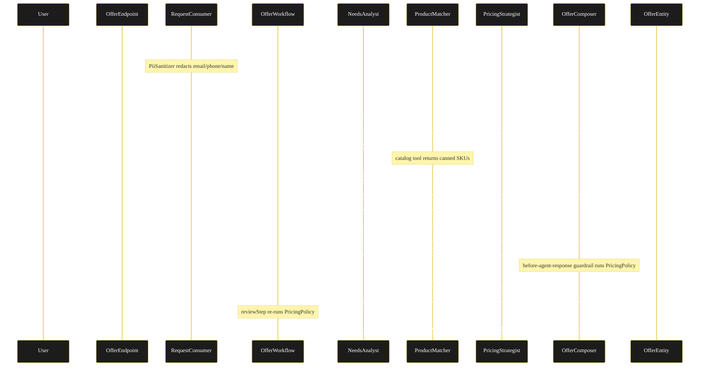
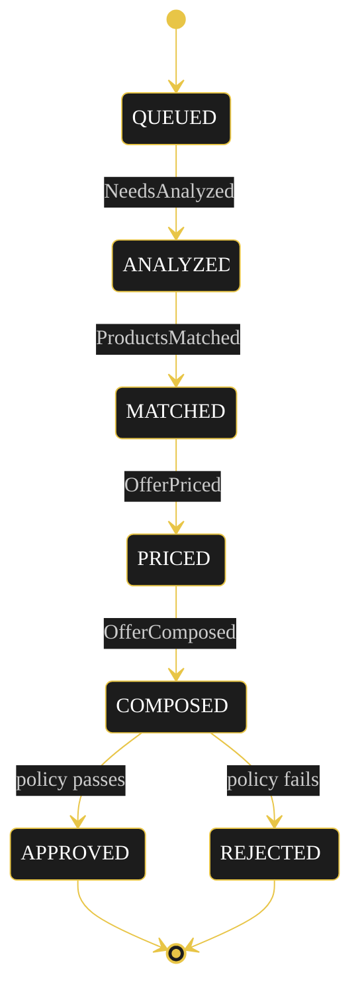
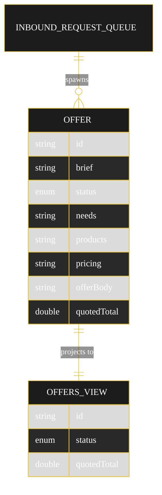

# Implementation Plan — `sales-offer-generator`

The architecture this blueprint resolves to once `SPEC.md` runs through `/akka:specify` → `/akka:plan`.

---

## Component graph

```mermaid
%%{init: {'theme':'base','themeVariables':{'primaryColor':'#1c1c1c','primaryTextColor':'#ffffff','primaryBorderColor':'#e8c547','lineColor':'#e8c547','nodeTextColor':'#ffffff','fontFamily':'Instrument Sans, sans-serif'}}}%%
flowchart TB
  Sim[RequestSimulator<br/>TimedAction] -.->|every 30s| Queue[InboundRequestQueue<br/>EventSourcedEntity]
  OfferEP[OfferEndpoint<br/>HttpEndpoint] -->|enqueueBrief| Queue
  Queue -.->|BriefQueued| Consumer[RequestConsumer<br/>Consumer]
  Consumer -->|PiiSanitizer + start| WF[OfferWorkflow<br/>Workflow]
  WF -->|runSingleTask| NA[NeedsAnalyst<br/>AutonomousAgent]
  WF -->|runSingleTask| PM[ProductMatcher<br/>AutonomousAgent]
  WF -->|runSingleTask| PS[PricingStrategist<br/>AutonomousAgent]
  WF -->|runSingleTask| OC[OfferComposer<br/>AutonomousAgent]
  PM -->|catalog tool| Catalog[CatalogEndpoint<br/>HttpEndpoint]
  WF -->|record*/approve/reject| Offer[OfferEntity<br/>EventSourcedEntity]
  Offer -.->|events| View[OffersView<br/>View]
  OfferEP -->|getAllOffers / SSE| View
  App[AppEndpoint<br/>HttpEndpoint] --> UI[(static-resources)]

  classDef agent fill:#2a2118,stroke:#e8c547;
  classDef entity fill:#1c2a1c,stroke:#7ec97e;
  classDef other fill:#1c1c1c,stroke:#888;
  class NA,PM,PS,OC agent;
  class Offer,Queue entity;
  class WF,View,Consumer,Sim,OfferEP,Catalog,App other;
```

Solid arrows are synchronous commands, dashed arrows are event subscriptions, dotted arrows are scheduled ticks.

## Interaction sequence

## State machine

State-label and transition-label colours are set both via theme variables and the CSS overrides in `index.html` (Lesson 24): theme variables alone leave state names black-on-black and clip edge labels.

## Entity model

## Component table

| Component | Kind | File |
|---|---|---|
| NeedsAnalyst | AutonomousAgent | `application/NeedsAnalyst.java` |
| ProductMatcher | AutonomousAgent | `application/ProductMatcher.java` |
| PricingStrategist | AutonomousAgent | `application/PricingStrategist.java` |
| OfferComposer | AutonomousAgent | `application/OfferComposer.java` |
| OfferTasks | task definitions | `application/OfferTasks.java` |
| OfferWorkflow | Workflow | `application/OfferWorkflow.java` |
| PricingPolicy | helper | `application/PricingPolicy.java` |
| PiiSanitizer | helper | `application/PiiSanitizer.java` |
| OfferEntity | EventSourcedEntity | `application/OfferEntity.java` |
| InboundRequestQueue | EventSourcedEntity | `application/InboundRequestQueue.java` |
| OffersView | View | `application/OffersView.java` |
| RequestConsumer | Consumer | `application/RequestConsumer.java` |
| RequestSimulator | TimedAction | `application/RequestSimulator.java` |
| OfferEndpoint | HttpEndpoint | `api/OfferEndpoint.java` |
| CatalogEndpoint | HttpEndpoint | `api/CatalogEndpoint.java` |
| AppEndpoint | HttpEndpoint | `api/AppEndpoint.java` |
| Offer / OfferStatus / OfferEvent | domain | `domain/*.java` |
| Bootstrap | service-setup | `Bootstrap.java` |

Component count: 3 http-endpoint · 1 timed-action · 1 view · 1 workflow · 1 service-setup · 4 autonomous-agent · 1 consumer · 2 event-sourced-entity.

## Concurrency notes

- **Step timeouts.** `analyzeStep`, `matchStep`, `priceStep`, `composeStep` each call an agent; override the 5s default with `stepTimeout(60s)` (Lesson 4). `reviewStep` is in-process and keeps the default.
- **Idempotency.** The workflow id is the `offerId` (a UUID minted by `RequestConsumer` per `BriefQueued`). Re-delivery of the same queued event reuses the id, so a restarted workflow resumes rather than duplicates.
- **Compensation.** No external side effects, so no saga compensation is needed. A policy failure in `reviewStep` is a forward transition to `REJECTED`, not a rollback. The before-agent-response guardrail and `reviewStep` run the same `PricingPolicy` check; the guardrail blocks early, `reviewStep` is the durable gate.
- **PII boundary.** `PiiSanitizer` runs once in `RequestConsumer` before the brief enters any prompt or event, so no downstream component handles raw identifiers.
- **View indexing.** `OffersView` exposes one unfiltered `getAllOffers` query; status filtering is client-side because Akka cannot auto-index the enum column (Lesson 2).
