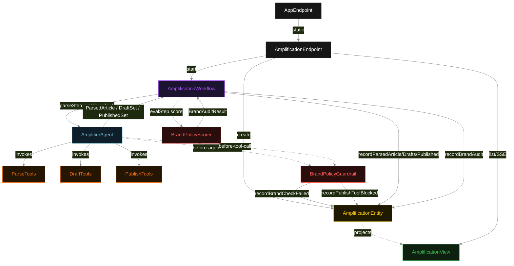
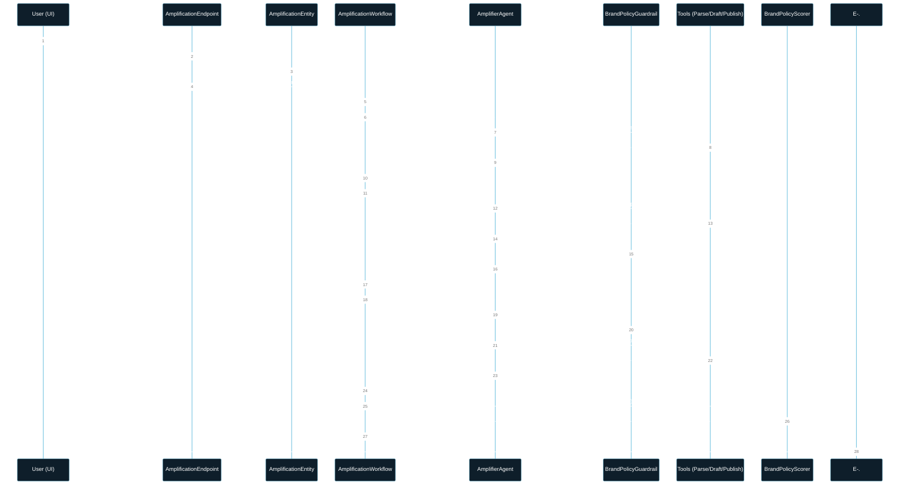
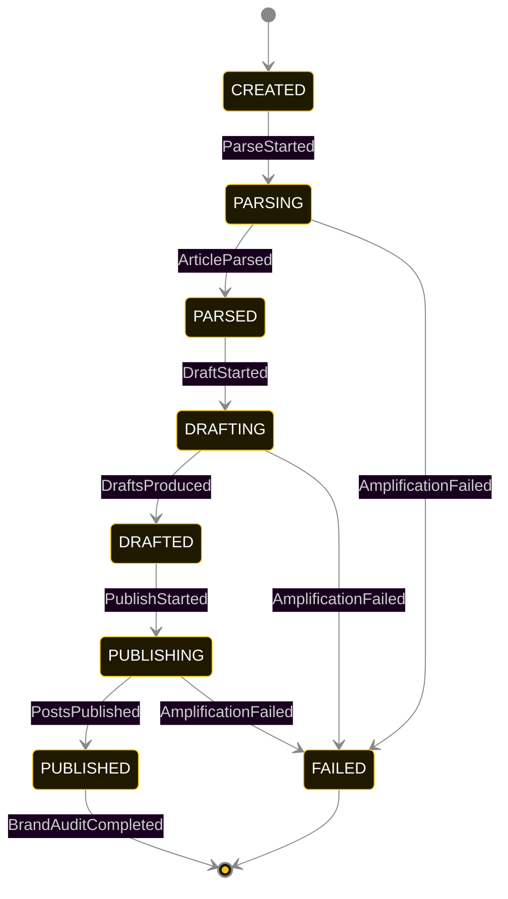
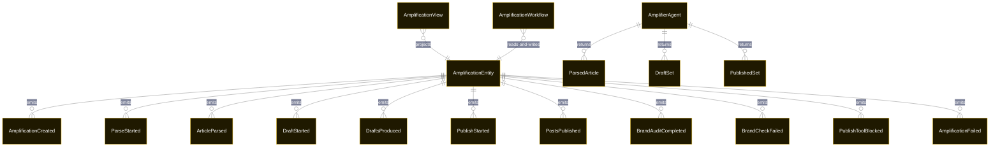

# PLAN — social-amplifier

Architectural sketch consumed by `/akka:plan` and rendered on the generated system's Architecture tab. The four mermaid diagrams below carry the theme variables and CSS overrides from Lesson 24; without them, state names render black-on-black and edge labels clip.

---

## Component graph

## Interaction sequence — J1 (happy path)

## State machine — `AmplificationEntity`

BrandCheckFailed and PublishToolBlocked are side-events recorded on the entity for audit; they do not change the status — the agent's retry stays inside the same task, and the workflow's step continues. Only an exhausted retry budget or a step timeout transitions to FAILED.

## Entity model

## Component table — Java file targets

| Component | Path (generated) |
|---|---|
| `AmplificationEndpoint` | `api/AmplificationEndpoint.java` |
| `AppEndpoint` | `api/AppEndpoint.java` |
| `AmplificationEntity` | `application/AmplificationEntity.java` (state in `domain/AmplificationRecord.java`, events in `domain/AmplificationEvent.java`) |
| `AmplificationWorkflow` | `application/AmplificationWorkflow.java` |
| `AmplifierAgent` | `application/AmplifierAgent.java` (tasks in `application/AmplifierTasks.java`) |
| `ParseTools` | `application/ParseTools.java` |
| `DraftTools` | `application/DraftTools.java` |
| `PublishTools` | `application/PublishTools.java` |
| `BrandPolicyGuardrail` | `application/BrandPolicyGuardrail.java` |
| `BrandPolicyScorer` | `application/BrandPolicyScorer.java` |
| `AmplificationView` | `application/AmplificationView.java` |
| `MockModelProvider` (option-a only) | `application/MockModelProvider.java` |
| Bootstrap | `Bootstrap.java` |

## Concurrency notes

- **Per-step timeout**: `parseStep` 60 s, `draftStep` 60 s, `publishStep` 60 s, `evalStep` 5 s, `error` 5 s. Default step recovery `maxRetries(2).failoverTo(AmplificationWorkflow::error)`. The 60 s on each agent-calling step accommodates LLM latency including tool round-trips and potential brand-policy retry iterations (Lesson 4).
- **Idempotency**: each workflow uses `"amp-" + amplificationId` as the workflow id; restart of the same amplificationId is rejected by the workflow runtime. The agent instance id is `"agent-" + amplificationId` so each run has its own per-task conversation memory.
- **One agent per run**: `AmplifierAgent` runs three tasks per amplification — PARSE, DRAFT, PUBLISH — each with `capability(...).maxIterationsPerTask(4)`. The 4-iteration budget accommodates brand-policy rejections on DRAFT and publish-gate rejections on PUBLISH.
- **Dual-hook guardrail**: `BrandPolicyGuardrail` implements both hooks. The response hook fires on every DRAFT task response; the tool-call hook fires on every PUBLISH task tool call. The two hooks are registered independently on the agent's guardrail-configuration block.
- **Guardrail-driven retry**: when `BrandPolicyGuardrail` rejects a response or tool call, the rejection is returned as a structured error to the agent loop. Each rejection counts toward `maxIterationsPerTask`; if all 4 iterations fail validation, the workflow step fails over to `error` and the entity transitions to `FAILED`.
- **Eval is synchronous and deterministic**: `BrandPolicyScorer` runs in-process inside `evalStep`. No LLM call — the same run always scores the same.
- **Task-boundary handoff is the dependency contract**: `parseStep` writes `ArticleParsed` BEFORE returning; `draftStep` reads the recorded `ParsedArticle` from the entity to build its task's instruction context; `publishStep` reads both `ParsedArticle` and `DraftSet`. The agent itself is stateless across phases.
- **No saga / no compensation**: every step is either pure read, append-only event write, or a single-task agent call. A failed run stays at the last successful event; the UI shows the partial state.
