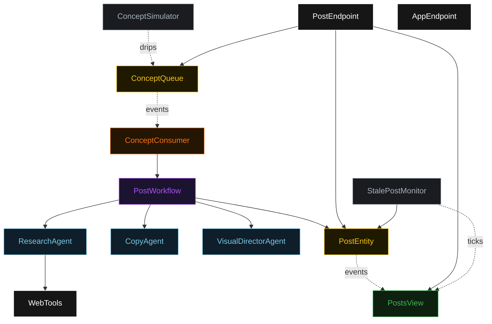
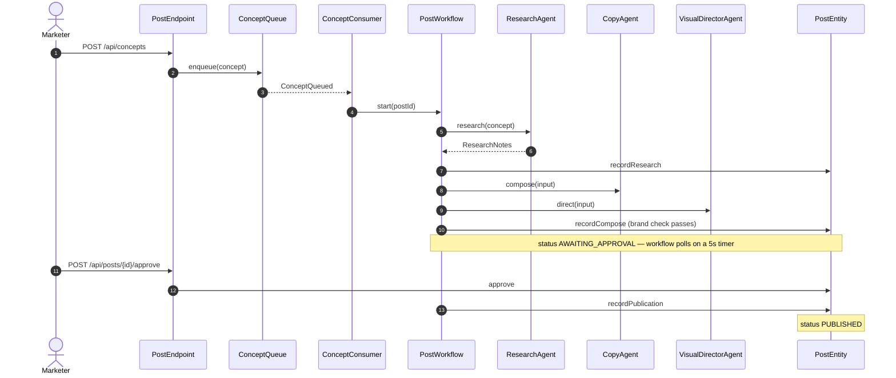
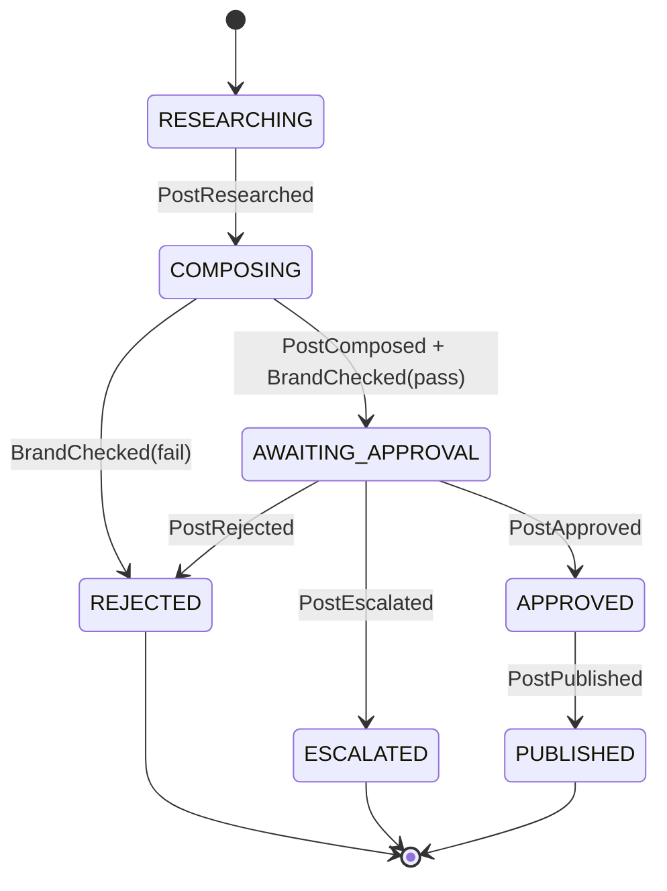
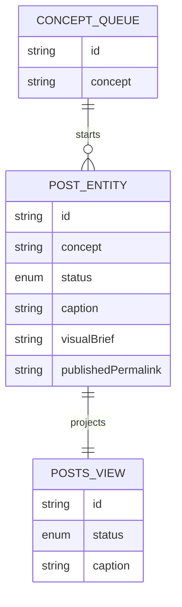

# PLAN — social-post-team

Architectural sketch. All four mermaid diagrams + the component table.

---

## Component graph

## Interaction sequence

## State machine

## Entity model

## Component table

| Component | Path (generated) |
|---|---|
| ResearchAgent | `application/ResearchAgent.java` |
| CopyAgent | `application/CopyAgent.java` |
| VisualDirectorAgent | `application/VisualDirectorAgent.java` |
| PostWorkflow | `application/PostWorkflow.java` |
| PostEntity | `domain/PostEntity.java` |
| ConceptQueue | `domain/ConceptQueue.java` |
| PostsView | `application/PostsView.java` |
| ConceptConsumer | `application/ConceptConsumer.java` |
| ConceptSimulator | `application/ConceptSimulator.java` |
| StalePostMonitor | `application/StalePostMonitor.java` |
| WebTools | `api/WebTools.java` |
| PostEndpoint | `api/PostEndpoint.java` |
| AppEndpoint | `api/AppEndpoint.java` |

## Concurrency notes

- Workflow step timeouts: 60s on `researchStep`, `composeStep`, `brandCheckStep`, `publishStep` (agent calls take 10–30s — the 5s default would retry forever, Lesson 4). `awaitApprovalStep` self-schedules a 5s resume timer and re-polls `PostEntity.getPost`.
- Idempotency: workflow id is the post id; re-delivery of `ConceptQueued` reuses the same workflow instance. Entity commands are guarded by current status so a duplicate `approve` after `PUBLISHED` is a no-op.
- Compensation: `brandCheckStep` failure transitions the post to `REJECTED` with the check notes as reason — no publish side effect runs. `defaultStepRecovery(maxRetries(2).failoverTo(error))` ends the workflow on exhausted retries; the post stays at its last recorded status for operator inspection.
