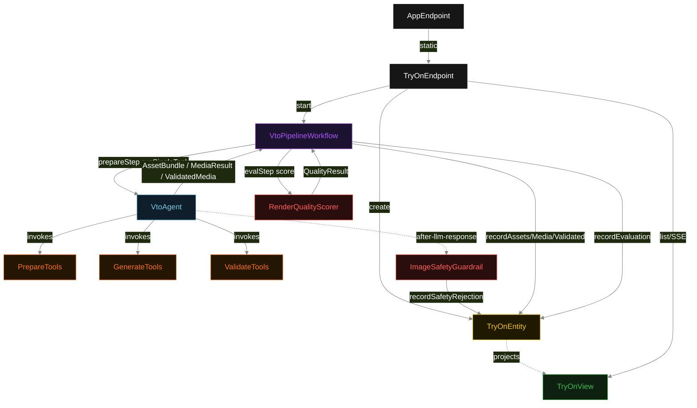
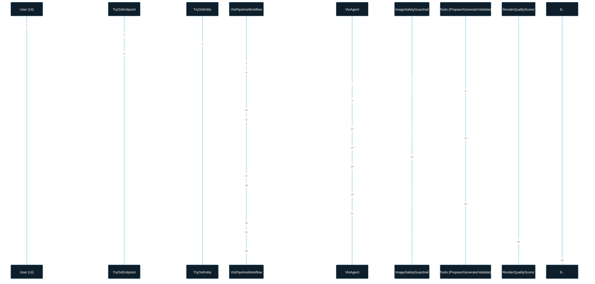
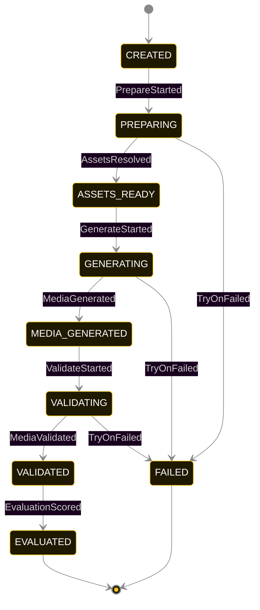
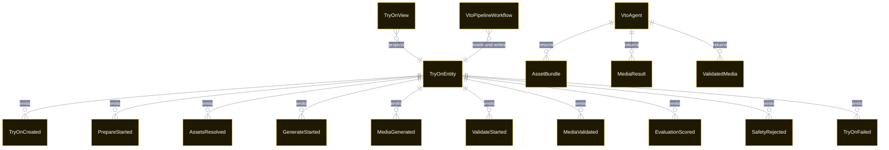

# PLAN — vto-genmedia

Architectural sketch consumed by `/akka:plan` and rendered on the generated system's Architecture tab. The four mermaid diagrams below carry the theme variables and CSS overrides from Lesson 24; without them, state names render black-on-black and edge labels clip.

---

## Component graph

## Interaction sequence — J1 (happy path)

## State machine — `TryOnEntity`

`SafetyRejected` is a side-event recorded on the entity for audit; it does not change the status — the agent's retry stays inside the same task, and the workflow's step continues. Only an exhausted retry budget or a step timeout transitions to `FAILED`.

## Entity model

## Component table — Java file targets

| Component | Path (generated) |
|---|---|
| `TryOnEndpoint` | `api/TryOnEndpoint.java` |
| `AppEndpoint` | `api/AppEndpoint.java` |
| `TryOnEntity` | `application/TryOnEntity.java` (state in `domain/TryOnRecord.java`, events in `domain/TryOnEvent.java`) |
| `VtoPipelineWorkflow` | `application/VtoPipelineWorkflow.java` |
| `VtoAgent` | `application/VtoAgent.java` (tasks in `application/VtoTasks.java`) |
| `PrepareTools` | `application/PrepareTools.java` |
| `GenerateTools` | `application/GenerateTools.java` |
| `ValidateTools` | `application/ValidateTools.java` |
| `ImageSafetyGuardrail` | `application/ImageSafetyGuardrail.java` |
| `RenderQualityScorer` | `application/RenderQualityScorer.java` |
| `TryOnView` | `application/TryOnView.java` |
| `MockModelProvider` (option-a only) | `application/MockModelProvider.java` |
| Bootstrap | `Bootstrap.java` |

## Concurrency notes

- **Per-step timeout**: `prepareStep` 60 s, `generateStep` 120 s, `validateStep` 60 s, `evalStep` 5 s, `error` 5 s. Default step recovery `maxRetries(2).failoverTo(VtoPipelineWorkflow::error)`. The 120 s on `generateStep` accommodates image and video generation latency (Lesson 4).
- **Idempotency**: each workflow uses `"vto-pipeline-" + tryOnId` as the workflow id; restart of the same tryOnId is rejected by the workflow runtime. The agent instance id is `"vto-agent-" + tryOnId` so each request has its own per-task conversation memory.
- **One agent per request**: `VtoAgent` runs three tasks per try-on — PREPARE, GENERATE, VALIDATE — each with `capability(...).maxIterationsPerTask(4)`. The 4-iteration budget gives the safety guardrail room to reject an unsafe output and still let the agent self-correct.
- **Safety guardrail-driven retry**: when `ImageSafetyGuardrail` rejects a generated output, the rejection is returned as a structured error to the agent loop. The loop counts toward `maxIterationsPerTask`; if all 4 iterations fail the safety check, the workflow step fails over to `error` and the entity transitions to `FAILED`.
- **Eval is synchronous and deterministic**: `RenderQualityScorer` runs in-process inside `evalStep`. No LLM call — the same `ValidatedMedia` always scores the same. This is a deliberate single-agent invariant.
- **Task-boundary handoff is the dependency contract**: `prepareStep` writes `AssetsResolved` BEFORE returning; `generateStep` reads the recorded `AssetBundle` from the entity to build its task's instruction context; `validateStep` reads both `AssetBundle` and `MediaResult`. The agent itself is stateless across phases.
- **No saga / no compensation**: every step is either pure read, append-only event write, or a single-task agent call. A failed try-on request stays at the last successful event; the UI shows the partial state for the user.
